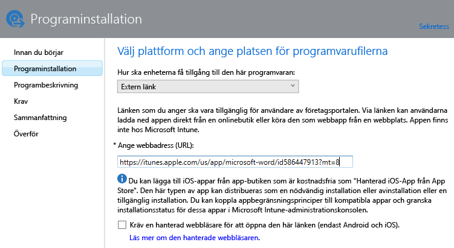
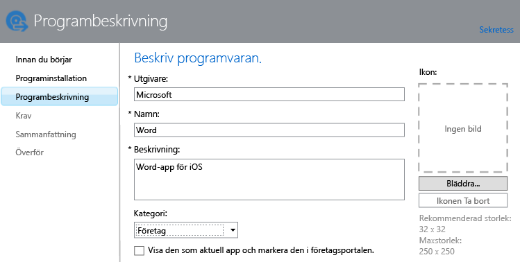

# Lägga till appar för registrerade enheter i Intune

Innan du kan distribuera och hantera en app måste du lägga till den i Microsoft Intune. Det här avsnittet visar hur du lägger till appar för registrerade enheter.

> [!IMPORTANT]
> Informationen i det här avsnittet hjälper dig att lägga till appar som du vill distribuera till registrerade enheter och registrerade Windows-datorer. Information om hur du lägger till appar för Windows-datorer som du hanterar med hjälp av Intune-klientprogrammet finns i [Lägg till appar för Windows-datorer i Microsoft Intune](add-apps-for-windows-pcs-in-microsoft-intune.md).

## Lägg till appen
Du använder Intune programvaruutgivare för att konfigurera egenskaper för appen och, om tillämpligt, överföra den till molnlagringsutrymmet. Gör så här:

1.  Gå till [Microsoft Intune-administratörskonsolen](https://manage.microsoft.com) och välj **Appar** &gt; **Lägg till appar** så startas Intune programvaruutgivare.

    > [!TIP]
    > Du kan behöva ange ditt användarnamn och lösenord för Intune innan utgivaren startas.

2.  På sidan **Programvaruinstallation** för utgivaren väljer du något av följande alternativ för **Hur ska enheterna få tillgång till den här programvaran**:
    - **Installationsprogram för programvara**, för appar med filnamnstillägget **.msi** eller **.exe**:
        - **Välj typ av programinstallationsfil**. Detta anger vilken typ av programvara som du vill distribuera. Om du till exempel vill installera en iOS-app väljer du **Appaket för iOS (&#42;.ipa-fil)**.
        - **Ange platsen för programvarans installationsfiler**. Ange platsen för installationsfilerna, eller välj **Bläddra** för att välja platsen i en lista.
        - **Inkludera ytterligare filer och undermappar från samma mapp**. Det här alternativet gäller endast för **Windows Installer**-filtypen. Vissa program som använder Windows Installer kräver stödfiler som vanligtvis finns i samma mapp som installationsfilerna. Välj det här alternativet om du även vill distribuera dessa filer. Den här installationstypen använder en del av ditt molnlagringsutrymme.

  -   **Extern länk**, för appar som du vill skapa genom att ange en länk till en appbutik:

        - **Ange webbadress (URL)**. Ange webbadressen i följande format:
            - Webbadressen till App Store för den app som du vill distribuera. Om du till exempel vill distribuera appen Microsoft Remote Desktop för Android anger du **https://play.google.com/store/apps/details?id=com.microsoft.rdc.android**. Du hittar webbadressen till appen genom att använda en sökmotor för att hitta Store-sidan där appen finns. Om du till exempel vill hitta Remote Desktop-appen kan du söka efter **Microsoft Remote Desktop Android**.
            - En webbplats. Intune distribuerar en genvägsikon till platsen till enheten (kallas även för web clip).
            - En app på webben. Intune distribuerar en genvägsikon till appen på enheten.
        - **Kräv en hanterad webbläsare för att öppna den här länken (endast Android och iOS)**. När du distribuerar en länk till en webbplats eller en webbapp till användare kan de bara öppna den i Intune Managed Browser. Den här webbläsaren måste installeras på enheterna. Mer information om den hanterade webbläsaren finns i [Hantera Internetåtkomst med hanterade webbläsarprinciper med Microsoft Intune](manage-internet-access-using-managed-browser-policies.md). Den här installationstypen använder inte något av ditt molnlagringsutrymme.

  -   **Hanterad iOS-app från App Store**, för kostnadsfria appar från iTunes-butiken som du vill hantera med hanteringsprinciper för mobila program (MAM):

        - **Ange webbadress (URL)**. Ange webbadressen till App Store för den app som du vill distribuera. Om du till exempel vill distribuera appen Microsoft Work Folders för iOS anger du **https://itunes.apple.com/us/app/work-folders/id950878067?mt=8**. Den här installationstypen använder inte något av ditt molnlagringsutrymme.

        Om du till exempel vill distribuera appen Microsoft Word från iTunes-butiken till enheterna skulle sidan se ut så här:

        

3.  På sidan **Programvarubeskrivning** konfigurerar du följande:

    > [!TIP]
    > Beroende på vilken typ av installationsprogram som du använder kan en del av dessa värden ha angetts automatiskt.

    - **Utgivare**. Ange namnet på appens utgivare.
    - **Namn**. Ange namnet på appen så som det ska visas i företagsportalen. Kontrollera att alla appnamn du använder är unika. Om samma appnamn förekommer två gånger visas endast en av apparna för användare i företagsportalen.
    - **Beskrivning**. Ange en beskrivning för appen. Detta visas för användare i företagsportalen.
    - **Webbadress (URL) för programinformation**. Detta är endast tillgängligt om du har valt **Programinstallation**. Du kan välja att ange en webbadress till en webbplats som innehåller information om den här appen. Webbadressen visas för användare i företagsportalen.
    - **Sekretess-URL**. Detta är endast tillgängligt om du har valt **Programinstallation**. Du kan välja att ange en webbadress till en webbplats som innehåller sekretessinformation för den här appen. Webbadressen visas för användare i företagsportalen.
    - **Kategori** (valfritt). Välj någon av de inbyggda appkategorierna. Det gör det enklare för användarna att hitta appen när de söker i företagsportalen.
    - **Visa den som aktuell app och markera den i företagsportalen**. Visa appen tydligt på huvudsidan för företagsportalen när användare söker efter appar.
    - **Ikon** (valfritt). Överför en ikon som ska kopplas till appen. Den här ikonen visas med appen när användare söker i företagsportalen.

        I det här exemplet konfigureras en beskrivning för Microsoft Word-appen för iOS:

        

4.  På sidan **Krav** väljer du de krav som måste uppfyllas innan appen kan installeras på en enhet. För ett appaket för iOS kan du till exempel välja den lägsta version av iOS som krävs. Du kan också välja vilken typ av enhet det måste vara, till exempel iPhone eller iPad.

    > [!TIP]
    > Sidan **Krav** visas inte för alla typer av appar.

5.  Ytterligare guidesidor visas när du väljer filtypen **Windows Installer**. Den här filtypen används när du distribuerar programvara till datorer som kör Windows 10 eller senare och som har registrerats i Intune.

6.  På sidan **Sammanfattning** läser du igenom den information som du har angivit. När du är klar väljer du **Överför**.

7.  Välj **Stäng** för att slutföra.

Appen visas i noden **Appar** på arbetsytan **Appar**.

## Exempel: Distribuera MSI-program till Windows 10-enheter
I den här fyra minuter långa videon får du lära dig mer om hur du distribuerar program för Windows Installer (.msi) till registrerade enheter som kör Windows 10.  

<iframe src="https://channel9.msdn.com/Series/How-to-Control-the-Uncontrolled/6--How-to-Deploy-MSI-Applications-to-Windows-10-Using-Intune-and-Mobile-Device-Management-MDM/player" width="640" height="360" allowFullScreen frameBorder="0"></iframe>

## Nästa steg

När du har skapat en app är nästa steg att distribuera den. Mer information finns i [Distribuera appar i Microsoft Intune](deploy-apps.md).

<!--HONumber=Jul16_HO4-->

