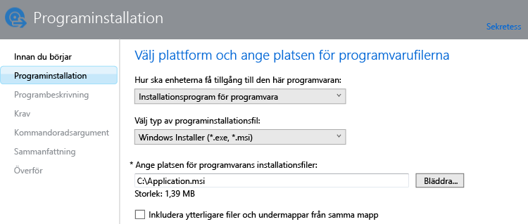

# Lägg till appar för Windows-datorer i Microsoft Intune

Använd informationen i det här avsnittet för att lära dig hur du lägger till appar i Intune innan du distribuerar dem.

> [!IMPORTANT]
> Informationen i det här avsnittet hjälper dig att distribuera appar till Windows-datorer som du hanterar med Intune-klientprogrammet. Om du vill lägga till appar för registrerade Windows-datorer och andra mobila enheter kan du läsa [Lägga till appar för mobila enheter i Microsoft Intune](add-apps-for-mobile-devices-in-microsoft-intune.md).

## Lägg till appen
Använd Intune-programvaruutgivaren för att konfigurera egenskaper för appen och överföra den till molnlagringsutrymmet på följande sätt.

1.  Gå till [Microsoft Intune-administratörskonsolen](https://manage.microsoft.com) och välj **Appar** &gt; **Lägg till appar** så startas programvaruutgivaren för Intune.

    > [!TIP]
    > Du kan behöva ange ditt användarnamn och lösenord för Intune innan utgivaren startas.

2.  På sidan **Programvaruinstallation** i programvaruutgivaren konfigurerar du följande:

    **Välj hur enheterna ska få tillgång till den här programvaran** – Välj **Programinstallation** och ange sedan:

    - **Välj typ av programinstallationsfil** – Detta anger vilken typ av programvara som du vill distribuera. För en Windows-dator väljer du **Windows Installer**.
    - **Ange platsen för programvarans installationsfiler** – Ange platsen för installationsfilerna eller välj **Bläddra** för att välja platsen i en lista.
    - **Inkludera ytterligare filer och undermappar från samma mapp** – Vissa program som använder Windows Installer kräver stödfiler som vanligtvis finns i samma mapp som installationsfilerna. Välj det här alternativet om du vill distribuera dessa stödfiler.

    Om du till exempel vill publicera en app med namnet Application.msi i Intune skulle sidan se ut så här: 

   Den här installationstypen använder en del av ditt molnlagringsutrymme.

3.  På sidan **Programvarubeskrivning** konfigurerar du följande:

    En del av dessa värden kan anges automatiskt eller visas inte, beroende på den installationsfil som används.

    - **Utgivare** – Ange namnet på appens utgivare.
    - **Namn** – Ange namnet på appen så som det ska visas i företagsportalen.  Kontrollera att alla appnamn du använder är unika. Om samma appnamn förekommer två gånger visas endast en av apparna för användare i företagsportalen.
    - **Beskrivning** – Ange en beskrivning för appen. Detta visas för användare i företagsportalen.
    - **Webbadress (URL) för programinformation** – (valfritt) Ange webbadressen till en webbplats som innehåller information om denna app. Webbadressen visas för användare i företagsportalen.
    - **Sekretess-URL** – (Valfritt) Ange en webbadress till en webbplats som innehåller sekretessinformation för den här appen. Webbadressen visas för användare i företagsportalen.
    - **Kategori** – (Valfritt) Välj någon av de inbyggda appkategorierna. Det gör det enklare för användarna att hitta appen när de söker i företagsportalen.
    - **Ikon** – (Valfritt) Överför en ikon som ska kopplas till appen. Den här ikonen visas med appen när användare söker i företagsportalen.

4.  På sidan **Krav** väljer du de krav som måste uppfyllas innan appen kan installeras på en enhet. Välj mellan **Arkitektur** – välj om den här appen kan installeras på 32-bitars- eller 64-bitarsoperativsystem eller båda, **Operativsystem** – välj det lägsta operativsystem där den här appen kan installeras.

5.  På sidan **Identifieringsregler** kan du konfigurera regler för att upptäcka om appen du konfigurerar redan är installerad på en dator, eller så kan du använda standardidentifieringsreglerna för att automatiskt skriva över eventuella tidigare installerade versioner av appen. Det här alternativet är för Windows Installer (endast .exe-filer).
6.  
    Reglerna du kan konfigurera är:
    - **Filen finns** – Ange sökvägen till filen som du vill identifiera. Du kan söka under **%ProgramFiles%** (som söker i **Program Files**\*&lt;sökväg&gt;* och **Program Files (x86)**\*&lt;sökväg&gt;*) på datorn eller **%SystemDrive%** (som söker från datorns rotenhet, normalt C:)
    - **MSI produktkod finns** – Välj **Bläddra** för att välja den Windows Installer-fil (msi) som du vill identifiera. 
    - **Registernyckel finns** – Ange en registernyckel som börjar med **HKEY_LOCAL_MACHINE\*\**. Både 32-bitars och 64-bitars registersökvägar genomsöks. Om den nyckel som du angav finns på någon av platserna uppfylls identifieringsregeln.

    Om appen uppfyller någon av de regler som du har konfigurerat kommer den inte att installeras.

7.  Endast för **Windows Installer**-filtypen (msi och exe): På sidan **Kommandoradsargument** väljer du om du vill ange valfria kommandoradsargument för installationsprogrammet. En del installationsprogram kanske har stöd för argumentet **/q** för tyst installation utan användaråtgärd.

8.  Endast för **Windows Installer**-filtypen (endast exe): På sidan **Returkoder** kan du lägga till nya felkoder som tolkas av Intune när appen installeras på en hanterad Windows-dator.
    Som standard använder Intune returkoder som är branschstandard för att rapportera fel eller framgång för installation av ett appaket: **0** – Klart eller **3010** – Lyckas med omstart. Du kan också lägga till egna returkoder i listan. Om du anger en lista över returkoder och appinstallationen returnerar en kod som inte finns i listan tolkas det som ett fel.

9.  På sidan **Sammanfattning** läser du igenom informationen du har angivit. När du är klar väljer du **Överför**.

10. Välj **Stäng** för att slutföra.

Appen visas i noden **Appar** på arbetsytan **Appar**.

## Nästa steg

När du har skapat en app är nästa steg att distribuera den. Mer information finns i [Distribuera appar i Microsoft Intune](deploy-apps.md)

<!--HONumber=Jun16_HO4-->

