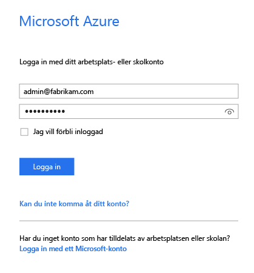
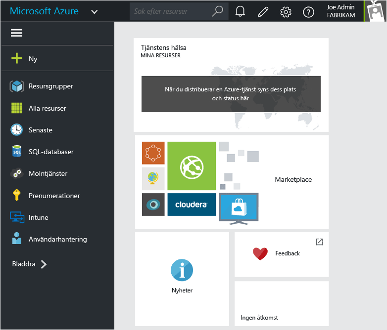
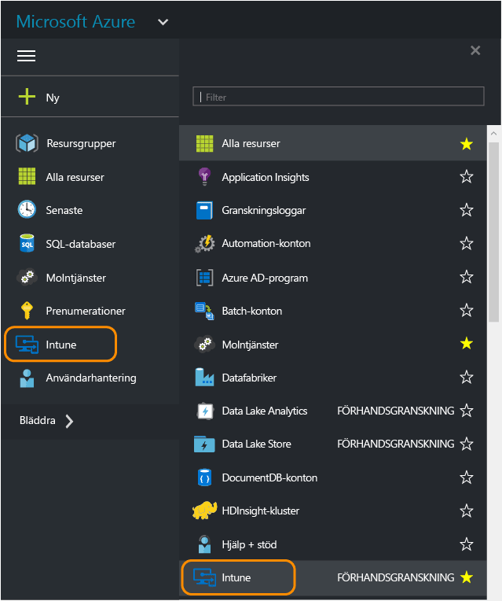
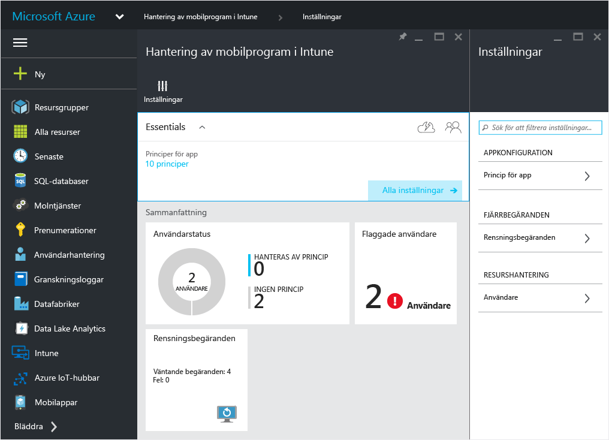
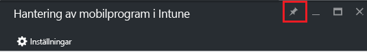
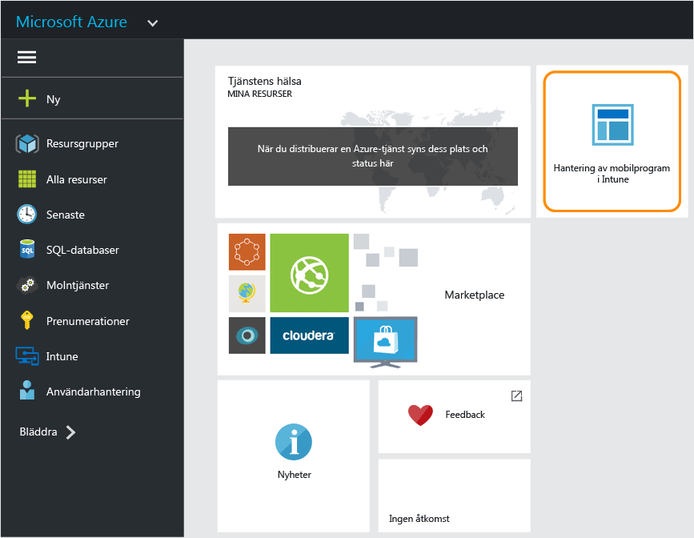

# Azure Portal för Microsoft Intune MAM-principer
## Åtkomst till Azure Portal
**Azure Portal** gör det möjligt att skapa och hantera hanteringsprinciper för mobilappar.

Azure Portal har stöd för att skapa MAM-principer för:
- Appar som körs på enheter **som är registrerade och hanteras av Intune**.
- Appar som körs på enheter som **inte är registrerade** i någon MDM-lösning.
- Appar som körs på enheter som **är registrerade i en MDM-lösning från tredje part**.

>[!IMPORTANT]

> Om du för närvarande använder Intune-administratörskonsolen för hantering av enheterna kan du skapa en MAM-princip som har stöd för appar för enheter som har registrerats i Intune med [Intune-administratörskonsolen](configure-and-deploy-mobile-application-management-policies-in-the-microsoft-intune-console.md).

> Du kanske inte kan se alla MAM-principinställningar i Intune-administratörskonsolen. Azure Portal är den nya administratörskonsol som används för att skapa MAM-principer. Om du skapar MAM-principer i både Intune-administrationskonsolen och Azure Portal, tillämpas principen i Azure Portal på apparna och distribueras till användarna.

## Logga in på Azure Portal och anpassa startsidan

1.  Gå till [Azure Portal](https://portal.azure.com) och logga in med dina autentiseringsuppgifter för [!INCLUDE[wit_nextref](../includes/wit_nextref_md.md)].

    

2.  När du har loggat in visas sidan **instrumentpanelen**. **Instrumentpanelssidan** kan anpassas.

    

3.  På menyn **Bläddra** letar du upp **Intune**.

4.  Välj **Intune > Hantering av mobilprogram i Intune > Inställningar**.

    

    > [!TIP]
    > Om du vill fästa ett blad på sidan **Start** kan du använda alternativet **fäst** på bladet.  Klicka på fästikonen på **bladet för hantering av mobilappar i Intune**för att fästa den på sidan **Start** .

    

    
## Nästa steg
[Förbered dig för att konfigurera hanteringsprinciper för mobilappar](get-ready-to-configure-mobile-app-management-policies-with-microsoft-intune.md)

<!--HONumber=Jul16_HO5-->

