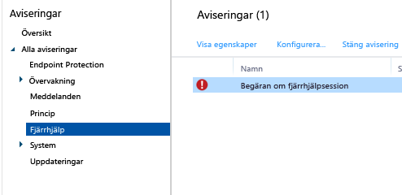

# Vanliga hanteringsuppgifter för Windows-dator med Microsoft Intune datorklient
Läs mer om hur du hanterar datorer som kör Intune-klienten. Om du inte har installerat klienten på dina datorer än läser du [Installera Windows PC-klienten med Microsoft Intune](install-the-windows-pc-client-with-microsoft-intune.md).

## Använd principer för att förenkla datorhantering
### Hantera Windows-brandväggen
Med principer förenklas administrationen av Windows-brandväggen på hanterade datorer. Mer information finns i [Hjälp till att skydda Windows-datorer med principer för Windows-brandväggen i Microsoft Intune](help-protect-windows-pcs-using-windows-firewall-policies-in-microsoft-intune.md).

### Hantera Microsoft Intune Center
Med Microsoft Intune Center kan användarna:

-   Hämta program från företagsportalen.

-   Söka efter uppdateringar.

-   Hantera Microsoft Intune Endpoint Protection.

<!--- -   Request remote assistance.--->

Microsoft Intune Center är installerat på alla hanterade datorer. Du kan konfigurera följande inställningar i en Intune-princip och dessa visas för användaren i Microsoft Intune Center:

|Principinställningar|Information|
|------------------|--------------------|
|**Namn**|Namnet på den administratör som hanterar datorn.  Maxlängd: 40 tecken|
|**Telefonnummer**|Telefonnumret till den administratör som hanterar datorn.  Maxlängd: 20 tecken|
|**E-postadress**|E-postadressen till den administratör som hanterar datorn.  Maxlängd: 40 tecken|
|**Webbplatsnamn**|Namnet på användarnas supportwebbplats.  Maxlängd: 40 tecken|
|**Webbadress**|Webbadressen till supportwebbplatsen.  Maxlängd: 150 tecken|
|**Anteckningar**|En kommentar som visas för användarna.  Maxlängd: 120 tecken|

### Hantera inställningar för programuppdateringar
Använd principer för att konfigurera de inställningar som hanterade datorer använder för att söka efter och hämta uppdateringar från Microsoft och från tredje part. Mer information finns i [Hålla Windows-datorer uppdaterade med programvaruuppdateringar i Microsoft Intune](keep-windows-pcs-up-to-date-with-software-updates-in-microsoft-intune.md).

### Hantera Endpoint Protection-inställningar
Använd principer för att konfigurera inställningar för Endpoint Protection , som du sedan distribuerar till hanterade datorer. De omfattar bland annat genomsökningsscheman och åtgärder som ska vidtas om skadlig kod upptäcks. Mer information finns i [Skydda Windows-datorer med Endpoint Protection för Microsoft Intune](help-secure-windows-pcs-with-endpoint-protection-for-microsoft-intune.md).

## Visa maskinvaru- och programvaruinventering.
Intune samlar in detaljerad information om de hanterade datorernas maskinvara och programvara. Använd informationen i följande procedurer för att lära dig skapa:

-   En rapport som visar information om maskinvarukapaciteten hos datorerna.

-   En rapport som visar en lista över vilka program som finns installerade på varje dator.

-   Så här uppdaterar du en datorinventering för att säkerställa att data i rapporten är aktuella.

### Så här visar du information om datorerna

1.  Gå till [Microsoft Intune-administratörskonsolen](https://manage.microsoft.com/) och välj **Rapporter** &gt; **Datorinventeringsrapporter**.

2.  På sidan **Skapa ny rapport** accepterar du standardvärdena eller anpassar dem om du vill filtrera resultatet som rapporten skickar tillbaka. Du kan till exempel välja att endast de datorer som kör Windows 8.1 ska visas i rapporten.

3.  Välj **Visa rapport** för att öppna **Datorinventeringsrapporter** i ett nytt fönster.

    Du kan sortera rapporten på valfri kolumn, t.ex. **Namn**, **Chassityp** eller **Tillverkare** genom att välja kolumnens rubrik.

### Så här ser du vilka program som är installerade på datorerna

1.  Gå till [Microsoft Intune-administrationskonsolen](https://manage.microsoft.com/) och välj **Rapporter** &gt; **Rapporter om identifierad programvara**.

2.  På sidan **Skapa ny rapport** accepterar du standardvärdena eller anpassar dem om du vill filtrera resultatet som rapporten skickar tillbaka. Du kan till exempel välja att endast program som är utgivna av Microsoft ska visas i rapporten.

3.  Välj **Visa rapport** för att öppna **Upptäckta programvarurapporter** i ett nytt fönster.

    Du kan sortera rapporten på valfri kolumn, t.ex. **Namn**, **Utgivare** eller **Kategori** genom att välja kolumnens rubrik. Du kan expandera uppdateringarna i listan om du vill visa mer information (t.ex. vilka datorer som programmet har installerats på) genom att klicka på riktningspilen bredvid listposten.

### Så här uppdaterar du datorinventeringen för att säkerställa att den är aktuell

1.  Gå till [Microsoft Intune-administrationskonsolen](https://manage.microsoft.com/) och välj **Grupper** &gt; **Alla enheter** (eller någon annan grupp som innehåller den dator som du vill uppdatera inventeringen för).

2.  Välj en dator eller tryck och håll ned **Ctrl** för att välja flera datorer.

3.  Klicka på **Fjärruppgifter** &gt; **Uppdatera inventering** i aktivitetsfältet.

4.  Om du vill visa aktivitetens status väljer du **Fjärruppgifter** längst ner till höger på sidan.

    Dialogrutan **Aktivitetsstatus** visar aktuella fjärrhanteringsaktiviteter, aktivitetsstatus, enhetsnamn och eventuella rapporterade fel och innehåller en länk till felsökningsinformation.

## Starta om en Windows-dator via en fjärranslutning

1.  Gå till [Microsoft Intune-administrationskonsolen](https://manage.microsoft.com/) och välj **Grupper** &gt; **Alla enheter** (eller någon annan grupp som innehåller den dator du vill starta om).

2.  Markera en eller flera datorer, och välj sedan **Fjärruppgifter** &gt; **Starta om datorn**.

3.  Om du vill visa aktivitetens status väljer du **Fjärruppgifter** längst ner till höger på sidan.

4.  I dialogrutan **Aktivitetsstatus** kan du granska aktuella fjärrhanteringsaktiviteter, aktivitetsstatus, enhetsnamn och eventuella rapporterade fel.

## Dra tillbaka en dator

1.  I [Microsoft Intune-administrationskonsolen](https://manage.microsoft.com/) väljer du **Grupper** &gt; **Alla enheter** (eller någon annan grupp som innehåller den dator du vill dra tillbaka).

2.  Markera de enheter som du vill dra tillbaka och välj sedan **Dra tillbaka/Rensa**.

Om du vill återregistrera en dator i Intune installerar du om klientprogrammet på datorn med hjälp av informationen i avsnittet [Installera Windows PC-klienten med Microsoft Intune](install-the-windows-pc-client-with-microsoft-intune.md).

Om en dator inte kan ansluta till Intune visas ett meddelande i arbetsytan **Instrumentpanel**.

När du drar tillbaka en dator:

-   Tas den bort från Intune-inventeringen och licensen som är kopplad till datorn görs tillgänglig så att den kan användas igen.

-   Visas dess status inte längre i Intune-konsolen.

-   Intune tar bort klientprogrammet från datorn. Om datorn inte är ansluten till Intune-tjänsten tas klientprogrammet bort nästa gång datorn ansluts.

-   Microsoft Endpoint Protection tas bort från datorn. Om datorn har ett annat slutpunktsprogram installerat och det inaktiveras kan programmet aktiveras igen efter att Microsoft Intune Endpoint Protection har tagits bort, så att datorerna skyddas.

-   Principer tas bort från datorn och de värden som angavs av principen kommer att ändras.

-   Datorn kommer inte längre att ta emot programuppdateringar eller uppdaterade definitioner för skadlig programvara från Intune-tjänsten.

-   Beroende på datorernas konfiguration kan de eventuellt fortfarande kan ta emot uppdateringar via Windows Server Update Services, Windows Update eller Microsoft Update.

    > [!IMPORTANT]
    > Om klientprogrammet har installerats med en hjälp av ett grupprincipobjekt (GPO), måste du ta bort grupprincipobjektet innan du kan ta bort klientprogrammet, för att förhindra att programvaran installeras på nytt.

    Om det inte går att avinstallera klienten läser du [Felsöka Endpoint Protection](/intune/troubleshoot/troubleshoot-endpoint-protection-in-microsoft-intune) om du behöver mer hjälp.

## Hantera länkning av användarenheter
Innan du kan distribuera programvara till en användare måste du koppla användaren till en dator. Du kan koppla en användare till flera datorer, men varje dator kan bara kopplas till en enda användare. Användarna länkas automatiskt till alla datorer som de registrerar i Intune med hjälp av företagsportalen.

### Så här länkar du en användare till en dator

1.  I [Microsoft Intune-administrationskonsolen](https://manage.microsoft.com/) väljer du **Grupper** &gt; **Alla enheter** (eller någon annan grupp som innehåller den dator som du vill länka till en användare).

2.  Välj den dator som du vill koppla en användare till och välj sedan **Länka användare**.

    Dialogrutan **Länka användare** visar en lista över tillgängliga användare med deras visningsnamn, användar-ID och hur många datorer som varje användare för närvarande är länkad till. Om en användare redan är länkad till den valda datorn visas användarens namn och användar-ID under **Aktuell användare**. Om datorn inte är länkad till någon användare visas **Ingen användare** under **Aktuella användare**.

3.  Gör något av följande:

    -   Om du vill låta datorn fortsätta att vara kopplad till den aktuella användaren, om det finns en sådan, väljer du **Avbryt**.

    -   Om du vill ta bort länken till den aktuella användaren, om det finns en sådan, väljer du **Ta bort länk**&gt;**OK**.

    -   För att länka datorn till en ny användare väljer du en användare i listan **Alla användare** . Bekräfta att användardatan är korrekt och välj sedan **OK**.

> [!TIP]
> Om du vill begränsa slutanvändarnas möjlighet att länka sig själva till datorer aktiverar du alternativet **Begränsa användarnas möjlighet att länka sig själva till datorer** i principen **Agentinställningar för Microsoft Intune**.

<!--- ## Request and provide remote assistance to Windows PCs that use the Intune client software

> [!IMPORTANT]
> You might not see the options to configure TeamViewer integration for remote assistance in the Intune admin console. This capability is not currently available to all customers, but will be rolling our more widely soon.

Microsoft Intune can use the [TeamViewer](https://www.teamviewer.com) software to let users of PCs that run the Intune client software get remote assistance help from you. When a user requests help from the Microsoft Intune Center, you are informed by an alert, can accept the request, and then provide assistance.
This functionality replaces the existing Windows Remote Assistance functionality in Intune.

### Before you start

Before you begin to establish and respond to remote assistance requests, you must ensure the following prerequisites are in place:

- You must have [signed up for a TeamViewer account](https://login.teamviewer.com/LogOn#register) to log into the TeamViewer website.
- Windows PCs that you want to administer must be [managed by the Windows PC client](manage-windows-pcs-with-microsoft-intune.md)
- All Windows PC operating systems supported by Intune can be administered.

### Configure the TeamViewer Connector

1. In the [Microsoft Intune administration console](https://manage.microsoft.com), choose **Admin**.
2. In the **Admin** workspace, choose **TeamViewer**.
3. On the **TeamViewer** page, under **TeamViewer Connector**, choose **Enable**.
4. In the **Enable TeamViewer** dialog box, view, then **Accept** the license terms. If you don't already own a TeamViewer license, choose **Purchase a TeamViewer license**.
5. After the TeamViewer browser window opens, sign into the site with your TeamViewer credentials.
6. On the TeamViewer site, read, then accept the options to allow Intune to connect with TeamViewer.
7. In the Intune console, verify that the **TeamViewer Connector** item shows as **Enabled**.

### Open a remote assistance request (end user)

1. On a client Windows PC, open the **Microsoft Intune Center**.
2. Under **Remote Assistance**, choose **Request Remote Assistance**.
3. After you approve the request (see below), TeamViewer opens on the client. The user must accept any messages indicating that the web browser is trying to open the TeamViewer application.
4. The user sees a message asking if you can control their PC. They must accept this message to continue.
5. During the remote assistance session, the user sees a window that shows them you are connected. If they close this window, the remote session ends.

### Respond to a remote assistance request

1. When a user submits a remote assistance request, you can view it in the **Alerts** workspace, under **Monitoring** > **Remote Assistance**. For example:
> 

 If a request goes unanswered for more than 4 hours, it is removed.
2. To accept the request, choose **Approve request and launch Remote Assistance**.
3. In the **A New Remote Assistance Request is Pending** dialog box, choose **Accept the remote assistance request**. If it's not already installed, TeamViewer will install any necessary apps on your computer.
4. TeamViewer then notifies the end user that you want to take control of their PC. After the user has accepted the request, the TeamViewer windows opens, and you can control the PC.

While in a remote assistance session, you can use all available TeamViewer commands to control the remote PC. For help with these commands, download the [Manual for remote control](http://www.teamviewer.com/en/support/documents/) from the TeamViewer website.

### Close the remote assistance session

From the **Actions** menu of the **TeamViewer** window, choose **End Session**.--->

<!--HONumber=Jul16_HO4-->

