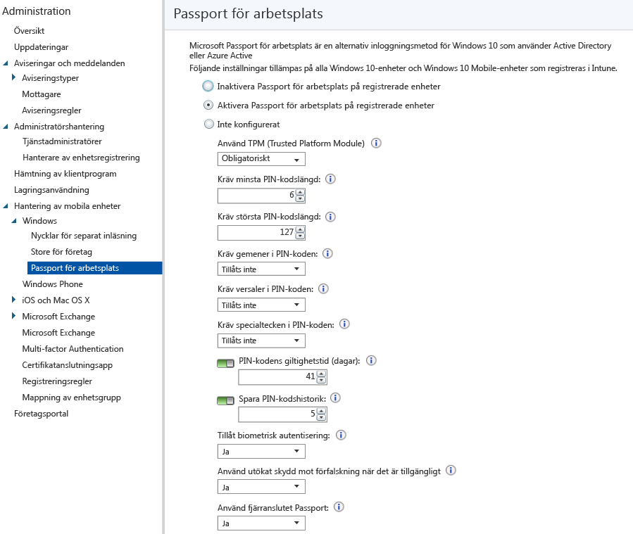

# Kontrollera Microsoft Passport-inställningar på enheter med Microsoft Intune
Microsoft Intune gör att du kan integrera med **Microsoft Passport för arbetsplats** som är en alternativ inloggningsmetod som använder Active Directory, eller ett Azure Active Directory-konto för att ersätta lösenord, smartkort eller virtuellt smartkort.

Passport gör det möjligt att använda en **användargest** för att logga in i stället för ett lösenord. En användargest kan vara en enkel PIN-kod, biometrisk autentisering, t.ex. Windows Hello, eller en extern enhet, t.ex. en fingeravtrycksläsare.

Intune kan integreras med Passport för arbetsplats på två sätt:

-   Du kan använda Intune-principen för att styra vilka gester användare kan och inte kan använda för inloggning.

-   Du kan lagra certifikat för autentisering i nyckellagringsprovidern (KSP) för Passport for Work. Mer information finns i [Skydda resursåtkomst med certifikatprofiler i Microsoft Intune](secure-resource-access-with-certificate-profiles.md).

## Skapa en Passport for Work-princip

1.  Gå till [Microsoft Intune-administrationskonsolen](https://manage.microsoft.com) och klicka på **Admin** &gt; **Hantering av mobila enheter** &gt; **Windows** &gt; **Passport för arbetsplats** så öppnas sidan Passport för arbetsplats som visas nedan.

    

2.  Välj någon av följande inställningar:
    - **Inaktivera Passport för arbetsplats på registrerade enheter** – Välj den här inställningen om du inte vill använda Passport för arbetsplats på Windows 10-enheter. Alla andra inställningar på skärmen inaktiveras.
    - **Aktivera Passport för arbetsplats på registrerade enheter** – Välj den här inställningen om du vill konfigurera inställningar för Passport för arbetsplats på alla Windows 10-enheter.
    - **Inte konfigurerad** – Välj den här inställningen om du inte vill använda Intune för att styra inställningar för Passport för arbetsplats. Eventuella befintliga inställningar för Passport för arbetsplats på Windows 10-enheter kommer inte att förändras. Alla andra inställningar på skärmen inaktiveras.
3.  Om du har valt **Aktivera Passport för arbetsplats på registrerade enheter** konfigurerar du de obligatoriska inställningar som kommer att gälla på alla registrerade Windows 10- och Windows 10 Mobile-enheter.
3.  När du är klar klickar du på **Spara**.

## Passport för arbetsplats: PIN-inställningar

  
- **Kräv minsta PIN-kodslängd**/**Kräv största PIN-kodslängd** – Konfigurerar enheterna så att de använder de minsta och största PIN-kodslängder du anger för att hjälpa till att säkerställa säker inloggning. Standardlängden för PIN-kod är 6 tecken, men du kan ange en minsta längd på 4 tecken. Den maximala längden för PIN-kod är 127 tecken.
- **Kräv gemener i PIN-koden**/**Kräv versaler i PIN-koden**/**Kräv specialtecken i PIN-koden** – Du kan även genomdriva en starkare PIN-kod genom att kräva att versaler, gemener och specialtecken används i PIN-koden. Välj mellan:
    - **Tillåts** – Användare kan använda teckentypen i sina PIN-koder, men det är inte obligatoriskt.
    - **Krävs** – Användarna måste inkludera minst en av teckentyperna i sina PIN-koder. Det är till exempel vanligt att man kräver minst en versal och ett specialtecken.
    - **Tillåts inte** (standard) – Användarna får inte använda dessa teckentyper i sina PIN-koder (det är också det som gäller om inställningen inte konfigureras).
    > [!TIP]
    > Specialtecken omfattar följande: **! " # $ % &amp; ' ( ) &#42; + , – . / : ; &lt; = &gt; ? @ [ \ ] ^ _ &#96; { &#124; } ~**.
- **PIN-kodens giltighetstid (dagar)** – Det tillhör god praxis att ange en giltighetstid för en PIN-kod och efter denna tid måste användaren ändra den. Standarden är 41 dagar. 
- **Spara PIN-kodshistorik** – Använd den här inställningen för att begränsa återanvändning av PIN-koder som har använts tidigare. Standardvärdet är att de 5 senaste PIN-koder som har använts inte kan återanvändas.

## Passport för arbetsplats: Andra inställningar

- **Använd TPM (Trusted Platform Module)** – Ett TPM-chipp (Trusted Platform Module) ger ett ytterligare lager med datasäkerhet. Välj ett av följande värden:
    - **Obligatoriskt** (standard) – Endast enheter med en tillgänglig TPM kan etablera Passport för arbetsplats.
    - **Önskad** – Enheterna försöker först använda TPM. Om det inte är tillgängligt kan de använda programvarukryptering
- **Tillåt biometrisk autentisering** – Aktiverar biometrisk autentisering, t.ex. ansiktsigenkänning eller fingeravtryck som ett alternativ till PIN-koden för Passport för arbetsplats. Användarna måste ändå konfigurera en PIN-kod om den biometriska autentiseringen skulle misslyckas. Välj mellan:
    - **Ja** – Passport för arbetsplats tillåter biometrisk autentisering.
    - **Nej** – Passport för arbetsplats förhindrar biometrisk autentisering (för alla kontotyper).
- **Använd utökat skydd mot förfalskning när det är tillgängligt** – Konfigurerar om funktionerna för skydd mot förfalskning i Windows Hello används på enheter som har stöd för detta (t.ex. identifiering av ett foto av ett ansikte i stället för ett riktigt ansikte). Om detta är inställt på **Ja** kräver Windows att alla användare använder skydd mot förfalskning för ansiktsdrag när detta stöds.
- **Använd fjärranslutet Passport** – Om det här alternativet är inställt på **Ja** kan användarna använda ett fjärranslutet Passport som fungerar som en bärbar tillhörande enhet för autentisering på stationär dator. Den stationära datorn måste vara ansluten med Azure Active Directory och den tillhörande enheten måste vara konfigurerad med en PIN-kod för Passport for Work.

## Ytterligare information
Mer information om Microsoft Passport finns i [guiden](https://technet.microsoft.com/library/mt589441.aspx) i Windows 10-dokumentationen.

<!--HONumber=Jun16_HO4-->

