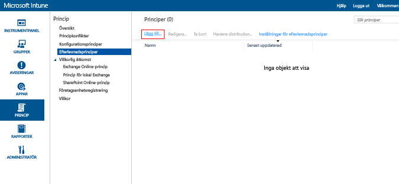
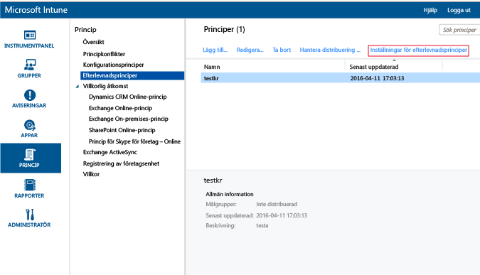
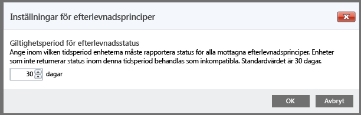

# Skapa en enhetsefterlevnadsprincip i Microsoft Intune
Det här avsnittet beskriver de steg du kan använda för att skapa en efterlevnadsprincip som en enhet måste följa för att anses vara kompatibel.

##  Steg 1: Lägg till en ny princip
  I [Microsoft Intune-administratörskonsolen](https://manage.microsoft.com) väljer du **Princip** &gt; **Efterlevnadsprinciper** &gt; **Lägg till**.

  

##  Steg 2: Konfigurera inställningar
Aktivera önskade inställningar på sidan **Skapa princip**:
  -   Inställningar för systemsäkerhet, t.ex. lösenord och kryptering
  -   Inställningar för enhetens hälsotillstånd, t.ex. om en enhet är jailbrokad eller inte, eller om den rapporteras som felfri av Windows-tjänsten för attestering av hälsotillstånd.
  -   Inställningar för enhetsegenskaper, t.ex. lägsta operativsystemsversion som krävs eller högsta operativsystemsversion som tillåts.

##  Steg 3: Spara principen
När du är klar väljer du **Spara princip**.

Du kan välja att distribuera principen direkt efter att du har sparat principen eller så kan du välja att distribuera den senare. Den nya principen visas i noden **Efterlevnadsprinciper** på arbetsytan **Principer**.

##  Steg 4: Ange giltighetsperioden för efterlevnadsstatus
Om du vill ange hur lång tid enheten har på sig att checka in innan den anses vara ej kompatibel, går du till inställningarna för efterlevnadsprincip och ändrar tiden.  Standardinställningen är 30 dagar.

## Principinställningar som stöds
I följande tabell visas inställningarna för efterlevnadsprincip och de plattformar där de stöds.

-------------
|Inställningar|iOS|Android|Windows|
|-----|----|-----|-----|
|Kräv ett lösenord för att låsa upp mobila enheter|iOS 6 och senare|Android 4.0 och senare  Samsung KNOX Standard 4.0 och senare|Windows Phone 8 och senare|
|Tillåt enkla lösenord|iOS 6 och senare|Stöds inte|Windows Phone 8 och senare|
|Minsta längd på lösenord|iOS 6 och senare| Android 4.0 och senare Samsung KNOX Standard 4.0 och senare| Windows Phone 8 och senare Windows 8,1|
|Lösenordstyp krävs|iOS 6 och senare|Saknas|Windows Phone 8 och senare  Windows RT  Windows RT 8.1  Windows 8,1|
|Lägst antal teckenuppsättningar|iOS 6 och senare|Saknas|Windows Phone 8 och senare  Windows RT  Windows RT 8.1  Windows 8,1|
|Lösenordskvalitet|Saknas|Android 4.0 och senare  Samsung KNOX Standard 4.0 och senare|Saknas|
|Antal minuters inaktivitet innan lösenord krävs|iOS 6 och senare|Android 4.0 och senare Samsung KNOX Standard 4.0 och senare|Windows Phone 8 och senare Windows RT och Windows RT 8.1 Windows 8,1|
|Lösenordets giltighetstid (i dagar)|iOS 6 och senare|Android 4.0 och senare Samsung KNOX Standard 4.0 och senare|Windows Phone 8 och senare Windows RT och Windows RT 8.1 Windows 8,1|
|Kom ihåg tidigare lösenord|iOS 6 och senare|Android 4.0 och senare Samsung KNOX Standard 4.0 och senare|Windows Phone 8 och senare Windows RT och Windows RT 8.1 Windows 8,1|
|Förhindra återanvändning av tidigare lösenord|iOS 6 och senare|Android 4.0 och senare Samsung KNOX Standard 4.0 och senare|Windows Phone 8 och senare Windows RT och Windows RT 8.1 Windows 8,1|
|Kräv lösenord när enheten återgår från viloläge| Saknas| Saknas|Windows 10 Mobil|
|Filkryptering på mobil enhet|Inte tillämpligt|Android 4.0 och senare Samsung KNOX Standard 4.0 och senare|Windows Phone 8 och senare  Windows 8,1|
|Kräv att enheter rapporteras som felfria| Saknas| Saknas|Windows  Windows 10 Mobil|
|Enheten får inte vara jailbrokad eller rotad|iOS 6 och senare|Android 4.0 och senare Samsung KNOX Standard 4.0 och senare|Saknas|
|E-postkontot måste hanteras av Intune|iOS 6 och senare|Saknas| Saknas|
|Välj den e-postprofil som måste hanteras av Intune|iOS 6 och senare|Saknas| Saknas|
|Lägsta version av operativsystemet krävs|iOS 6 och senare|Android 4.0 och senare Samsung KNOX Standard 4.0 och senare| Windows Phone 8 och senare Windows 8,1|
|Högsta tillåtna version av operativsystemet|iOS 6 och senare|Android 4.0 och senare Samsung KNOX Standard 4.0 och senare|Windows Phone 8 och senare Windows 8,1|

Välj något av följande om du vill veta mer om efterlevnadsinställningar som stöds på varje plattform:
> [!div class="op_single_selector"]
- [Inställningar för efterlevnadsprinciper för iOS-enheter](ios-compliance-policy-settings-in-microsoft-intune.md)
- [Inställningar för policy för efterlevnad för Android-enheter](android-compliance-policy-settings-in-microsoft-intune.md)
- [Inställningar för efterlevnadsprinciper för Windows- och Windows Phone-enheter ](windows-compliance-policy-settings-in-microsoft-intune.md)

## Nästa steg
[Distribuera och övervaka en efterlevnadsprincip](deploy-and-monitor-a-device-compliance-policy-in-microsoft-intune.md)

### Se även
[Introduktion till efterlevnadsprinciper för enheter](introduction-to-device-compliance-policies-in-microsoft-intune.md)

<!--HONumber=Jul16_HO5-->

