---
# required metadata

title: Skapa och distribuera MAM-principer | Microsoft Intune
description:
keywords:
author: karthikaraman
manager: jeffgilb
ms.date: 04/28/2016
ms.topic: article
ms.prod:
ms.service: microsoft-intune
ms.technology:
ms.assetid: c1b9a343-1737-4a65-a9c6-aca48acad11c

# optional metadata

#ROBOTS:
#audience:
#ms.devlang:
ms.reviewer: joglocke
ms.suite: ems
#ms.tgt_pltfrm:
#ms.custom:

---

# Skapa och distribuera hanteringsprinciper för mobilappar med Microsoft Intune
Hanteringsprinciper för mobilappar (MAM) kan tillämpas på appar som körs på enheter som kan, men som inte måste, hanteras av Intune. En detaljerad beskrivning av hur MAM-principer fungerar och de scenarier som stöds av Intunes MAM-principer finns i avsnittet [Skydda appdata med hanteringsprinciper för mobilappar](protect-app-data-using-mobile-app-management-policies-with-microsoft-intune.md).

Det här avsnittet beskriver processen för att skapa en MAM-princip i **Azure Portal**. Azure Portal är en ny administratörskonsol som används för att skapa MAM-principer och vi rekommenderar att du använder den här portalen när MAM-principerna skapas. Azure Portal har stöd för följande MAM-scenarier:
- Enheter som har registrerats i Intune
- Enheter som hanteras av en MDM-lösning från tredje part
- Enheter som inte hanteras av någon MDM-lösning (BYOD).

Om du för närvarande använder **Intune-administratörskonsolen** för hantering av enheterna kan du skapa en MAM-princip som har stöd för appar för enheter som har registrerats i Intune med [Intune-administratörskonsolen](configure-and-deploy-mobile-application-management-policies-in-the-microsoft-intune-console.md).
>[!IMPORTANT]
> Du kanske inte kan se alla MAM-principinställningar i Intune-administratörskonsolen. Azure Portal är den nya administratörskonsolen för att skapa MAM-principer. Om du skapar principer för MAM i både Intune-administrationskonsolen och Azure Portal tillämpas principen i Azure Portal på apparna och distribueras till användarna.

Om du vill se en lista över principinställningar som stöds för Android- och iOS-plattformar kan du välja något av följande:

> [!div class="op_single_selector"]
- [iOS-principer](ios-mam-policy-settings.md)
- [Android-principer](android-mam-policy-settings.md)

##  Skapa en MAM-princip
Innan du skapar en MAM-princip granskar du informationen om [krav och support](get-ready-to-configure-mobile-app-management-policies-with-microsoft-intune.md).
1.  Välj **Hantering av mobilprogram i Intune &gt; Inställningar** för att öppna bladet **Inställningar**.

    

    > [!TIP] Om det är första gången du använder Azure Portal läser du först [Azure Portal för Microsoft Intune MAM-principer](azure-portal-for-microsoft-intune-mam-policies.md) och bekantar dig med portalen.

2.  På bladet **Inställningar** väljer du **Apprincip**.  När du gör det öppnas bladet **Apprincip** där du kan skapa nya principer och redigera befintliga.

    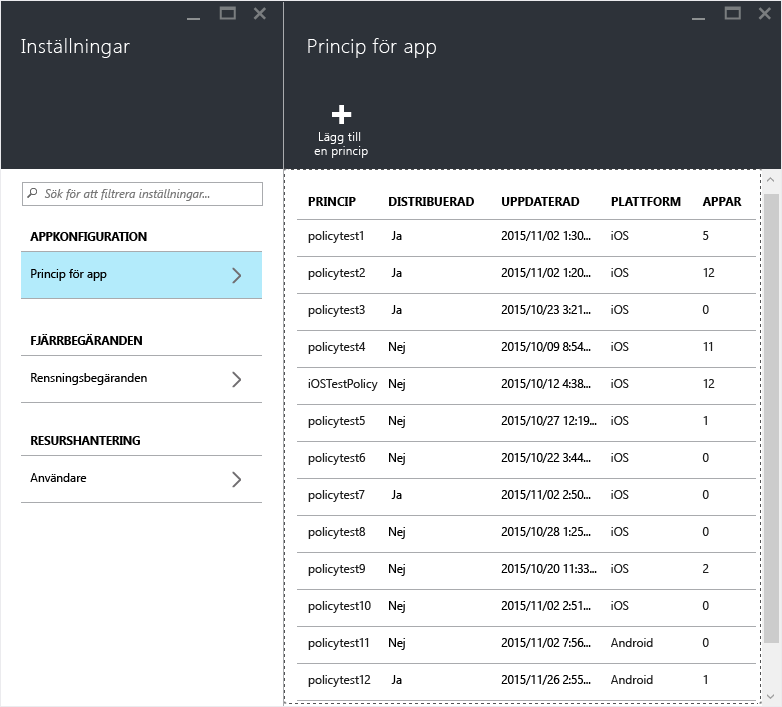

3.  Välj **Lägg till en princip**.

    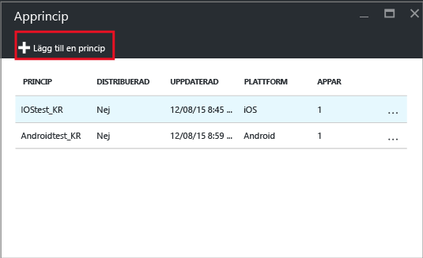

4.  Skriv ett namn för principen, lägg till en kort beskrivning och välj plattformstypen för att skapa en princip för iOS eller Android.  Du kan skapa mer än en princip för varje plattform.

    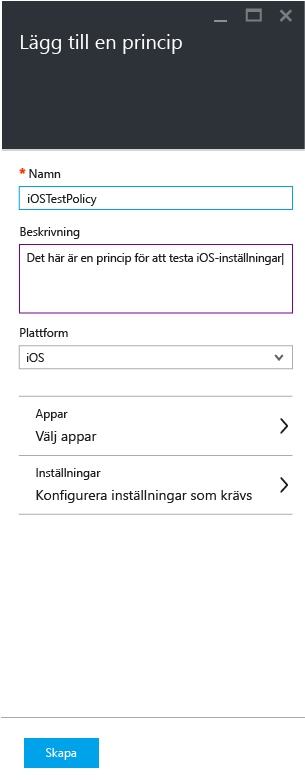

5.  Välj **Appar** för att öppna bladet **Appar** där en lista över tillgängliga appar visas. Du kan välja en eller flera appar i listan som du vill associera med principen som du skapar. När du har valt apparna väljer du knappen **Välj** längst ned på bladet **Appar** för att spara ditt val.

    > [!IMPORTANT] Du måste välja minst en app om du vill skapa en princip.

6.  Öppna principinställningsbladet genom att välja **Konfigurera nödvändiga inställningar** på bladet **Lägg till en princip**.

    Det finns två typer av principinställningar, **Dataflytt** och **Åtkomst**.  Principer för dataflytt tillämpas när data flyttas till och från appar, medan åtkomstprinciper avgör hur slutanvändare får åtkomst till apparna i en arbetskontext.
    Du kan snabbt komma igång genom att använda principinställningarnas standardvärden.  Du behöver inte göra några ändringar om standardvärdena uppfyller dina krav.

    > [!TIP]
    > Följande principinställningar används endast när du använder appar i arbetskontexten.  När slutanvändarna använder appen för att utföra personliga uppgifter påverkas de inte av dessa principer.

    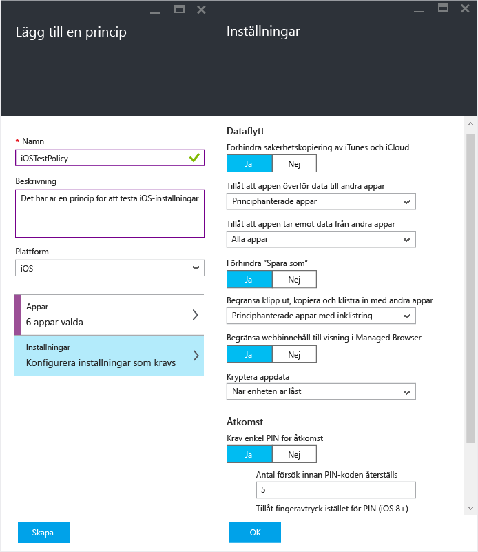

7.  Spara konfigurationen genom att välja **OK**.  Nu är du tillbaka i bladet **Lägg till en princip** . Skapa principen och spara inställningarna genom att välja **Skapa**.

    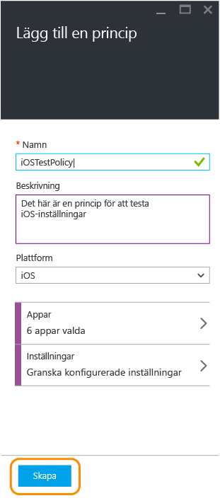

    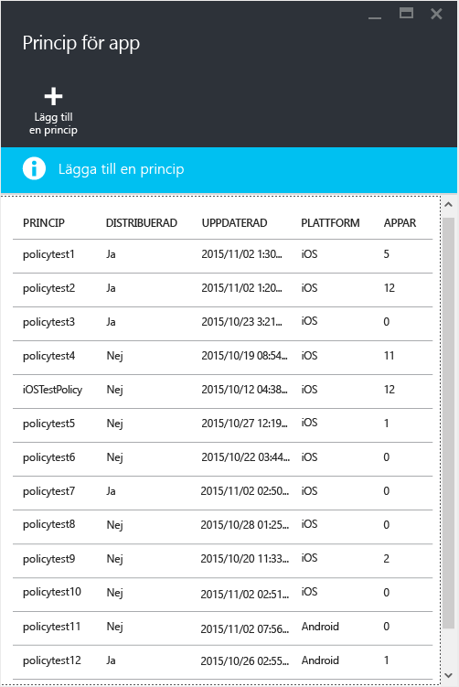

När du har skapat en princip genom att följa stegen i föregående procedur distribueras den inte till några användare.  Du distribuerar principen genom att följa stegen nedan.

> [!IMPORTANT]
> Om du skapar en MAM-princip för en app med Intune-administratörskonsolen och MAM-principen med Azure Portal har principen som du skapade med Azure Portal företräde. I Intune- eller Configuration Manager-konsolen rapporteras dock principinställningarna som skapats från Azure Portal. Exempel:
>
> -   Du har skapat en hanteringsprincip för mobilprogram i Intune-administrationskonsolen som blockerar kopiering från en app.
> -   Du har skapat en princip för hantering av mobilappar i Azure-konsolen som tillåter kopiering från en app.
> -   Du associerar båda principerna med samma app.
> -   Resultatet är att den princip som du skapade från Azure-konsolen prioriteras och kopiering tillåts.
> -   Dock indikerar statusen och rapporterna i Intune-konsolen felaktigt att kopiering är blockerat.

## Distribuera en princip för användare

1.  På bladet **Princip** väljer du **Användargrupper**, vilket öppnar bladet **Användargrupper**. Öppna bladet **Lägg till användargrupp** genom att välja **Lägg till användargrupp** på bladet **Användargrupper**.

    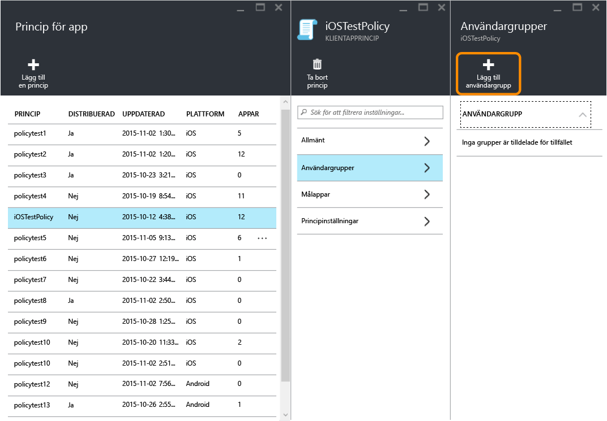

2.  En lista med användargrupper visas i bladet **Lägg till användargrupp** . Det här är en lista över alla säkerhetsgrupper i **Azure Active Directory**.  Du kan välja de användargrupper som du vill att den här principen ska tillämpas på och välja **Välj**. När du väljer **Välj** distribueras principen till användarna.

    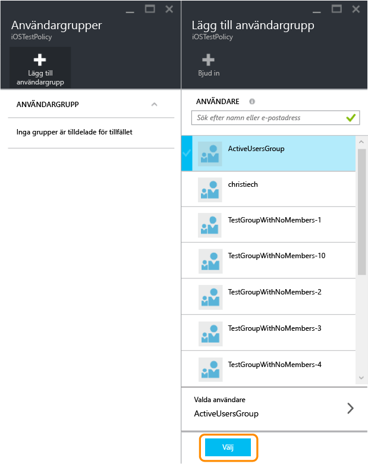

    Nu har du skapat en princip och distribuerat den till användare.

Endast användare med tilldelade [!INCLUDE[wit_nextref](../includes/wit_nextref_md.md)]-licenser påverkas av principen.  Användare som ingår i säkerhetsgruppen som du valde och som inte har tilldelats någon [!INCLUDE[wit_nextref](../includes/wit_nextref_md.md)]-licens påverkas inte.

Om du använder Intune med Configuration Manager för att hantera iOS- och Android-enheter tillämpas principen endast på användarna direkt i den grupp du valt.  Medlemmar i underordnade grupper till den grupp du valt påverkas inte.

Slutanvändarna kan hämta apparna från App Store eller Google Play. En detaljerad genomgång av hur MAM skyddar företagsdata på enheten finns i [slutanvändarupplevelse med MAM-aktiverade appar](end-user-experience-for-mam-enabled-apps-with-microsoft-intune.md).

##  Ändra befintliga principer
Du kan redigera en befintlig princip och tillämpa den på inriktade användare. När du ändrar befintliga principer ser dock inte användare som redan är inloggade i apparna ändringarna förrän efter åtta timmar.

Om användaren ska kunna se effekten av ändringarna direkt måste användaren logga ut ur appen och sedan logga in igen.

### Ändra listan över appar som är associerade med principen

1.  Välj den princip som du vill ändra på bladet **Apprincip**. När du gör det öppnas ett blad som är specifikt för den princip du valt.

    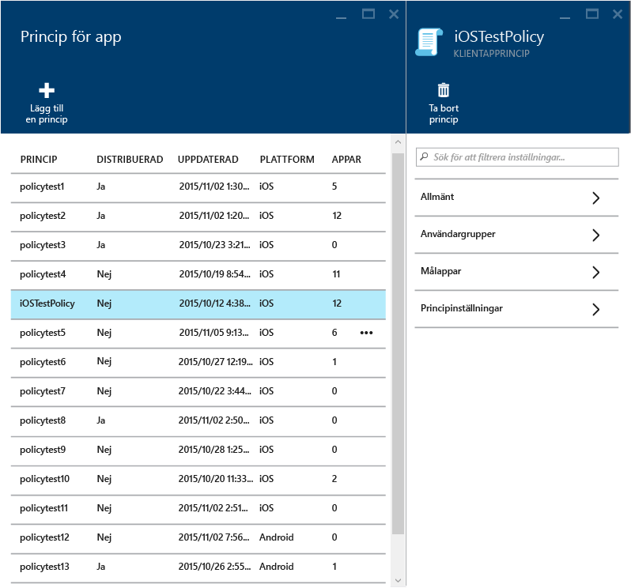

2.  Öppna listan med appar genom att välja **Målappar** på principbladet.

3.  Ta bort eller lägg till appar i listan och spara ändringarna genom att välja ikonen **Spara**.

### Ändra listan över användargrupper

1.  Välj den princip som du vill ändra på bladet **Apprincip**. När du gör det öppnas bladet som är specifikt för den princip du valt.

2.  Välj **Användargrupper** för att öppna bladet **Användargrupp** som innehåller en lista över aktuella användargrupper som omfattas av den här principen.

3.  Om du vill **lägga till en ny användargrupp** till principen väljer du **Lägg till användargrupp** och väljer användargruppen. Välj **Välj** om du vill distribuera principen till den grupp du valt.

    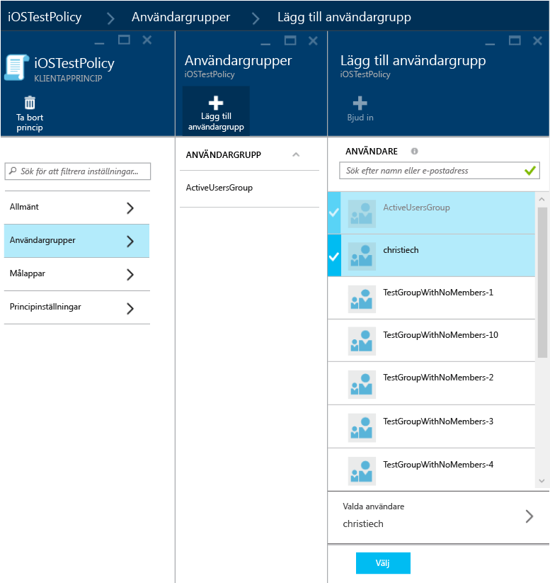

4.  Om du vill **ta bort en användargrupp** markerar du den användargrupp som du vill ta bort, väljer ellipserna (...) och sedan **Ta bort** för att ta bort användargruppen.

    

### Ändra principinställningar

1.  Välj den princip som du vill ändra på bladet **Apprincip**. När du gör det öppnas ett blad som är specifikt för den princip du valt.

    

2.  Öppna bladet **Principinställningar** genom att välja **Principinställningar**.

3.  Ändra inställningarna och spara ändringarna genom att klicka på ikonen **Spara**.

    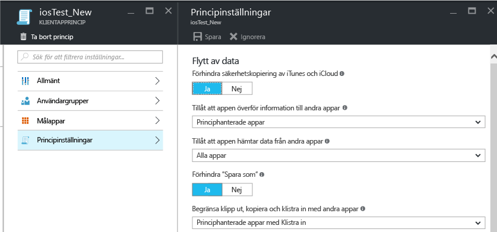

## Principinställningar
Välj något av följande om du vill se en fullständig lista med principinställningar för iOS och Android:

> [!div class="op_single_selector"]
  - [iOS-principer](ios-mam-policy-settings.md)
  - [Android-principer](android-mam-policy-settings.md)

## Nästa steg
[Övervaka efterlevnad och användarstatus](monitor-mobile-app-management-policies-with-microsoft-intune.md)

### Se även
[Slutanvändarupplevelse för MAM-aktiverade appar](end-user-experience-for-mam-enabled-apps-with-microsoft-intune.md)

<!--HONumber=Jun16_HO2-->

