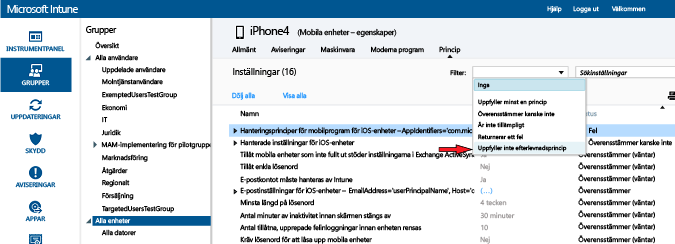

---
# required metadata

title: Distribuera och övervaka efterlevnadsprincipen i Microsoft Intune | Microsoft Intune
description:
keywords:
author: karthikaraman
manager: jeffgilb
ms.date: 04/28/2016
ms.topic: article
ms.prod:
ms.service: microsoft-intune
ms.technology:
ms.assetid: d8f246d4-0d86-4c8b-a1bf-9977985506d8

# optional metadata

#ROBOTS:
#audience:
#ms.devlang:
ms.reviewer: jeffgilb
ms.suite: ems
#ms.tgt_pltfrm:
#ms.custom:

---

# Distribuera och övervaka en enhetsefterlevnadsprincip i Microsoft Intune
## Distribuera en efterlevnadsprincip
Distribuera efterlevnadsprincipen som du har [skapat](create-a-device-compliance-policy-in-microsoft-intune.md) till en eller flera grupper av användare eller enheter i din organisation.

1.  På arbetsytan **Princip** väljer du den princip som du vill distribuera och väljer sedan **Hantera distribution**

2.  I dialogrutan **Hantera distribution** väljer du en eller flera grupper dit du vill distribuera principen och väljer sedan **Lägg till > OK**
 Använd statussammanfattning och varningar på sidan **Översikt** på arbetsytan **Principer** för att identifiera problem med principer som kräver din uppmärksamhet.

> [!IMPORTANT]Dessutom visas en statussammanfattning på arbetsytan **Instrumentpanel** .

## Om du inte har implementerat en villkorspolicy och därefter aktiverat en Exchange villkorlig åtkomstpolicy kommer alla målriktade enheter att ges tillgång.
Så här löser du Intunes principkonflikter Principkonflikter kan uppstå när flera Intune-principer används på en enhet.

-   Om principinställningarna överlappar varandra löser Intune eventuella konflikter med följande regler:

-   Om de motstridiga inställningarna är från en Intune-konfigurationsprincip och en efterlevnadsprincip, åsidosätter inställningar i efterlevnadsprincipen inställningarna i konfigurationsprincipen, även om inställningarna i konfigurationsprincipen är säkrare.

## Om du har distribuerat flera efterlevnadsprinciper används den säkraste av dessa principer.

#### Övervaka efterlevnadsprincipen

1.  Om du vill visa enheter som inte följer en efterlevnadsprincip

2.  I [Microsoft Intune-administrationskonsolen](https://manage.microsoft.com) väljer du **Grupper > Alla enheter**

3.  Dubbelklicka på namnet på en enhet i listan med enheter.

4.  Välj fliken **Princip** för att se en lista över principerna för den enheten.

#### Skärmbild som visar alternativen i listan filter

1.  Visa hälsoattesteringsrapporter

2.  I [Microsoft Intune-administrationskonsolen](https://manage.microsoft.com) väljer du **Rapporter** På sidan **Hälsoattesteringsrapport – Skapa en ny rapport** kan du visa en rapport med alla hälsoattesteringsdata för Windows 10 som Intune har samlat in. Du kan också skapa en rapport med en delmängd av data med hjälp av filter.

## Filtren kan baseras på enhetstyp, operativsystem eller endast en delmängd av datapunkter.
Nästa steg

[Du kan nu använda efterlevnadsprincipen med principer för villkorlig åtkomst och därigenom kontrollera åtkomsten till tjänster i din organisation.](restrict-access-to-email-and-o365-services-with-microsoft-intune.md)

### Begränsa åtkomst till e-post och O365-tjänster
[Se även](introduction-to-device-compliance-policies-in-microsoft-intune.md)

<!--HONumber=May16_HO2-->

