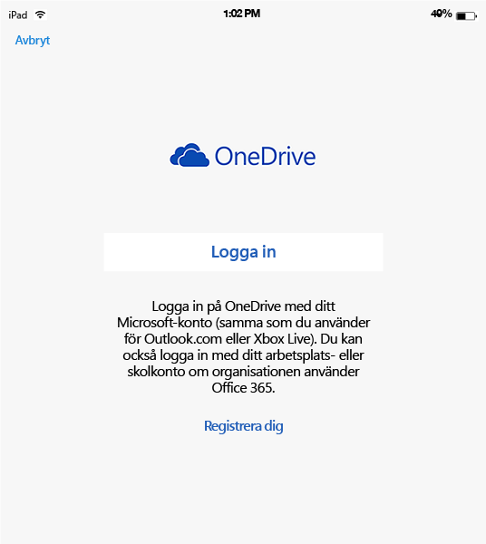
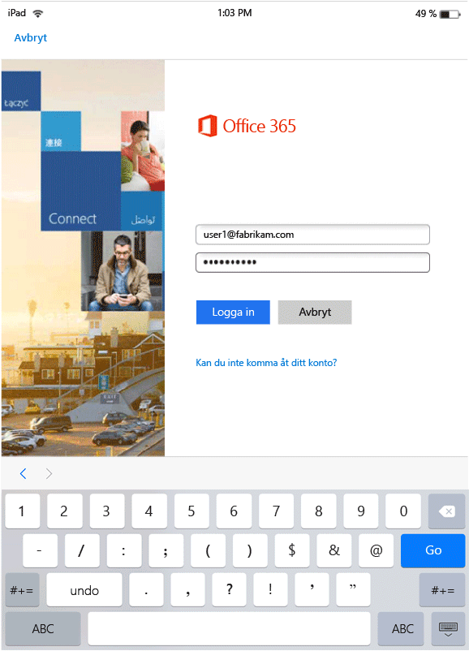
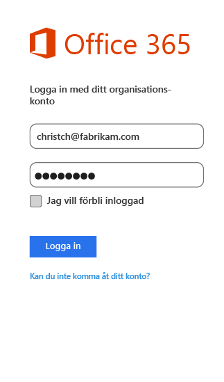
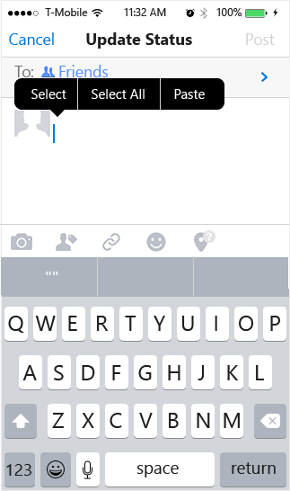
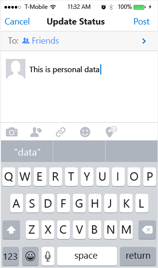

---
# required metadata

title: Slutanvändarupplevelse för MAM-aktiverade appar | Microsoft Intune
description:
keywords:
author: karthikaraman
manager: jeffgilb
ms.date: 04/28/2016
ms.topic: article
ms.prod:
ms.service: microsoft-intune
ms.technology:
ms.assetid: b57e6525-b57c-4cb4-a84c-9f70ba1e8e19

# optional metadata

#ROBOTS:
#audience:
#ms.devlang:
ms.reviewer: andcerat
ms.suite: ems
#ms.tgt_pltfrm:
#ms.custom:

---

# Slutanvändarupplevelse för MAM-aktiverade appar med Microsoft Intune
Hanteringsprinciper för mobilappar (MAM) används bara när appar används i en arbetskontext.  Läs följande scenarion för att förstå hur hanterade appar fungerar.
##  Komma åt OneDrive på en iOS-enhet

1.  Öppna inloggningssidan genom att starta  **OneDrive** -appen.

    

    > [!NOTE]
    > På en personlig enhet laddar slutanvändaren oftast ned appen.  Om enheten hanteras av en MDM-lösning kan du distribuera appen till enheten.

2.  Skriv användarnamnet för ditt arbetskonto. Du omdirigeras till **O365-autentiseringssidan** där du kan ange dina autentiseringsuppgifter för arbetet.

    

3.  När dina autentiseringsuppgifter har autentiserats av Azure AD tillämpas MAM-principerna och du uppmanas att starta om **OneDrive** -appen.

    

4.  När du startar om **OneDrive**-appen startas appen med MAM-principerna aktiverade. Nu uppmanas du att ange en **PIN-kod** för appen. (Om du konfigurerat principen för det).

    

5.  När du har angett och bekräftat PIN-koden kan du komma åt filerna på din **OneDrive för företag**.

    

    > [!NOTE] När du ändrar en distribuerad princip kommer ändringarna gälla nästa gång du öppnar appen.

##  Komma åt OneDrive på en Android-enhet

1.  Öppna inloggningssidan genom att starta OneDrive-appen.

    > [!NOTE]
    > På en personlig enhet laddar slutanvändaren oftast ned appen.  Om enheten hanteras av en MDM-lösning kan du distribuera appen till enheten.

2.  Skriv användarnamnet för ditt arbetskonto. Du omdirigeras till **O365-autentiseringssidan** där du kan ange dina autentiseringsuppgifter för arbetet.

    

3.  När dina autentiseringsuppgifter har autentiserats av **Azure AD**bör ett meddelande visas med anvisningar för att installera appen Företagsportal om den inte redan är installerad på enheten.  Fortsätt genom att trycka på **Hämta appen** .

>[!NOTE]
>Företagsportalappen krävs för alla appar som är kopplade till MAM-principer på Android-enheter. För enheter som inte har registrerats i Intune måste appen installeras på enheten, men det kräver inte start av eller inloggning i appen.  

  

4.  Nu befinner du dig i **Google Play Store** där du kan hämta och installera appen **Företagsportal** .

    Appen Företagsportal hjälper till att skydda dina data.

    

5.  När du har slutfört installationen accepterar du villkoren genom att klicka på **Acceptera** .

6.  **OneDrive** -appen startas automatiskt.

7.  Nästa gång du öppnar OneDrive uppmanas du att ange en **PIN-kod**, förutsatt att principen har konfigurerats att kräva en PIN-kod för åtkomst till **OneDrive** -appen.

    

8.  När PIN-koden angetts och bekräftats kan du fortsätta använda **OneDrive**, som nu hanteras av apprinciper.

##  Använda appar med stöd för flera identiteter
Microsoft Word används som exempel för det här scenariot.

1.  Öppna **Word** -appen på enheten. Vi använder en iOS-enhet för att illustrera stegen.

2.  Tryck på **Nytt** för att skapa ett nytt Word-dokument.

    

3.  Skriv in valfri mening.  När du försöker att spara dokumentet visas både personliga platser och arbetsplatser som alternativ för att spara dokumentet du nyss skapat.  I det här steget har apprinciperna inte tillämpats än eftersom kontexten arbete/personligt inte har definierats ännu.

4.  Spara dokumentet på platsen för OneDrive för företag. Nu märks dokumentet som företagsdata och principbegränsningarna gäller.

    

5.  Öppna dokumentet som du sparade till din arbetsplats.  Kopiera texten, öppna ditt personliga **Facebook**-konto och försök att klistra in den kopierade texten.  Du bör inte kunna klistra in innehållet i det nya Facebook-inlägget. Inklistringsalternativet är inte nedtonat men ingenting händer när du trycker på **Klistra in**.

    

    

6.  Upprepa nu steg 2 och 3 och skapa ännu ett nytt dokument, skriv en valfri mening och i stället för att spara den bland ditt arbete sparar du den på en personliga plats, exempelvis **OneDrive – personlig**.

    

7.  Öppna det personliga sparade dokumentet.  Kopiera texten, öppna **Facebook** -appen och försök att klistra in den kopierade texten. Som du ser kan du klistra in innehållet i ett Facebook-inlägg.

    

##  Hantera användarkonton

Intune har endast stöd för distribution av MAM-principer till endast ett användarkonto per enhet. Om en enhet har fler än ett arbetskonto hanteras endast ett arbetskonto av MAM-principerna.

Beroende på den app du använder kan den andra användaren eventuellt vara blockerad på enheten. I samtliga fall påverkas dock endast den första användaren som hämtar MAM-principerna av principen.

Om en enhet har flera befintliga användarkonton innan MAM-principerna distribueras kommer kontot som MAM-principerna distribueras till först att hanteras av Intune MAM-principer.

**Microsoft Word**, **Excel** och **PowerPoint** blockerar inte ett andra användarkonto, men det andra användarkontot påverkas inte av MAM-principerna.  

För **OneDrive- och Outlook-appar** kan du bara använda ett arbetskonto.  Det går inte att lägga till flera arbetskonton i dessa appar.  Däremot kan du ta bort en användare och lägga till en annan användare på enheten.

Läsa exemplet nedan för att få en bättre förståelse för hur flera användarkonton behandlas.

Användare A arbetar för två företag – **Företag X** och **Företag Y**. Användare A har ett arbetskonto för varje företag och båda använder Intune för att distribuera MAM-principer. **Företag X** distribuerar MAM-principer **före** **Företag Y**. Det konto som är kopplat till **Företag X** får MAM-principen, men inte kontot som är kopplat till Företag Y. Om du vill att användarkontot som är kopplat till Företag Y ska hanteras av MAM-principerna måste du ta bort användarkontot som är kopplat till Företag X.
### Lägga till ett andra konto
#### iOS
Om du använder en iOS-enhet visas ett blockeringsmeddelande om du försöker lägga till ett andra arbetskonto på samma enhet.  Du ser också ett alternativ för att ta bort det befintliga kontot och lägga till ett nytt. Du kan göra det genom att klicka på **Ja**.

####  Android
Om du använder en Android-enhet kan ett blockeringsmeddelande visas med instruktioner för att ta bort det befintliga kontot och lägga till ett nytt.  På Android-enheter tar du bort det befintliga kontot genom att gå till **Inställningar &gt;Allmänt &gt; Programhanterare &gt;Företagsportal och välja ”Rensa data”**.

##  Visa mediefiler med delningsappen Rights Management
Om du vill visa företagets AV-, PDF- och bildfiler på Android-enheter använder du [delningsappen Microsoft Rights Management (RMS)](https://play.google.com/store/apps/details?id=com.microsoft.ipviewer).

Hämta den här appen från Google Play Store.  När appen har installerats på enheten startar du appen och verifierar med dina autentiseringsuppgifter för företaget. Du bör nu kunna visa oskyddade och skyddade filer från andra principhanterade appar.

**Android-enheter som inte har registrerats i Intune**

Innan du kan använda RMS-delningsappen för att visa filer från andra appar som hanteras av Intune startar du RMS-appen och autentiserar med ditt arbetskonto.  När du loggar in visas följande meddelande **endast om du inte har en licens för RMS**:

**Autentisering lyckades – Nu kan du visa företagets filer, men din organisation har inte ställts in så att du kan skydda filer. Kontakta IT-administratören om du vill har mer information.**

Detta förhindrar inte att du använder RMS-delningsappen för att visa företagets filer. Du kan fortfarande öppna och visa företagets filer från andra appar som hanteras av Intune och MAM-principerna gäller fortfarande.  Meddelandet betyder att du inte kan lägga till ytterligare skyddsfunktioner som RMS-delningsappen innehåller.  Du måste ha en RMS-licens om du vill kunna lägga till skydd åt dina filer. Läs mer om RMS-funktionerna för filskydd i [Skydda en fil på en enhet](https://docs.microsoft.com/en-us/rights-management/rms-client/sharing-app-protect-in-place) och [Skydda en fil som du delar via e-post](https://docs.microsoft.com/en-us/rights-management/rms-client/sharing-app-protect-by-email).

### Se även
[Skapa och distribuera hanteringsprinciper för mobilappar med Microsoft Intune](create-and-deploy-mobile-app-management-policies-with-microsoft-intune.md)

<!--HONumber=Jun16_HO2-->

