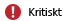
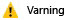

# Håll dig informerad med aviseringar från Microsoft Intune
Aviseringar låter dig ha koll på vad som händer i Microsoft Intune.

Aviseringar kan exempelvis låta dig få reda på följande händelser:

-   Ett problem med Exchange-anslutaren som påverkar mobil enhetshantering

-   Skadlig kod har hittats på en dator

-   En konflikt mellan två Intune-principer har upptäckts

## Så fungerar aviseringar
Aviseringar genereras baserat på **aviseringstyper**, en uppsättning förinställda regler som finns inbyggda i Intune. Aviseringstypen **Molnlagringen har 10% eller mindre ledigt utrymme** låter dig exempelvis veta när du börjar få slut på utrymme att lagra dina appar i molnet. Du kan aktivera eller inaktivera och konfigurera egenskaper för varje typ av avisering. Genom att använda ovanstående aviseringstyp kan du exempelvis konfigurera:

-   **Tillstånd:** Om aviseringstypen är aktiverad eller inaktiverad.

-   **Allvarlighetsgrad:** Hur allvarlig är den här aviseringen?

|Allvarlighetsgrad|Information|
|--------|-------|
    ||Anger ett allvarligt problem som du bör undersöka så fort som möjligt, exempelvis om skadlig kod har upptäckts på en dator.|
    ||Anger ett problem som inte är allvarligt än, men som kan bli allvarligt om du inte tar tag i det. Ett exempel är säkerhetsuppdateringar som väntar på att installeras.|
    ||Visar information som inte är driftskritisk, exempelvis att en ny version av Exchange-anslutaren finns tillgänglig.|

Andra aviseringstyper kan innehålla olika konfigurerbara objekt som exempelvis vilken procentsats av enheter som ska vara påverkade av ett problem innan en avisering genereras.

**När villkoret i en aviseringstyp uppfylls genereras en avisering som visas i administratörskonsolen för Intune.**

Du kan dessutom konfigurera Intune att meddela dig via e-post när en avisering genereras.

## Att konfigurera aviseringar
I [Microsoft Intune-administrationskonsolen](https://manage.microsoft.com) väljer du **Admin** &gt; **Aviseringar och meddelanden**, och väljer sedan någon av följande konfigurationsåtgärder.

|Aktivitet|Beskrivning|
|--------|---------------|
|**Aviseringstyper**|Välj den aviseringstyp du vill konfigurera och gör sen något av följande:  Välj **Konfigurera**. I dialogrutan **Konfigurera aviseringstyp** konfigurerar du önskade inställningar och klickar sedan på **OK**.  **Aktivera** eller **Inaktivera** aviseringen.  Expandera noden **Aviseringstyper** och välj en kategori för att bara visa aviseringstyperna i den kategorin.|
|**Mottagare**|Klicka på **Lägg till** om du vill lägga till en ny e-postadress som ska ta emot de e-postmeddelanden som du konfigurerar.  Du kan också **Redigera** eller **Ta bort** befintliga mottagare.  För att ta emot aviseringar måste du även lägga till e-postadressen som mottagare under **Aviseringsregler**.|
|**Aviseringsregler**|Konfigurerar regler som definierar vem en e-postavisering kommer skickas till. Du kan antingen:  **Välj en befintlig regel** – Välj en regel och klicka sedan på **Välj mottagare**. Sedan kan du välja alla mottagare som kommer få ett e-postmeddelande när en avisering som uppfyller regeln har genererats.  **Skapa en ny regel** - Ange ett namn för regeln, välj aviseringskategorier och allvarlighetsgrad som ska gälla för reglerna, välj de enhetsgrupper som regeln gäller för och markera de användare som ska få ett e-postmeddelande när en avisering har genererats.  Du kan också **Aktivera**, **Avaktivera**, **Redigera**, or **Ta bort** en befintlig regel.|

## Arbeta med aviseringar
Använd följande alternativ för att hjälpa dig arbeta med aviseringar från Intunes adminstratörskonsol.

|Alternativ|Beskrivning|
|----------|---------------|
|**Visa aktiva aviseringar**|Välj något av:  **Visa en aviseringssammanställning** - På arbetsytan **Instrumentpanel**, visas de viktigaste felen i Aviseringspanelen. Klicka på fönstret om du vill se mer detaljerad information.  Dessutom kan du visa en sammanställning av aviseringar på sidan **Översikt** i arbetsytan **Aviseringar** .  **Visa alla aviseringar** – Gå till arbetsytan **Aviseringar** och klicka på **Alla aviseringar**.|
|**Visa meddelanden**|Välj något av:  Gå till arbetsytan **Instrumentpanel** och välj **Meddelanden**.  På arbetsytan **Aviseringar** väljer du **Alla aviseringar** &gt; **Aviseringar**.|
|**Att stänga en avisering**|I listan över aviseringar väljer du vilken avisering du vill stänga och klickar på **Stäng avisering**.  Stängda aviseringar tas bort permanent efter 90 dagar.|
|**Att återaktivera en stängd avisering**|I listan över aviseringar öppnar du listrutan **Filter** och väljer **Stängd**.  I listan över stängda aviseringar väljer du den avisering som du vill återaktivera och klickar sedan på **Återaktivera avisering**.|
Intune-aviseringar är aktiva tills:

-   Det problem som orsakade aviseringen har lösts

-   Aviseringen stängs manuellt.

-   Det har gått 45 dagar sedan aviseringen genererades

> [!TIP]
> Om samma avisering genereras av enheter som kör olika operativsystem så är det möjligt att du ser flera versioner av samma avisering i aviseringslistan.

### Se även
[Övervakning och rapporter med Microsoft Intune](monitoring-and-reports-with-microsoft-intune.md)

<!--HONumber=Jul16_HO4-->

