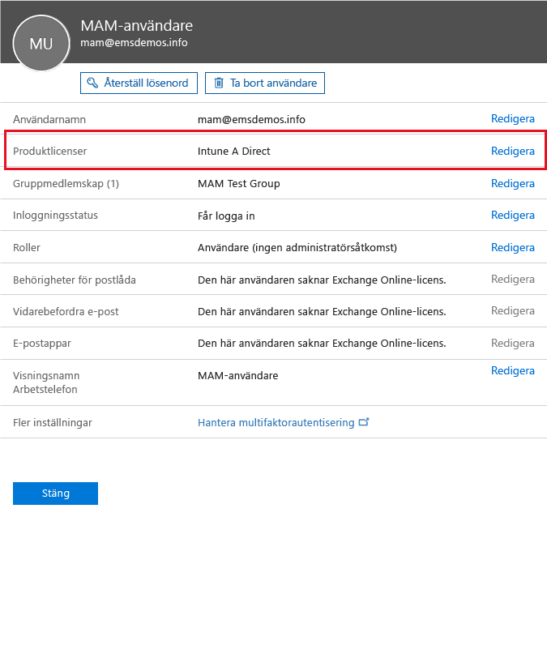

# Förbered dig för att konfigurera hanteringsprinciper för mobila appar med Microsoft Intune
I här artikeln beskrivs vad du behöver göra innan du kan skapa principer för hantering av mobilappar (MAM) i Azure Portal.

Azure Portal är den nya administratörskonsolen för att skapa MAM-principer. Vi rekommenderar att du använder den här portalen när du skapar MAM-principer. Azure Portal har stöd för följande MAM-scenarier:
- Enheter som har registrerats i Intune
- Enheter som hanteras av en MDM-lösning från tredje part
- Enheter som inte hanteras av någon MDM-lösning (BYOD)

Om du inte har använt Azure Portal tidigare kan du läsa avsnittet [Azure Portal för Microsoft Intune MAM-principer](azure-portal-for-microsoft-intune-mam-policies.md) så får du en snabb överblick.

>[!IMPORTANT]

> Om du för närvarande använder Intune-administratörskonsolen för att hantera enheterna kan du skapa MAM-principer som har stöd för appar för enheter som har registrerats i Intune med Intune-administratörskonsolen. Men vi rekommenderar att du använder Azure Portal även för enheter som registreras i Intune. Anvisningar om hur du skapar en MAM-princip med hjälp av Intune-administratörskonsolen finns i [Konfigurera och distribuera hanteringsprinciper för mobilprogram i Microsoft Intune-konsolen](configure-and-deploy-mobile-application-management-policies-in-the-microsoft-intune-console.md).

> Du kanske inte kan se alla MAM-principinställningar i Intune-administratörskonsolen. Om du skapar MAM-principer i både Intune-administratörskonsolen och Azure Portal är det principen i Azure Portal som tillämpas på apparna och distribueras till användarna.
> MAM-principer som skapas i Intune-administratörskonsolen kan inte importeras till Azure Portal.  MAM-principer måste återskapas i Azure Portal.

##  Plattformar som stöds
- iOS 8.1 eller senare

- Android 4 eller senare

Windows-enheter stöds inte för tillfället.
##  Appar som stöds
* **Microsoft-appar:** Dessa appar har en inbyggd app-SDK för Intune och kräver ingen ytterligare bearbetning innan du tillämpar MAM-principer.
Om du vill se en fullständig lista över Microsoft-appar som stöds går du till [Microsoft Intune-mobilprogramsgalleriet](https://www.microsoft.com/en-us/server-cloud/products/microsoft-intune/partners.aspx) på sidan för Microsoft Intune-programpartner. Klicka på appen om du vill se vilka scenarier och plattformar som stöds och huruvida appen har stöd för flera identiteter.
* **Verksamhetsspecifika appar:** Med dessa måste appen förberedas för att innefatta Intune App SDK innan du kan tillämpa MAM-principer.

  * För enheter som hanteras av Intune, se [Besluta hur du ska förbereda appar för MAM](decide-how-to-prepare-apps-for-mobile-application-management-with-microsoft-intune.md).
  * För enheter som inte hanteras som personalägda enheter eller för enheter som hanteras av en tredjepartslösning för hantering av mobila enheter finns mer information i [Skydda branschspecifika appar och data på enheter som inte har registrerats i Intune](protect-line-of-business-apps-and-data-on-devices-not-enrolled-in-microsoft-intune.md).

*Innan* du kan konfigurera MAM-principer behöver du följande:

-   En prenumeration på Microsoft Intune.    Användare behöver [!INCLUDE[wit_nextref](../includes/wit_nextref_md.md)]-licenser för att hämta appar som har MAM-principer.

-   En prenumeration på Office 365, vilket krävs för följande:
  - Tillämpa MAM-principer för appar med stöd för flera identiteter.
  - Skapa konton för SharePoint Online och Exchange Online-arbete. Lokalt Exchange och lokalt SharePoint stöds inte.
-   Installation av Skype för företag – Online för modern autentisering. Mer information finns i [Aktivera modern autentisering](http://social.technet.microsoft.com/wiki/contents/articles/34339.skype-for-business-online-enable-your-tenant-for-modern-authentication.aspx.md).

- Azure Active Directory (Azure AD) för att skapa användare. Azure AD autentiserar användare när de öppnar appen och anger sina autentiseringsuppgifter för arbetet.

    > [!NOTE]
    > Observera att MAM-principkonfigureringen flyttar till Azure Portal, om du konfigurerar användare med [!INCLUDE[wit_nextref](../includes/wit_nextref_md.md)]-konsolen. För att kunna använda den här portalen måste du skapa användargrupper i Azure AD med hjälp av Office 365-portalen.

## Skapa användare och tilldela Microsoft Intune-licenser

1. Se till att du har en Intune-prenumeration. Du har redan en [!INCLUDE[wit_nextref](../includes/wit_nextref_md.md)]-prenumeration om du för närvarande använder [!INCLUDE[wit_nextref](../includes/wit_nextref_md.md)] för att hantera enheter.  Du har också en [!INCLUDE[wit_nextref](../includes/wit_nextref_md.md)]-prenumeration om du har köpt en EMS-licens (Enterprise Mobility Suite). Om du provar [!INCLUDE[wit_nextref](../includes/wit_nextref_md.md)] för att få en överblick över MAM-funktionerna kan du skapa ett utvärderingskonto på [webbsidan för Microsoft Intune](http://www.microsoft.com/en-us/server-cloud/products/microsoft-intune/).

    Du kan kontrollera om du har en [!INCLUDE[wit_nextref](../includes/wit_nextref_md.md)]-prenumeration på sidan **Fakturering** på Office-portalen.  [!INCLUDE[wit_nextref](../includes/wit_nextref_md.md)] ska visas som **aktivt** i prenumerationerna.

2.  Logga in som administratör på [Office-portalen](http://portal.office.com).

3.  Gå till sidan **Aktiva användare** och lägg till användare och tilldela [!INCLUDE[wit_nextref](../includes/wit_nextref_md.md)]-licenser.

    

    

4.  Om du vill ge en användare möjlighet att komma åt Office-portalen, Azure AD-portalen och Azure Portal tilldelar du användaren rollen **Global administratör**.

    

5.  MAM-principer har distribuerats till användargrupper i Azure Active Directory. Om du vill skapa användargrupper för MAM-principerna går du till sidan **Grupper** på Office-portalen och väljer alternativet **Lägg till en grupp** på den översta menyn för att skapa en ny säkerhetsgrupp.  Skriv ett namn och en beskrivning och klicka sedan på **Skapa**. När gruppen har skapats kan du lägga till användaren i gruppen genom att klicka på **Redigera medlemmar**. Säkerhetsgruppen har skapats i Azure Active Directory.

    

I följande tabell visas de roller och behörigheter som du kan tilldela administrativa användare.

|||
|--|----|
|**Roll**|**Behörigheter**|
|Global administratör (Office 365-portalen)|Åtkomst till Office 365-portalen och Azure AD-portalen.  Åtkomst till Azure Portal (kan utföra uppgifter för både roll- och mobilappshantering).|
|Ägare (Azure Portal)|Åtkomst till Azure Portal (kan utföra uppgifter för både roll- och mobilappshantering).|
|Deltagare (Azure Portal)|Åtkomst till Azure Portal (kan bara utföra uppgifter för mobilappshantering).|

## Tilldela en användare deltagarrollen

Globala administratörer har åtkomst till [Azure Portal](https://portal.azure.com).  Om du vill att andra administrativa användare ska kunna konfigurera principer och utföra andra uppgifter för hantering av mobilappar kan du tilldela deltagarrollen till användarna:

1.  Gå till bladet **Inställningar** och klicka på **Användare** i avsnittet **Resurshantering**.

    

2.  Klicka på **Lägg till** för att öppna bladet **Lägg till åtkomst** .

3.  Klicka på **Välj en roll** och sedan på **Deltagare**.

    

4.  Klicka på **Lägg till användare** och sök efter användare efter namn eller e-postadress. Användarna som visas i listan är de 1 000 första användarna som du tidigare skapade i Azure AD med hjälp av Office-portalen. Klicka på **OK** på bladet **Lägg till åtkomst** för att spara och tilldela användaren rollen.

    

    > [!IMPORTANT]
    > Om du väljer en användare som inte har tilldelats någon [!INCLUDE[wit_nextref](../includes/wit_nextref_md.md)]-licens kommer den användaren inte att komma åt portalen.

## Nästa steg
[Skapa och distribuera hanteringsprinciper för mobilappar med Microsoft Intune](create-and-deploy-mobile-app-management-policies-with-microsoft-intune.md)

<!--HONumber=Jul16_HO4-->

