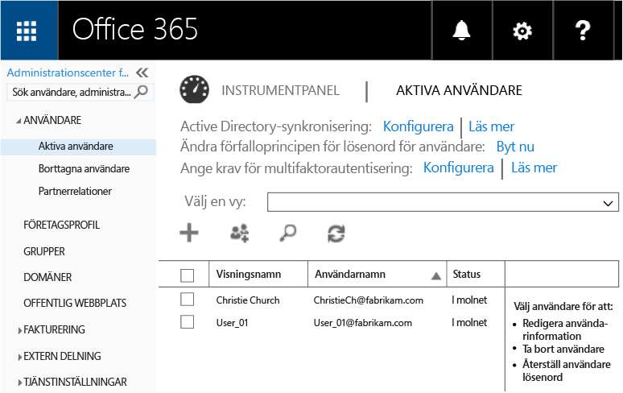
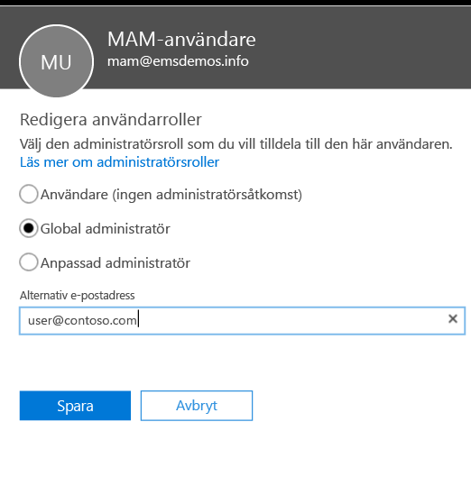
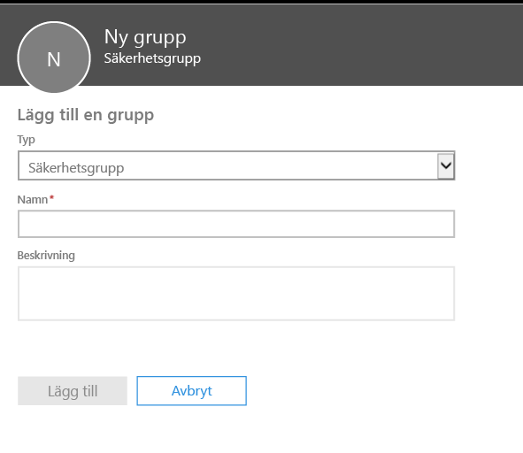
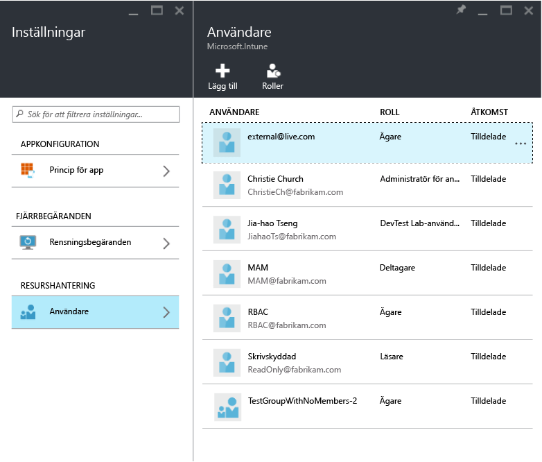
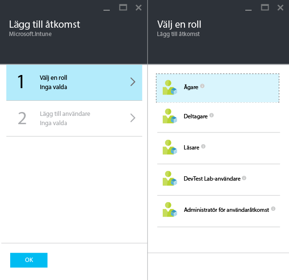
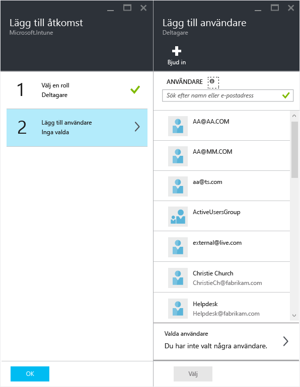

---
# required metadata

title: Förbered dig för att konfigurera hanteringsprinciper för mobila appar | Microsoft Intune
description:
keywords:
author: karthikaraman
manager: jeffgilb
ms.date: 04/28/2016
ms.topic: article
ms.prod:
ms.service: microsoft-intune
ms.technology:
ms.assetid: 7e6a85e7-e007-41b6-9034-64d77f547b87

# optional metadata

#ROBOTS:
#audience:
#ms.devlang:
ms.reviewer: jeffgilb
ms.suite: ems
#ms.tgt_pltfrm:
#ms.custom:

---

# Förbered dig för att konfigurera hanteringsprinciper för mobila appar med Microsoft Intune
Den här artikeln beskriver vad du behöver göra innan du kan skapa principer för hantering av mobilappar (MAM) i Azure Portal.

Azure Portal är en ny administratörskonsol som används för att skapa MAM-principer och vi rekommenderar att du använder den här portalen när MAM-principerna skapas. Azure Portal har stöd för följande MAM-scenarier:
- Enheter som har registrerats i Intune
- Enheter som hanteras av en MDM-lösning från tredje part
- Enheter som inte hanteras av någon MDM-lösning (BYOD).

Om du inte har använt Azure Portal tidigare kan du läsa avsnittet [Azure Portal för Microsoft Intune MAM-principer](azure-portal-for-microsoft-intune-mam-policies.md) så får du en snabb överblick.

Om du för närvarande använder **Intune-administratörskonsolen** för att hantera dina enheter kan du skapa MAM-principer som har stöd för appar för enheter som är registrerade i Intune med hjälp av **Intune-administratörskonsolen**, men det är bäst att använda Azure Portal även för enheter som är registrerade i Intune. Anvisningar för hur du skapar en MAM-princip med Intune-administratörskonsolen finns [här](configure-and-deploy-mobile-application-management-policies-in-the-microsoft-intune-console.md).

>[!IMPORTANT]
> Du kanske inte kan se alla MAM-principinställningar i Intune-administratörskonsolen. Om du skapar principer för MAM i både Intune-administrationskonsolen och Azure Portal tillämpas principen i Azure Portal på apparna och distribueras till användarna.

##  Plattformar som stöds
- iOS 8.1 eller senare

- Android 4 eller senare

##  Appar som stöds
* **Microsoft-appar:** Dessa appar har en inbyggd app-SDK för Intune och kräver ingen ytterligare bearbetning innan du tillämpar MAM-principer.
Om du vill se en fullständig lista över Microsoft-appar som stöds går du till [Microsoft Intune-mobilprogramsgalleriet](https://www.microsoft.com/en-us/server-cloud/products/microsoft-intune/partners.aspx) på sidan för Microsoft Intune-programpartner. Klicka på appen om du vill se vilka scenarier och plattformar som stöds och huruvida appen har stöd för flera identiteter.
* Din internt byggda **Branschspecifika appar:** Med dessa måste appen förberedas för att inkludera Intune App SDK innan du kan tillämpa MAM-principer.

  * För enheter som hanteras av Intune, se [Besluta hur du ska förbereda appar för MAM](decide-how-to-prepare-apps-for-mobile-application-management-with-microsoft-intune.md).
  * För enheter som inte hanteras som medarbetarägda enheter eller för enheter som hanteras av en tredjepartslösning för hantering av mobila enheter finns mer information i [Skydda branschspecifika appar och data på enheter som inte har registrerats i Intune](protect-line-of-business-apps-and-data-on-devices-not-enrolled-in-microsoft-intune.md).

**Innan** du kan konfigurera MAM-principer behöver du följande:

-   **En prenumeration på Microsoft Intune**.    Slutanvändare behöver [!INCLUDE[wit_nextref](../includes/wit_nextref_md.md)]-licenser för att hämta appar med MAM-principen.

-   En prenumeration på **Office 365 (O365)** som krävs för följande:
  - Tillämpa MAM-principer för appar med stöd för flera identiteter.
  - Skapa konton för SharePoint Online och Exchange Online-arbete. Lokalt Exchange och lokalt SharePoint stöds inte.
-    **Aktivera modern autentisering** för **Skype för företag – online**. Logga in på Microsoft Connect och fyll i [det här formuläret](https://connect.microsoft.com/office/Survey/NominationSurvey.aspx?SurveyID=17299&ProgramID=8715) om du vill registreras i programmet för modern autentisering.

- **Azure Active Directory (Azure AD)** för att skapa användare. Azure AD autentiserar användaren när slutanvändaren startar appen och anger sina autentiseringsuppgifter.

    > [!NOTE] Om du konfigurerar användare via [!INCLUDE[wit_nextref](../includes/wit_nextref_md.md)]-konsolen bör du tänka på att MAM-principskonfigureringen flyttar till Azure Portal framöver och om du vill använda den här portalen måste du skapa användargrupper i Azure AD med hjälp av Office 365-portalen.

## Skapa användare och tilldela Microsoft Intune-licenser

1. Du behöver en Intune-prenumeration: Du har redan en [!INCLUDE[wit_nextref](../includes/wit_nextref_md.md)]-prenumeration om du för närvarande använder [!INCLUDE[wit_nextref](../includes/wit_nextref_md.md)] för att hantera enheter.  Du har också en [!INCLUDE[wit_nextref](../includes/wit_nextref_md.md)]-prenumeration om du har köpt en EMS-licens. Om du provar [!INCLUDE[wit_nextref](../includes/wit_nextref_md.md)] för att få en överblick av MAM-funktionerna kan du skapa ett provkonto [här](http://www.microsoft.com/en-us/server-cloud/products/microsoft-intune/).

    Kontrollera om du har en [!INCLUDE[wit_nextref](../includes/wit_nextref_md.md)]-prenumeration genom att besöka sidan Fakturering på Office-portalen.  Du bör se [!INCLUDE[wit_nextref](../includes/wit_nextref_md.md)] som **aktivt** under prenumerationerna.

2.  Logga in på   [Office-portalen](http://portal.office.com) med dina autentiseringsuppgifter som administratör.

3.  Navigera till sidan **Aktiva användare** för att lägga till användare och tilldela [!INCLUDE[wit_nextref](../includes/wit_nextref_md.md)]-licenser.

    

4.  Om du vill ge en användare möjlighet att komma åt Office-portalen, Azure AD-portalen och Azure Portal tilldelar du användaren rollen **Global administratör**.

    

5.  MAM-principer har distribuerats till användargrupper i Azure Active Directory. Om du vill skapa användargrupper som ska användas i MAM-principerna navigerar du till sidan **Grupper** på **Office-portalen** och klickar på ikonen **+** för att skapa en ny säkerhetsgrupp.  Skriv ett namn och en beskrivning och klicka på **Skapa**. När gruppen skapas kan du lägga till användaren i gruppen genom att klicka på **Redigera medlemmar** i den nya säkerhetsgruppen. Säkerhetsgruppen har skapats i Azure Active Directory.

    

I följande tabell visas rollen och behörigheterna som du kan tilldela administrativa användare.

|||
|--|----|
|**Roll**|**Behörigheter**|
|Global administratör (O365-portalen)|Åtkomst till O365-portalen och Azure AD-portalen  Åtkomst till Azure Portal (kan utföra uppgifter för både roll- och mobilappshantering).|
|Ägarrollen (Azure Portal)|Åtkomst till Azure Portal (kan utföra uppgifter för både roll- och mobilappshantering).|
|Deltagarrollen (Azure Portal)|Åtkomst till Azure Portal (kan bara utföra uppgifter för mobilappshantering).|

## Tilldela en användare deltagarrollen

**Globala administratörer** har åtkomst till [Azure Portal](https://portal.azure.com).  Om du vill att andra administrativa användare ska kunna konfigurera principer och utföra andra uppgifter för hantering av mobilappar kan du tilldela användaren **deltagarrollen** enligt beskrivningen nedan:

1.  Gå till bladet **Inställningar** och klicka på **Användare** i avsnittet **Resurshantering**.

    

2.  Klicka på **Lägg till** för att öppna bladet **Lägg till åtkomst** .

3.  Klicka på **Välj en roll**och sedan på **Deltagarroll**.

    

4.  När du har valt rollen klickar du på **Lägg till användare**och söker efter användaren med användarnamn eller e-postadress. Användarna som visas i listan är de 1 000 första användarna som du tidigare skapade i Azure AD med hjälp av Office-portalen. Klicka på **Ok** på bladet **Lägg till åtkomst** för att spara och tilldela användaren rollen.

    

    > [!IMPORTANT] Om du väljer en användare som inte har tilldelats någon [!INCLUDE[wit_nextref](../includes/wit_nextref_md.md)]-licens kommer den här användaren inte att komma åt portalen.

## Nästa steg
[Skapa och distribuera hanteringsprinciper för mobilappar med Microsoft Intune](create-and-deploy-mobile-app-management-policies-with-microsoft-intune.md)

<!--HONumber=May16_HO3-->

