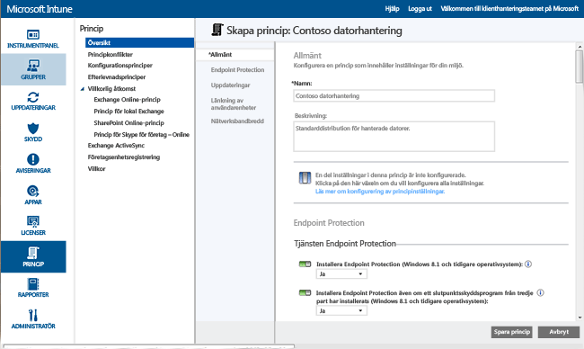
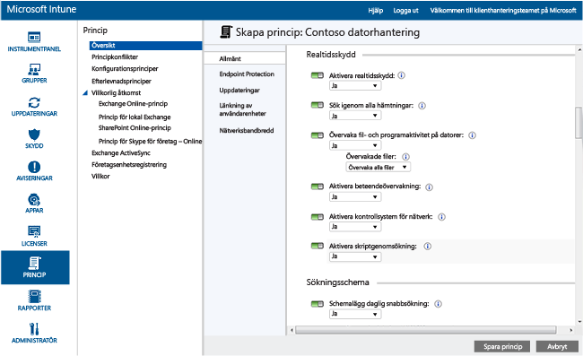
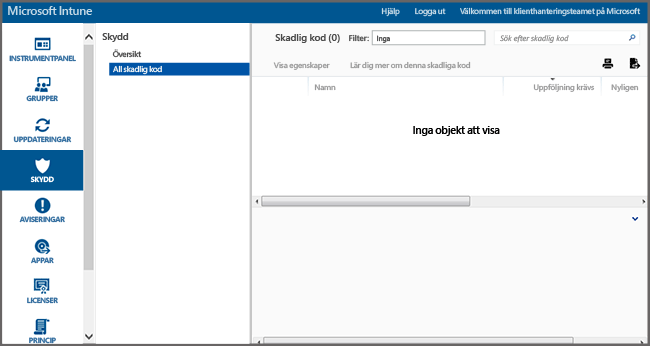

---
# required metadata

title: Endpoint Protection för Windows-datorer| Microsoft Intune
description:
keywords:
author: NathBarn
manager: jeffgilb
ms.date: 04/28/2016
ms.topic: article
ms.prod:
ms.service: microsoft-intune
ms.technology:
ms.assetid: 002241bf-6cd0-4c75-a4f0-891ac7e6721a

# optional metadata

#ROBOTS:
#audience:
#ms.devlang:
ms.reviewer: jeffgilb
ms.suite: ems
#ms.tgt_pltfrm:
#ms.custom:

---

# Skydda Windows-datorer med Endpoint Protection för Microsoft Intune
Microsoft Intune kan hjälpa dig att skydda dina hanterade datorer på en mängd sätt, inklusive Endpoint Protection som ger realtidsskydd mot skadlig kod, bibehåller uppdaterade definitioner för skadlig kod och skannar datorer automatiskt. Endpoint Protection innehåller dessutom verktyg som hjälper dig att hantera och övervaka angrepp från skadlig kod.

Om du ännu inte har installerat Intune-klienten på dina datorer, se [Installera Windows PC-klienten med Microsoft Intune](install-the-windows-pc-client-with-microsoft-intune.md).

Använd informationen i de följande avsnitten som hjälp när du konfigurerar, distribuerar och övervakar Endpoint Protection.

## Välj när Endpoint Protection ska användas
Som IT-administratör är en av dina högsta prioriteter att hålla datorer som du hanterar fria från skadlig programvara och virus. Innan du distribuerar Intune på Windows-datorerna i din organisation bör du bestämma hur datorerna ska skyddas genom att välja ett av följande alternativ och konfigurera inställningarna för associerade principer:

|Jag vill:|Principinställningar för Endpoint Protection|Mer information|
|--------------|---------------------------------------|--------------------|
|Använd Microsoft Intune Endpoint Protection endast när inget slutpunktsskyddsprogram från tredje part har installerats.  Du kan använda Microsoft Intune Endpoint Protection på alla datorer där ett slutpunktsskyddsprogram från tredje part inte har installerats.|Installera Endpoint Protection = **Ja**  Aktivera Endpoint Protection = **Ja**  Installera Endpoint Protection även om ett slutpunktsskyddsprogram från tredje part har installerats = **Nej**|Om ett slutpunktsskyddsprogram från tredje part upptäcks installeras, kommer Microsoft Intune Endpoint Protection inte att installeras, eller kommer att avinstalleras om det redan har installerats.|
|Använd Microsoft Intune Endpoint Protection även om ett slutpunktsskyddsprogram från tredje part har installerats.  Med den här metoden körs Microsoft Intune Endpoint Protection och ett slutpunktsskyddsprogram från tredje part parallellt. Detta är inte en rekommenderad konfiguration och kan medföra sämre prestanda.|Installera Endpoint Protection = **Ja**  Aktivera Endpoint Protection = **Ja**  Installera Endpoint Protection även om ett slutpunktsskyddsprogram från tredje part har installerats = **Ja**|Använd när:  - Du vill växla till att använda Microsoft Intune Endpoint Protection. - Du distribuerar en ny klient som ska använda Microsoft Intune Endpoint Protection - Du uppgraderar en klient som ska använda Microsoft Intune Endpoint Protection|
|Använd Intune utan Microsoft Intune Endpoint Protection. Istället kommer du förlita dig på ett slutpunktsskyddsprogram från tredje part.|Installera Endpoint Protection = **Nej**|Om du inte använder ett slutpunktsskyddsprogram från tredje part rekommenderas inte den här konfigurationen eftersom den kan uttsätta organisationens datorer för skadlig programvara eller andra attacker.  Microsoft Intune Endpoint Protection installeras inte och avinstalleras om det har installerats tidigare.|
Om du vill växla från ditt aktuella slutpunktsskydd till Microsoft Intune Endpoint Protection, gör du följande:

1.  Låt ditt aktuella slutpunktsskyddprogram köra medan du distribuerar Intune-klientprogramvaran på dessa datorer.

2.  Bekräfta att Microsoft Intune Endpoint Protection har installerats och skyddar klientdatorerna.

3.  Ta bort från slutpunktsskyddprogram från tredje part så här:

    -   Installera ett avinstallationsverktyg med hjälp av programvarudistribution för Intune som tillhandahålls av tillverkaren av slutpunktsskyddprogrammet. Mer information finns i [Distribuera appar med Microsoft Intune](deploy-apps.md).

    -   Ta bort från slutpunktsskyddprogram från tredje part manuellt så här:

> [!NOTE] Intune kommer inte att avinstallera slutpunktsskyddsprogram från tredje part automatiskt.

## Så här konfigurerar du Microsoft Intune Endpoint Protection
Använd följande steg när du konfigurerar Endpoint Protection för Microsoft Intune.

1.  Gå till [Microsoft Intune-administrationskonsolen](https://manage.microsoft.com/) och klicka på **Princip** > **Lägg till princip**.

2.  Expandera **Datorhantering** och välj **Inställningar för Microsoft Intune Agent**. Välj **Skapa och distribuera en anpassad princip** för att ange en princip för Endpoint Protection-inställningar och klicka sedan på knappen **Skapa princip**. Du kan använda rekommenderade inställningar eller anpassa inställningarna. Om du behöver mer information om hur du skapar och distribuerar principer läser du artikeln [Vanliga hanteringsuppgifter för Windows-datorer med Microsoft Intune-datorklienten](common-windows-pc-management-tasks-with-the-microsoft-intune-computer-client.md).

  

Du kan visa den distribuerade principen för Endpoint Protection på sidan **Alla principer** på arbetsytan **Principer**.

## Serviceinställningar för Endpoint Protection

|Principinställningar|Information|
|------------------|--------------------|
|**Installera Endpoint Protection**|Ställ in på **Ja** för att installera Endpoint Protection på hanterade datorer. Om ett slutpunktsskyddsprogram från tredje part upptäcks under installationen kan Endpoint Protection inte installeras om inte alternativet **Installera Endpoint Protection även om ett slutpunktsskyddsprogram från tredje part har installerats** har angetts till **Ja**. **Obs!** Intune Endpoint Protection installeras på hanterade datorer som standard. Om du inte vill att Endpoint Protection ska installeras på hanterade datorer, måste du uttryckligen ställa in principen till **Nej**. Om Endpoint Protection redan har installerats och principen uppdateras till **Nej** kommer Endpoint Protection-klienten att avinstalleras. Rekommenderat värde: **Ja**|
|**Installera Endpoint Protection även om ett slutpunktsskyddsprogram från tredje part har installerats**|Ställa in på **Ja** för att installera Microsoft Intune Endpoint Protection även om ett slutpunktsskyddsprogram från tredje part har identifierats.  Rekommenderat värde: **Ja**|
|**Aktivera Endpoint Protection**|Ange till **Ja** för att aktivera Microsoft Intune Endpoint Protection på datorer som har Endpoint Protection-klienten.  Om värdet är **Nej** och Microsoft Intune Endpoint Protection har installerats kommer Endpoint Protection-klientens användargränssnitt inte att visas för användaren och alla skyddsfunktioner kommer att avaktiveras.  Rekommenderat värde: **Ja**|
|**Inaktivera klientens användargränssnitt**|Ställ in på **Ja** om du vill dölja Microsoft Intune Endpoint Protection-klientens användargränssnitt från användare (kräver en omstart av klienten för att träda i kraft).  Rekommenderat värde: **Nej**|
|**Installera Endpoint Protection även om ett slutpunktsskyddsprogram från tredje part har installerats**|Ställ in på **Ja** för att tvinga igenom installationen av Microsoft Intune Endpoint Protection även om ett slutpunktsskyddsprogram från tredje part har identifierats.  Rekommenderat värde: **Nej**|
|**Skapa en återställningspunkt för systemet innan åtgärder mot skadlig kod**|Ange till **Ja** att skapa en återställningspunkt för Windows-systemet innan du påbörjar åtgärder mot skadlig kod.  Rekommenderat värde: **Ja**|
|**Spåra åtgärdad skadlig kod (dagar)**|Gör att Endpoint Protection kan spåra skadlig kod som har åtgärdats under en viss tid så att du kan kontrollera datorer som har påverkats tidigare manuellt.  Du kan ange ett värde mellan 0 och 30 dagar.  Rekommenderat värde: **7 dagar**|
Om du har ställt in principvärden för **Installera Endpoint Protection** och **Aktivera Endpoint Protection** som **Ja**och principvärdet för  **Installera Endpoint Protection även om ett slutpunktsskyddsprogram från tredje part har installerats** som **Nej**, Microsoft Intune Endpoint Protection upptäcker att ett annat slutpunktsskydd har installerats och avbryter installationen eller avinstalleras om det redan har installerats. (däremot kan Microsoft Intune Endpoint Protection rapportera om det andra slutpunktsskyddprogrammets prestanda i Intune).

  Realtidsskydd är hur Microsoft Security Essentials aviserar dig när potentiella hot, till exempel virus och spionprogram, försöker installeras eller köras på datorn. Den tidpunkt då det händer visas ett meddelande i meddelandefältet längst till höger i aktivitetsfältet

### Inställningar för realtidsskydd

|Principinställningar|Information|
|------------------|--------------------|
|**Aktivera realtidsskydd**|Aktiverar övervakning och skanning för alla filer och program som nås. Blockerar också skadliga filer och program innan de kan köras på datorer.  Rekommenderat värde: **Ja**|
|**Skanna alla hämtningar**|Aktiverar skanning av alla filer och bifogade filer som hämtas från internet till datorer.  Rekommenderat värde: **Ja**|
|**Övervaka fil- och programaktivitet på datorer**|Aktiverar övervakning av inkommande filer och utgående filer samt programaktivitet på datorer. Med den här inställningen kan Endpoint Protection övervaka när filer och program startar och varnar om att åtgärder som de vidtar eller åtgärder som vidtas på dem.  Rekommenderat värde: **Ja**|
|**Filer som övervakas**|Om **Övervaka fil- och programaktiviteter på datorer** är aktiverad kan den här inställningen kan du välja om endast inkommande, endast utgående eller alla filer ska övervakas.  Rekommenderat värde: **Övervaka alla filer**|
|**Aktivera prestandaövervakning**|Gör det möjligt för Microsoft Intune Endpoint Protection att kontrollera vissa mönster på misstänkt aktivitet på klientdatorer.  Rekommenderat värde: **Ja**|
|**Aktivera system för nätverksinspektion**|Aktiverar kontrollsystem för nätverk (NIS) på klientdatorer. NIS använder signaturer för kända problem från [Microsoft Malware Protection Center](http://go.microsoft.com/fwlink/?LinkId=234249) för att identifiera och blockera skadlig nätverkstrafik.  Rekommenderat värde: **Ja**|

  

### Skanna inställningar för schemaläggning

|Principinställningar|Mer information|
|------------------|--------------------|
|**Schemalägg en snabb daglig genomgång**|Schemalägger en daglig snabbgenomgång av både vanliga och viktiga systemfiler på datorer. Den här snabbgenomgången har minimal inverkan på prestandan.  Rekommenderat värde: **Ja**|
|**Kör en snabb genomgång om du har missat två på varandra följande skanningar**|Konfigurerar Endpoint Protection för att köra en snabb genomgång på datorer automatiskt om de förbiser två på varandra följande, schemalagda snabbskanningar.  Rekommenderat värde: **Ja**|
|**Schemalägga en fullständig skanning**|Konfigurerar en fullständig skanning av alla filer och resurser på de lokala datorernas hårddiskar. skanningen kan ta lite tid och kan påverka datorprestandan (beroende på hur många filer och resurser som genomsöks).  Rekommenderat värde: **Nej**|
|**Kör en snabb skanning om du har missat två på varandra följande skanningar**|Konfigurerar Endpoint Protection för att köra en fullständig genomgång på datorer automatiskt om de förbiser två på varandra följande, schemalagda fullständiga genomsökningar.  Rekommenderat värde: Inte konfigurerat|

### Inställningar för skanning

|Principinställningar|Information|
|------------------|--------------------|
|**Kör en fullständig skanning efter installationen av Endpoint Protection**|Konfigurerar Endpoint Protection för att köra en fullständig skanning automatiskt när den har installerats på datorerna. Skanningen körs endast när datorerna är inaktiva för att minimera effekten på produktiviteten för användaren.  Rekommenderat värde: **Ja**|
|**Kör automatiskt en fullständig skanning vid behov för att följa upp borttagning av skadlig kod**|Ange till **Ja** så att Endpoint Protection automatiskt genomsöker hela systemet på datorer efter borttagning av skadlig kod för att bekräfta att andra filer inte påverkas.  Rekommenderat värde: **Ja**|
|**Starta en schemalagd skanning endast när datorn är inaktiv**|Ange till **Ja** för att förhindra schemalagda skanningar från att starta när datorer används så att förlust av användarproduktivitet förebyggs.  Rekommenderat värde: **Ja**|
|**Sök efter de senaste definitionerna för skadlig kod innan du startar en skanning**|Ange till **Ja** så att Endpoint Protection söker automatiskt efter de senaste definitionerna för skadlig kod innan en skanning på datorer påbörjas.  Rekommenderat värde: **Ja**|
|**Skanna arkivfiler**|Ange till **Ja** för att konfigurera Endpoint Protection till att söka efter skadlig kod i arkivfiler (till exempel ZIP- eller CAB-filer) på datorer.  Rekommenderat värde: **Nej**|
|**Skanna e-postmeddelanden**|Ange till **Ja** för att konfigurera Endpoint Protection så att inkommande e-postmeddelanden skannas när de hämtas till datorerna.  Rekommenderat värde: **Ja**|
|**Skanna filer som har öppnats från delade nätverksmappar**|Ange till **Ja** att konfigurera Endpoint Protection så att filer som öppnas från delade nätverksmappar skannas. Detta är vanligen filer som kan nås via en UNC-sökväg. Om den här funktionen aktiveras kan problem för användare som har läsbehörighet inträffa eftersom de inte kan ta bort skadlig kod.  Rekommenderat värde: **Nej**|
|**Skanna mappade nätverksenheter**|Ange till **Ja** för att konfigurera Endpoint Protection så att filer på mappade nätverksenheter skannas. Om den här funktionen aktiveras kan problem för användare som har läsbehörighet inträffa eftersom de inte kan ta bort skadlig kod.  Rekommenderat värde: **Nej**|
|**Skanna flyttbara enheter**|Ange till **Ja** för att konfigurera Endpoint Protection till att skanna efter skadlig kod och oönskad programvara i flyttbara enheter, till exempel USB-minnen, när du skannar hela datorn.  Rekommenderat värde: **Ja**|
|**Begränsa CPU-användning under en skanning**|Konfigurerar högsta procentandelen av CPU-kapaciteten som kan användas vid schemalagda skanningar på datorer. Du kan ange ett värde mellan 1 och 100 procent.  Rekommenderat värde: **50%**|

### Standardinställningarna för åtgärder

Inställningen **Välj hur Endpoint Protection åtgärdar skadlig kod för följande varningsnivåer** anger den standardåtgärd som Endpoint Protection vidtar när skadlig programvara på olika varningsnivåer upptäcks. Du kan ta bort den skadliga koden, sätta den i karantän eller utföra Microsofts rekommenderade åtgärd för varje varningsnivå. Rekommenderat värde: **Rekommenderad åtgärd** som gör att Endpoint Protection vidtar den föreskrivna åtgärden.   

### Inställningar för exkluderade filer och mappar

Inställningen **Filer och mappar som ska undantas när du kör en skanning eller använder realtidsskydd** undantar vissa filer och mappar när en sökning körs eller när realtidsskydd används på datorer.

### Inställningar för undantagna processer

Med inställningen **Processer som ska undantas när du kör en skanning eller använder realtidsskydd** kan du undanta vissa processer när en skanning körs eller från realtidsskydd. Du kan endast utesluta filer med följande filtillägg: **.exe**, **.com** eller **.scr**.

### Inställningar för exkluderade filtyper

Inställningen **Filnamnstillägg att undanta när en sökning körs eller när realtidsskyddet används** undantar vissa filnamnstillägg när en sökning körs eller när realtidsskydd används på datorer.

### Microsoft Active Protection Service-inställningar
Microsoft Active Protection Service är en online-community som hjälper dig att bestämma hur du ska svara på potentiella hot. Gruppen kan även stoppa spridning av nya infektioner av skadlig kod. Du kan **Delta i Microsoft Active Protection Service** genom att välja **Ja** och sedan ange din **medlemskapsnivå**:
  - **Grundläggande** – skickar grundläggande information till Microsoft om skadlig kod som upptäckts. Här ingår varifrån programmet kommer, vilka åtgärder som du har utfört eller som Endpoint Protection vidtar automatiskt samt om åtgärderna hade önskat resultat.
  - **Avancerad** – skickar information till Microsoft om skadlig programvara, spionprogram och oönskad programvara. Här ingår programvarans plats, filnamn, hur programvaran fungerar och hur den påverkar din dator.

Du kan också **Ta emot dynamiska definitioner baserat på Microsoft Active Protection Service-rapporter**.

## Hanteringsuppgifter för Endpoint Protection
Följande hjälper dig att utföra olika hanteringsuppgifter på hanterade datorer som kör Endpoint Protection:
 - Uppdatera definitioner för skadlig kod
  - Intune-konsolen - Från arbetsytan **Grupper** markerar du de datorer som du vill uppdatera. Klicka på **Fjärruppgifter** &gt; **Uppdatera definitioner för skadlig kod**.
  - Hanterad dator - Starta Endpoint Protection-klientprogrammet från meddelandefältet i Windows. Klicka på fliken **Uppdatera** och därefter på **Uppdatera**.
 - Sök efter skadlig kod:
  - Intune-konsolen - Från arbetsytan **Grupper** markerar du de datorer som du vill genomsöka. Klicka på **Köra en fullständig skanning skadlig kod** eller **Kör en snabb skanning av skadlig kod**.
  - Hanterad dator - Starta Endpoint Protection-klientprogrammet från meddelandefältet i Windows. Välj **Snabb**, **Fullständig**, eller **Anpassad**, och klicka sedan på **Sök nu**.

Du kan visa statusen för en fjärraktivitet genom att klicka på länken **Fjärraktiviteter** i det nedre högra hörnet av Intune-konsolen. Dialogrutan **Fjärraktivitetsstatus** visar aktuell fjärraktiviteter, aktivitetsstatus, enhetsnamn, eventuella rapporterade fel och innehåller en länk till felsökningsinformation i förekommande fall.

## Övervaka Endpoint Protection
Du övervaka status för skadlig kod på datorer med hjälp av arbetsytan **Skydd** i administrationskonsolen för [Microsoft Intune](https://manage.microsoft.com/). Den här arbetsytan innehåller två sidor:
 - **Översikt av skydd** - Visar viktiga problem som länkar som du kan klicka på för mer information. Problem som kan visas är:
  - **Förekomst av skadlig kod som behöver åtgärder** – Klicka på länken om du vill se en lista över problem och åtgärder som krävs för att lösa problemen. Du se ytterligare detaljer i listan för att se vilka datorer som påverkas.
  - **Datorer med skadlig kod som behöver åtgärder** – Klicka på länken om du vill se en lista över problem och åtgärder som krävs för att lösa problemen.
  - **Enheter som inte är skyddade** – Klicka på länken om du vill se datorer som inte skyddas av någon programvara för slutpunktsskydd eftersom inga program har installerats eller eftersom det finns ett fel. Välj en dator om du vill visa mer information.
  - **Enheter med ett annat slutpunktsskyddprogram körs** – Klicka på länken om du vill se datorer som kör ett slutpunktsskyddprogram från tredje part.
 - **All skadlig programvara** - Visar en lista över all aktiv skadlig kod som finns på dina datorer. Listan innehåller detaljer om alla datorer som påverkas av en viss typ av skadlig kod, eller kan du välja en av följande uppgifter:
  - **Visa egenskaper** – öppnar sidan med mer information om den valda skadliga koden.
  - **Lär dig mer om den här skadliga koden** – öppnar ett ämne från Microsoft Malware Protection Center med mer information om den skadliga koden.

> [!IMPORTANT] Arbetsytan **Skydd** visas inte i administratörskonsolen förrän du har installerat klienten och hanterar minst en datorklient.

  

### Hur man visar de senaste upptäckta sökvägar för sabotageprogram på datorer
Intune kan visa sökvägar för upp till 10 mest senaste upptäckta fall av sabotageprogram på en enhet.  **Senast upptäckt sökväg** är inaktiverad som standard. När du vill aktivera den här visningen:

1.  I [Microsoft Intune-administrationskonsolen](https://manage.microsoft.com/) går du till **Grupper** > **Alla enheter**. **Skadlig kod**.

2.  Högerklicka på en kolumnrubrik. En lista över tillgängliga kolumner visas.

3.  Markera kryssrutan **Senaste upptäckta sökvägar** i listan.  **Senaste upptäckta sökvägar** kolumnen visas och upp till de 10 senaste tillfällen av sabotageprogram övervakas på enheten.

## Köra en sökning efter skadlig kod eller uppdatera definitionerna för skadlig kod på en dator
Intune kan köra antingen en fullständig sökning eller snabbsökning efter skadlig kod med Endpoint Protection eller Windows Defender på en fjärrhanterad dator som har installerats med Intune-klienten.

1. I den [Microsoft Intune-administrationskonsolen](https://manage.microsoft.com/) går du till **Grupper** > **Översikt** > **Alla enheter** > **Alla datorer** och markerar den dator som du vill använda.

2. Klicka på listrutan **Fjärråtgärder** och välj sedan aktiviteten. Aktiviteten körs på fjärrdatorn.

## Behöver du mer hjälp?
Mer hjälp och support finns i [Felsöka slutpunktsskydd i Microsoft Intune](/intune/troubleshoot/troubleshoot-endpoint-protection-in-microsoft-intune).

### Se även
[Principer för att skydda Windows-datorer](policies-to-protect-windows-pcs-in-microsoft-intune.md)

<!--HONumber=May16_HO3-->

