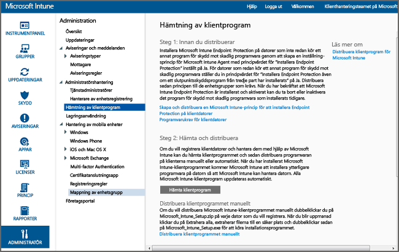

# Installera Windows PC-klienten med Microsoft Intune
Använd den här guiden för att låta dina Windows-datorer hanteras av Microsoft Intune-klientprogrammet.

## Innan du börjar
Innan du börjar installera klientprogramvaran för Intune bör du läsa artikeln [Åtgärda konflikter mellan grupprincipobjekt och Microsoft Intune-principer](resolve-gpo-and-microsoft-intune-policy-conflicts.md) för att förstå vad som behövs för att installera klienten korrekt. Återkom sedan till dessa instruktioner.

## Installera klienten
Använd de här stegen för att installera klienten:

-   [Så här hämtar du klientprogramvaran](#to-download-the-client-software)

Använd sedan en eller flera av följande metoder för att installera klienten:

-   [Så här hämtar och distribuerar du klientprogrammet](#to-manually-deploy-the-client-software)

-   [Så här distribuerar du klientprogrammet automatiskt med hjälp av en grupprincip](#to-automatically-deploy-the-client-software-by-using-group-policy)

-   [Hur användare kan registrera sina datorer själva](#how-users-can-self-enroll-their-computers)

-   [Installera Microsoft Intune-klientprogramvaran som en del av en avbildning](#install-the-microsoft-intune-client-software-as-part-of-an-image)

Om du inte längre behöver hantera en dator med Intune, kan du inaktivera datorn, vilket även tar bort klientprogramvaran från datorn. Mer information finns i [Vanliga hanteringsuppgifter för Windows-dator med Microsoft Intune-datorklienten](common-windows-pc-management-tasks-with-the-microsoft-intune-computer-client.md).

### Så här hämtar du klientprogramvaran

1.  I [Microsoft Intune-administratörskonsolen](https://manage.microsoft.com/) klickar du på **Administratör** &gt; **Hämtning av klientprogramvara**.

  

2.  På sidan **Hämtning av klientprogramvara** klickar du på **Hämta klientprogramvara** och sparar paketet **Microsoft_Intune_Setup.zip** som innehåller programvaran på en säker plats i nätverket.

    > [!NOTE]
    > Installationspaketet för Intune-klientprogramvaran innehåller information om ditt konto. Om obehöriga användare får tillgång till installationspaketet, kan de registrera datorer till kontot som representeras av dess inbäddade certifikat.

3.  Extrahera innehållet i installationspaket till en säker plats i nätverket.

    > [!IMPORTANT]
    > Byt inte namn eller ta inte bort filen **ACCOUNTCERT** som extraheras. Om du gör det, kommer installationen av klientprogramvaran att misslyckas.

### Så här hämtar och distribuerar du klientprogrammet

1.  Bläddra till den mapp där installationsfilerna för klientprogramvaran finns och kör sedan **Microsoft_Intune_Setup.exe** för att installera klientprogramvaran.

    > [!NOTE]
    > Installationsförloppet visas när du hovrar över ikonen i verktygsfältet på klientdatorn.

### Så här distribuerar du klientprogrammet automatiskt med hjälp av en grupprincip

1.  I mappen som innehåller filerna **Microsoft_Intune_Setup.exe** och **MicrosoftIntune.accountcert** kör du följande kommando för att extrahera Windows Installer-baserade installationsprogram för 32-bitars och 64-bitars datorer:

    ```
    Microsoft_Intune_Setup.exe/Extract <destination folder>
    ```

2.  Kopiera filerna **Microsoft_Intune_x86.msi**, **Microsoft_Intune_x64.msi** och **MicrosoftIntune.accountcert** till en nätverksplats som kan användas av alla datorer som klientprogramvaran ska installeras på.

    > [!IMPORTANT]
    > Dela inte upp och byt inte namn på filerna. Om du gör det, kommer installationen av klientprogramvaran att misslyckas.

3.  Använd grupprinciper för att distribuera programvaran till datorer i nätverket.

    Mer information om hur du använder grupprinciper för att automatiskt distribuera programvara finns i dokumentationen för Windows Server.

### Hur användare kan registrera sina datorer själva
Användare kan självregistrera sina datorer via företagsportalen i Intune. Varje registrerad dator länkas till det användarkonto som användes för att installera klientprogramvaran.

> [!NOTE]
> -   Användaren måste vara administratör på datorn för att installera klientprogramvaran.
> -   Självregistrering kräver att Internet Explorer är installerat på klientdatorn.
> -   Varje gång en användare själv registrerar en dator, används en Intune-licens.
> -   Du måste använda ett arbets- eller skolkonto för att själv registrera en dator. Du kan inte själv registrera en dator med hjälp av ett Microsoft-konto.
> -   Om klientprogramvaran redan är installerad på en dator visas ett felmeddelande till slutanvändaren.

### Så här registrerar du själv en dator (information för slutanvändare)

1.  Logga in på företagsportalen från den dator som du vill registrera.

2.  Klicka på **Lägg till enhet**.

3.  Klicka på **Hämta programvara** och klicka sedan på **Kör**.

4.  Klicka på **Nästa** för att starta Intune-installationsguiden.

5.  När guiden är klar klickar du på **Slutför**.

### Installera Microsoft Intune-klientprogramvaran som en del av en avbildning
Du kan distribuera Intune-klientprogramvaran till datorer som en del av en operativsystemsavbildning med hjälp av följande procedur som bas:

1.  Kopiera klientinstallationsfilerna **Microsoft_Intune_Setup.exe** och **MicrosoftIntune.accountcert** till mappen **%Systemdrive%\Temp\Microsoft_Intune_Setup** på referensdatorn.

2.  Skapa registerposten **WindowsIntuneEnrollPending** genom att lägga till följande kommando i skriptet **SetupComplete.cmd** :

    ```
    %windir%\system32\reg.exe add HKEY_LOCAL_MACHINE\Software\Microsoft\Onlinemanagement\Deployment /v
    WindowsIntuneEnrollPending /t REG_DWORD /d 1
    ```

3.  Lägg till följande kommando i **setupcomplete.cmd** för att köra registreringspaketet med kommandoradsargumentet /PrepareEnroll:

    ```
    %systemdrive%\temp\Microsoft_Intune_Setup\Microsoft_Intune_Setup.exe /PrepareEnroll
    ```
    > [!TIP]
    > Skriptet **SetupComplete.cmd** gör det möjligt för installationsprogrammet för Windows att göra ändringar i systemet innan en användare loggar in. Kommandoradsargumentet **/PrepareEnroll** förbereder en måldator för att registreras automatiskt i Intune efter att installationsprogrammet för Windows slutförts.

4.  Lägg **SetupComplete.cmd** i mappen **%Windir%\Setup\Scripts** på referensdatorn.

5.  Avbilda referensdatorn och distribuera avbildningen till måldatorerna.

När måldatorn startar efter att installationsprogrammet för Windows slutförts, skapas registernyckeln **WindowsIntuneEnrollPending** . Registreringspaketet kontrollerar om datorn har registrerats. Om datorn har registrerats, vidtas inga ytterligare åtgärder. Om datorn inte har registrerats, skapar registreringspaketet en automatisk registreringsuppgift för Microsoft Intune.

När den automatiska registreringsuppgiften körs vid nästa schemalagda tidpunkt, kontrolleras förekomsten av registervärdet **WindowsIntuneEnrollPending** och ett försök görs för att registrera måldatorn i Intune. Om registreringen misslyckas av någon anledning försöks registreringsprocessen nästa gång uppgiften körs. Återförsöken fortsätter under en period av en månad.

Den automatiska registreringsuppgiften för Intune registervärdet **WindowsIntuneEnrollPending** och kontocertifikatet tas bort från måldatorn när registreringen lyckas eller efter en månad.

## Övervaka och kontrollera lyckade klientdistributioner
Använd en av följande procedurer som hjälper dig att övervaka och kontrollera lyckade klientdistributioner.

### Så här kontrollerar du installationen av klientprogrammet från Microsoft Intune-administrationskonsolen

1.  I [Microsoft Intune-administrationskonsolen](https://manage.microsoft.com/) klickar du på **Grupper** &gt; **Alla enheter** &gt; **Alla datorer**.

2.  Bläddra nedåt i listan över datorer för att hitta hanterade datorer som kommunicerar med Intune, eller sök efter en viss hanterad dator genom att skriva namnet på datorn eller någon del av namnet i rutan **Sök enheter**.

3.  Kontrollera status för datorn längst ned i fönstret i konsolen och åtgärda eventuella fel.

### Så här skapar du en datorinventeringsrapport för att visa alla datorer som har registrerats

1.  I [Microsoft Intune administrationskonsol](https://manage.microsoft.com/) klickar du på **Rapporter** &gt; **Datorinventeringsrapport**.

2.  På sidan **Skapa ny rapport** lämnar du alla fält som standardvärden (om du inte vill använda filter) och klickar på **Visa rapport**.

3.  Sidan **Datorinventeringsrapport** öppnas i ett nytt fönster och visar alla datorer som registrerats i Intune.

    > [!TIP]
    > Klicka på valfri kolumnrubrik i rapporten för att sortera listan efter innehållet i den kolumnen.


### Se även
[Hantera Windows-datorer med Microsoft Intune](manage-windows-pcs-with-microsoft-intune.md)


<!--HONumber=Jun16_HO4-->


