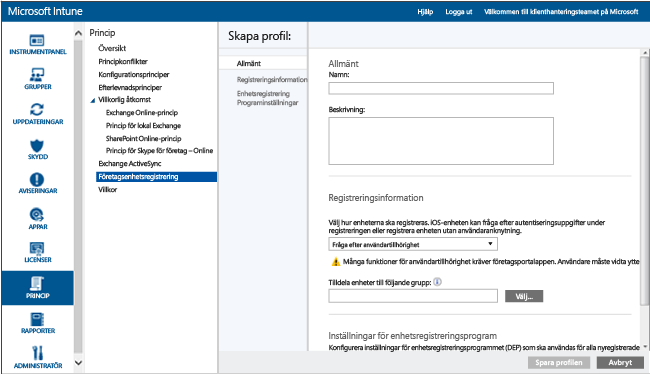
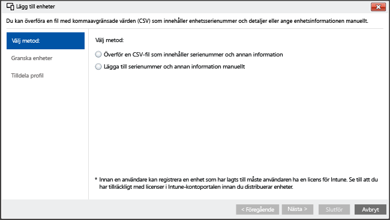

---
# required metadata

title: Installationsassistent för registrering av iOS-enheter med Microsoft Intune | Microsoft Intune
description:
keywords:
author: NathBarn
manager: jeffgilb
ms.date: 04/28/2016
ms.topic: article
ms.prod:
ms.service: microsoft-intune
ms.technology:
ms.assetid: 46e5b027-4280-4809-b45f-651a6ab6d0cd

# optional metadata

#ROBOTS:
#audience:
#ms.devlang:
ms.reviewer: jeffgilb
ms.suite: ems
#ms.tgt_pltfrm:
#ms.custom:

---

# Registrera iOS-enheter med Apple Configurator med hjälp av installationsassistenten
Intune stöder registrering av företagsägda iOS-enheter med hjälp av [Apple Configurator](http://go.microsoft.com/fwlink/?LinkId=518017) på en Mac-dator. Den här processen fabriksåterställer enheten och förbereder den för att köra installationsassistenten för enhetens nya användare med företagets principer förinstallerade.


## Registrering med installationsassistenten för iOS-enheter med Microsoft Intune
Med Apple Configurator kan du återställa iOS-enheter till fabriksinställningarna och förbereda dem för installation av enhetens nya användare.  Den här metoden kräver att du utför företagsregistreringen genom att ansluta iOS-enheten till en Mac-dator via en USB-anslutning och förutsätter att du använder Apple Configurator 2.0. De flesta scenarier kräver att principen som tillämpas på iOS-enheten inkluderar *användartillhörighet* för att aktivera appen Intune-företagsportal.

**Krav**
* Fysisk åtkomst till iOS-enheter – Enheterna måste vara okonfigurerade (fabriksåterställning) utan lösenord
* Enhetsserienummer – [Hämta ett iOS-serienummer](https://support.apple.com/en-us/HT204308)
* USB-anslutningskablar
* Mac-dator med [Apple Configurator 2.0](https://itunes.apple.com/us/app/apple-configurator-2/id1037126344?mt=12)


1.  **Skapa mobil enhetsgrupp** (valfritt) Om ditt företag kräver mobila enhetsgrupper för att hantera enheter skapar du de grupperna. [Använda grupper för att hantera användare och enheter med Microsoft Intune](use-groups-to-manage-users-and-devices-with-microsoft-intune.md).

2.  **Skapa en profil för enheter** En enhets registreringsprofil definierar inställningarna som tillämpas på en grupp av enheter. Om du inte redan har gjort det, skapar du en registreringsprofil för iOS-enheter som använder Apple Configurator.

    ###### Så här skapar du en profil

    1.  I [Microsoft Intunes administrationskonsol](http://manage.microsoft.com) går du till **Princip** &gt; **Företagsägda enheter** och klickar sedan på **Lägg till...**.

    

    2.  Ange information om enhetsprofilerna:

        -   **Namn** – Namnet på enhetens registreringsprofil. (Inte synligt för användarna)

        -   **Beskrivning** – Beskrivning av enhetens registreringsprofil. (Inte synligt för användarna)

        -   **Registreringsinformation** – Anger hur enheterna registreras.

            -   **Fråga efter användartillhörighet** – iOS-enheten kan kopplas till en användare under installationen och kan sedan får åtkomst till företagets data och e-post som den användaren. I de flesta scenarier med installationsassistenten använder du **Fråga efter användartillhörighet**.
            Det här läget stöder ett antal scenarier:

                -   **Företagsägd personlig enhet** – CYOD (”Choose Your Own Device”) liknar privatägda eller personliga enheter, men administratören har viss behörighet och kan exempelvis rensa, återställa, administrera och avregistrera enheten. Enhetens användare kan installera appar och har de flesta behörigheter för enhetsanvändning som inte blockeras av hanteringsprincipen.

                -   **Enhetsregistrering av hanteringskonto** – Enheten har registrerats med hjälp av ett särskilt Intune-administratörskonto. Det kan hanteras som ett privat konto, men bara en användare som känner till registreringens autentiseringsuppgifter kan installera appar, rensa, återställa, administrera och avregistrera enheten. Information om hur du registrerar en enhet som delas av många användare via ett gemensamt konto finns i [Registrera företagsägda enheter med Enhetsregistreringshanteraren i Microsoft Intune](enroll-corporate-owned-devices-with-the-device-enrollment-manager-in-microsoft-intune.md).

            -   **Ingen användartillhörighet** – Enheten är användarlös. Använd den här anknytningen för enheter som utför uppgifter utan att öppna lokala användardata. Appar som kräver användaranknytning inaktiveras eller fungerar inte.

        -   **Förtilldelning av enhetsgrupp** – Alla enheter som har distribuerat den här profilen hör ursprungligen till den här gruppen. Du kan tilldela enheter på nytt efter registreringen.

          -  **Enhetsregistreringsprogram** – Apples Enhetsregistreringsprogram (Device Enrollment Program) kan inte användas med installationsassistenten för registrering. Kontrollera att växlingsknappen är i läget **av**.

    3.  Välj **Spara profil** för att lägga till profilen.

3.  **Lägg till iOS-enheter som ska registreras med installationsassistenten** I [Microsoft Intunes administrationskonsol](http://manage.microsoft.com) går du till **Grupper** &gt; **Alla enheter** &gt; **Alla företagsägda enheter** &gt; **Alla enheter** och väljer sedan **Lägg till enheter…**. Du kan lägga till enheter på två sätt:

    

    -   **Överför en CSV-fil som innehåller serienummer** – Skapa en kommaavgränsad lista med två kolumner utan rubrik som är begränsad till 5 000 enheter eller 5 MB per CSV-fil.

        |||
        |-|-|
        |&lt;Serienr 1&gt;|&lt;Information om enhet nr 1&gt;|
        |&lt;Serienr 2&gt;|&lt;Information om enhet nr 2&gt;|
        CSV-filen när den visas i en textredigerare:

        ```
        0000000,PO 1234
        111111111,PO 1234
        ```

    -   **Information om manuellt tillagd enhet** – Ange serienummer och enhetsinformation för upp till fem enheter

    > [!NOTE]
    > Om du senare måste ta bort företagsägda enheter från Intune-hanteringen kanske du behöver ta bort enhetens serienummer från Intune i enhetsgruppen **Efter iOS-serienummer** under **Företagets förregistrerade enheter** för att kunna inaktivera enhetsregistreringen.  Om Intune utför en katastrofåterställning på eller runt den tid då serienumren togs bort, måste du kontrollera att endast aktiva enheters serienummer finns kvar i gruppen.

    Välj **Nästa**.

4.  **Välj enheter som ska registreras** Bekräfta vilka enheter som ska registreras. Det går inte att importera serienummer som redan har registrerats eller som registrerats på annat sätt. Fortsätt genom att välja **Nästa** .

5.  **Tilldela profil** Ange profilen som ska tilldelas till enheter som lagts till i listan över tillgängliga profiler, granska **Profilregistreringsinformation** och välj sedan **Slutför**. Manuellt tillagda enheter kan tilldelas en registreringsprofil.

6.  **Exportera en profil som ska distribueras till iOS-enheter** I [Microsoft Intunes administrationskonsol](http://manage.microsoft.com) går du till **Princip** &gt; **Företagsenhetsregistrering**. Välj sedan den enhetsprofil som ska distribueras till mobila enheter. Välj **Exportera...** i verktygsfältet. Kopiera och spara **Profil-URL**. Du kommer att överföra den i Apple Configurator senare för att definiera den Intune-profil som används av iOS-enheter.
    För stöd för Apple Configurator 2 måste 2.0-profilens URL redigeras. Ersätt
    ```
    https://manage.microsoft.com/EnrollmentServer/Discovery.svc/iOS/ESProxy?id=
    ```
    med

    ```
    https://appleconfigurator2.manage.microsoft.com/MDMServiceConfig?id=
    ```

   Du kommer att överföra den här profil-URL:en till Apples enhetsregistreringsprogramtjänst med hjälp av Apple Configurator genom följande procedur för att definiera den Intune-profil som används av iOS-enheter.


7.  **Förbered enheten med Apple Configurator** iOS-enheter är anslutna till Mac-datorn och registreras för hantering av mobila enheter.

    1.  På en Mac-dator öppnar du **Apple Configurator 2**. Välj **Apple Configurator 2** i menyfältet och välj sedan **Inställningar**.

         > [!WARNING]
         > Enheterna kommer att återställas till fabrikskonfigurationerna vid registreringen. Vi rekommenderar att du återställer enheten och slår på den. Skärmen **Hello** bör visas på enheten när du ansluter den.

    2. Välj **servrar** i inställningsrutan och välj symbolen "+" nedan till vänster för att starta guiden för MDM-servern. Välj **Nästa**.

    3. Ange **namnet** och **registrerings-URL** för MDM-servern från Steg 6 ovan. Ange registreringsprofil-URL:en som exporteras från Intune som URL: en för registrering. Välj **Nästa**.  

       Om du får en varning om krav på förtroendeprofil för Apple TV kan du på ett säkert sätt kan avbryta **förtroendeprofil**-alternativet genom att välja det grå krysset. Du kan också på ett säkert sätt bortse från alla ankarcertifikatvarningar. Fortsätt genom att välja **Nästa** tills guiden har slutförts.

    4.  Välj "Redigera" i fönstret för **servrar** bredvid den nya serverns profil. Se till att registrerings-URL:en exakt matchar den URL som exporteras från Intune. Ange den ursprungliga URL:en igen om de är olika och **Spara** registreringsprofilen som exporteras från Intune.

    5.  Anslut mobila iOS-enheter till Apple-datorn med en USB-adapter.

        > [!WARNING]
        > Enheterna kommer att återställas till fabrikskonfigurationerna vid registreringen. Vi rekommenderar att du återställer enheten och slår på den. **Välkommen**-skärmen bör visas på enheten när du startar installationsassistenten.

    6.  Välj **Förbereda**. I fönstret **Förbered iOS-enhet** väljer du först **Manuellt** och sedan **Nästa**.

    7. I fönstret **Registrera i MDM-server** väljer du först servernamnet du skapat och sedan **Nästa**.

    8. I fönstret **Övervaka enheter** väljer du först övervakningsnivån och sedan **Nästa**.

    9. I fönstret **Skapa en organisation** väljer du **Organisation** eller skapar en ny organisation och väljer sedan **Nästa**.

    10. I fönstret **Konfigurera installationsassistenten för iOS** väljer du stegen som visas för användaren och väljer sedan **Förbered**. Autentisera för att uppdatera förtroendeinställningarna om du uppmanas att göra det.  

    11. När iOS-enheten har slutfört förberedelserna kan du koppla från USB-kabeln.  

8.  **Distribuera enheter** Enheterna är nu klara för företagets registrering. Stäng av enheterna och distribuera dem till användarna. Installationsassistenten startar när enheten slås på.


### Se även
[Dags att registrera enheter](get-ready-to-enroll-devices-in-microsoft-intune.md)


<!--HONumber=Jun16_HO3-->


