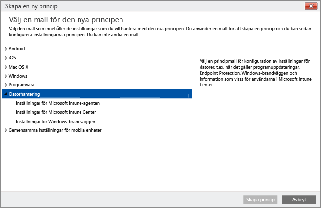

# Hantera Windows-datorer med Intune-klientprogramvara
I stället för att [registrera Windows-datorer som mobila enheter](set-up-windows-device-management-with-microsoft-intune.md) kan du registrera och hantera Windows-datorer genom att installera klientprogramvaran för Intune.

Intune hanterar Windows-datorer med hjälp av principer på liknande sätt som AD DS-grupprincipobjekt (Active Directory Domain Services) för Windows Server gör. Om du ska hantera domänanslutna Active Directory-datorer med Intune bör du [försäkra dig om att Intune-principerna inte står i konflikt med grupprincipobjekt](resolve-gpo-and-microsoft-intune-policy-conflicts.md) som används i din organisation.

Även om Intune-klientprogrammet har stöd för [hanteringsfunktioner som skyddar datorer](policies-to-protect-windows-pcs-in-microsoft-intune.md) med hjälp av hantering av programuppdateringar, Windows-brandväggen och Endpoint Protection, så kan inte datorer som hanteras med Intune-klienten användas med andra Intune-principer, t.ex. de **Windows**-principinställningar som är specifika för hantering av mobila enheter.

> [!NOTE]
> Enheter som kör Windows 8.1 eller senare kan hanteras med Intune-klienten eller registreras som mobila enheter. Informationen nedan gäller för datorer som kör Intune-klienten. Det går inte att både installera Intune-klienten och registrera Windows-enheten för hantering av mobila enheter.

## Krav för hantering av Intune-klienten

**Maskinvara**: Minsta maskinvarukrav för att installera Intune-klienten:

|Krav|Mer information|
|---------------|--------------------|
|Nätverk|Klienten kräver att datorn är ansluten till Internet.|
|Processor och minne|Se RAM- och processorkraven för datorns operativsystem.|
|Diskutrymme|200 MB ledigt diskutrymme innan klientprogrammet har installerats.|

**Programvara**: Programvarukrav för att installera klienten:

|Krav|Mer information|
|---------------|--------------------|
|Operativsystem | Windows-enheten måste köra Windows 7 eller senare. |
|Administrativ behörighet|Det konto som installerar klientprogramvaran måste ha lokal administratörsbehörighet på enheten.|
|Windows Installer 3.1|Datorn måste minst ha Windows Installer 3.1.  Så visar du versionen för Windows Installer på en dator:  -   Högerklicka på **%windir%\System32\msiexec.exe**, och sedan på **Egenskaper**.  Du kan hämta den senaste versionen av Windows Installer från [Windows Installer Redistributables](http://go.microsoft.com/fwlink/?LinkID=234258) på webbplatsen Microsoft Developer Network.|
|Ta bort klientprogram som inte är kompatibla|Innan du installerar Intune-klientprogramvaran måste du avinstallera Configuration Manager- eller System Management Server-klientprogramvara från datorn.|

## Installera Intune-datorklienten
Intune-klientprogramvaran kan installeras på något av följande sätt:

-  [Distribuera Microsoft Intune-klientprogramvaran manuellt](install-the-windows-pc-client-with-microsoft-intune.md#to-manually-deploy-the-client-software). I den här typen av distribution laddar administratören ned Intune-klientprogramvaran och installerar den manuellt på varje dator.

  Om du vill ladda ned Intune-klientprogramvaran öppnar du [Intune-administratörskonsolen](https://manage.microsoft.com), väljer **Admin** > **Hämta klientprogramvara** och klickar på **Hämta klientprogramvara**.

-  Använd samma filer som du laddar ned för att manuellt installera Intune-klientprogrammet om du vill [distribuera klienten till domänanslutna datorer med hjälp av Active Directory-grupprincipobjekt](install-the-windows-pc-client-with-microsoft-intune.md#to-automatically-deploy-the-client-software-by-using-group-policy).

-  Distribuera Intune-klientprogramvaran på datorer som en del av [operativsystemsdistributionen](install-the-windows-pc-client-with-microsoft-intune.md#install-the-microsoft-intune-client-software-as-part-of-an-image).

-  Skicka användarna anvisningar med URL:en till Intune-företagsportalen: [https://portal.manage.microsoft.com](http://go.microsoft.com/fwlink/?LinkId=825632). När användarna öppnar företagsportalen uppmanas de att registrera sina datorer genom att hämta och köra Intune-klientprogrammet.

## Datorhantering med Intune-datorklienten
När Intune-klientprogrammet har installerats ger klientprogramvaran tillgång till flera datorhanteringsfunktioner som exempelvis: [programhantering](deploy-apps-in-microsoft-intune.md), Endpoint Protection, maskin- och programvaruinventering, fjärrstyrning (via begäran om Fjärrhjälp), programuppdateringar och rapportering av efterlevnadsinställningar.

Flera datorhanteringsåtgärder som aktiveras av datorklienten hanteras med Intune-principer som till exempel kan användas för att:

-   Konfigurera [inställningarna för Windows-brandväggen](help-protect-windows-pcs-using-windows-firewall-policies-in-microsoft-intune.md) på hanterade datorer.

-   Konfigurera [inställningar för programuppdatering](keep-windows-pcs-up-to-date-with-software-updates-in-microsoft-intune.md) för hanterade datorer för att söka efter, och ladda ned, nödvändiga programuppdateringar.

-   Skydda hanterade datorer mot potentiella hot och skadlig programvara genom [övervakning i realtid och Endpoint Protection](help-secure-windows-pcs-with-endpoint-protection-for-microsoft-intune.md)-hantering.

Förutom att vidta åtgärder med Intune-klientagenten lokalt på enskilda datorer kan du utföra andra [vanliga datorhanteringsåtgärder](common-windows-pc-management-tasks-with-the-microsoft-intune-computer-client.md) med Intune-administratörskonsolen på Windows-datorer där klienten är installerad:

-   Visa maskin- och programvaruinventering för hanterade datorer

-   Starta om en dator via en fjärranslutning

-   Dra tillbaka en dator för att avinstallera klientprogramvaran och ta bort den från hantering i Intune

-   Länka användare till specifika hanterade datorer

-   Svara på en begäran om Fjärrhjälp

Intune-klientagenten körs vanligtvis tyst i bakgrunden och kräver sällan omfattande användarinteraktion eller felsökning. Om du ändå behöver hjälp med att lösa datorhanteringsproblem finns det flera [tillgängliga resurser där du kan få hjälp](/intune/troubleshoot/troubleshoot-client-setup-in-microsoft-intune).

<!--HONumber=Aug16_HO4-->

