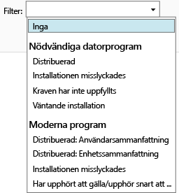

# Övervaka appdistributioner i Microsoft Intune

## Övervaka en appdistribution
Du kan se de appar som du hanterar och status för distributioner i Intune-administrationskonsolen.

### Visa de appar som du hanterar och deras status
I arbetsytan **Appar** klickar du på noden **Appar** och sedan på **Appar**.

Listan över appar som du hanterar visas. Du kan klicka på en app för att se installationsstatus i rutan längst ned i konsolfönstret. Klicka på denna status för att se ytterligare information. Om statusen exempelvis visar **1 användare har tillgång till programvaran** kan du klicka på meddelandet för att se användarens namn.

> [!TIP]
> Du kan använda listrutan **Filter** för att endast visa appar som uppfyller de kriterier du anger, t.ex. appar som inte installerades eller appar som har distribuerats.
> 
> 

Dessutom visar arbetsytan **Instrumentpanel** en översikt över apparnas status. Om du klickar någonstans i översikten vidarebefordras du till listan över appar.

## Visa mer detaljerad information om en app
Välj en app i listan över appar och klicka sedan på **Visa egenskaper**.

På sidan **Programvaruegenskaper** för appen klickar du på någon av dessa flikar: **Allmänt** –Visar allmän information om appen och dess installationsstatus, **Enheter** – Visar de enheter som har installerat en riktad distribution av appen, **Användare** – Visar de användare vars enheter har installerat en riktad distribution av appen.

Som tidigare kan du använda listrutan **Filter** för att konfigurera de värden som visas på var och en av flikarna.

<!--HONumber=Jul16_HO4-->

