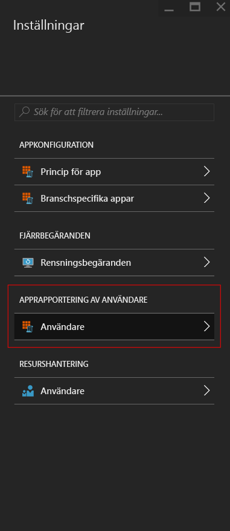
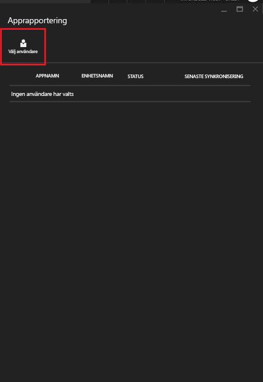
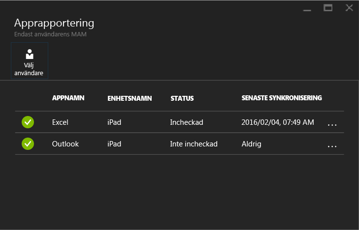

---
# required metadata

title: Övervaka hanteringsprinciper för mobilappar med Microsoft Intune | Microsoft Intune
description:
keywords:
author: karthikaraman
manager: jeffgilb
ms.date: 04/28/2016
ms.topic: article
ms.prod:
ms.service: microsoft-intune
ms.technology:
ms.assetid: d3aa6c74-6b5d-4b50-aa66-a040ec44393e

# optional metadata

#ROBOTS:
#audience:
#ms.devlang:
ms.reviewer: jeffgilb
ms.suite: ems
#ms.tgt_pltfrm:
#ms.custom:

---

# Övervaka hanteringsprinciper för mobilappar med Microsoft Intune
När du har konfigurerat en MAM-princip och tillämpat den för användarna kan du övervaka efterlevnadsstatus på [Azure Portal](https://portal.azure.com). Azure Portal innehåller information om de användare som påverkas av principen, efterlevnadsstatus och eventuella problem som slutanvändarna kan råka ut för.
## Sammanfattningsvy
På bladet **Hantering av mobilprogram i Intune** visas en sammanfattning av efterlevnadsstatus enligt nedan:

-   **ANVÄNDARE:** Totalt antal användare på företaget som använder de appar som är associerade med principen.

-   **HANTERAS AV PRINCIP:** Antalet användare som har använt minst en av apparna i arbetskontexten.

-   **INGEN PRINCIP:** Antalet användare som använder de appar som är associerade med principen, men inte är mål för principen.  Du kan lägga till dessa användare i principen.

- **Flaggade användare:** Antalet användare som har problem. För närvarande rapporteras endast användare med upplåsta enheter under **Flaggade användare**.

## Detaljerad vy
Du kommer till den detaljerade vyn av sammanfattningen genom att klicka på panelen **Användarstatus** och panelen **Flaggade användare**.

### Användarstatus
Du kan söka efter en enskild användare och titta på efterlevnadsstatus för användaren. På bladet **Apprapportering** visas följande information för en vald användare:
- Enheter som är associerade med användarkontot
- Appar med MAM-princip på enheten
- Status:

  **Incheckad:** Det innebär att principen har distribuerats till användaren, och att appen har använts i arbetskontexten minst en gång.

  **Inte incheckad:** Det innebär att principen har distribuerats till användaren, men att appen inte har använts i arbetskontexten sedan dess.

Visa rapporter för en användare genom att följa anvisningarna:

**Steg 1:** Välj en användare genom att klicka på panelen Sammanfattning eller välja alternativet **APPRAPPORTERING AV ANVÄNDARE** på bladet **Inställningar** enligt nedan:

**Steg 2:** Då öppnas bladet **Apprapportering**. Välj **Välj användare** om du vill söka efter en Azure Active Directory-användare.

**Steg 3:** När du har valt användaren i listan visas information om efterlevnadsstatus för användaren.

### Flaggade användare
I den detaljerade vyn visas felmeddelandet, appen som användes när felet inträffade, plattformen för enheten och en tidsstämpel.  

### Se även
[Hantera dataöverföring mellan iOS-appar](manage-data-transfer-between-ios-apps-with-microsoft-intune.md)

[Slutanvändarupplevelse för MAM-aktiverade appar](end-user-experience-for-mam-enabled-apps-with-microsoft-intune.md)

<!--HONumber=May16_HO3-->

