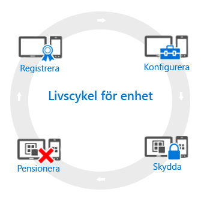

---
# required metadata

title: Översikt över enhetslivscykeln | Microsoft Intune
description:
keywords:
author: robstackmsft
manager: jeffgilb
ms.date: 04/28/2016
ms.topic: article
ms.prod:
ms.service: microsoft-intune
ms.technology:
ms.assetid: f6051fa7-133f-4712-86a5-e5f5bc5ab3c7

# optional metadata

#ROBOTS:
#audience:
#ms.devlang:
ms.reviewer: jeffgilb
ms.suite: ems
#ms.tgt_pltfrm:
#ms.custom:

---

# Översikt över livscykeln för hantering av mobila enheter (MDM)

Enhetslivscykeln i Intune börjar med att inledningsvis registrera en enhet, fortsätter genom flera steg och avslutas när enheten inte längre behövs.

## Registrera
Dagens strategier för hantering av mobila enheter (MDM) omfattar många olika telefoner, surfplattor och datorer (iOS, Android, Windows och Mac OS X). Om du behöver kunna hantera enheten, vilket ofta är fallet för företagsägda enheter, är det första steget att [konfigurera registrering av enheter](enroll-devices-in-microsoft-intune.md). Du kan även hantera Windows-datorer genom att antingen registrera dem med Intune (MDM) eller genom att [installera Intune-klientprogrammet](manage-windows-pcs-with-microsoft-intune.md).

## Konfigurera
Registrering av enheter är bara det första steget. Om du vill dra nytta av allt som Intune har att erbjuda och se till att enheterna är skyddade och kompatibla med företagets standarder, kan du välja bland en mängd olika **principer** som gör att du kan konfigurera nästan alla aspekter av hur hanterade enheter fungerar. Bör användare till exempel ha lösenord på enheter som innehåller företagsdata? Du kan kräva det. Har du företags-Wi-Fi? Du kan konfigurera det automatiskt. Här är typerna av konfigurationsalternativ:

- [**Konfigurationsprinciper**](manage-settings-and-features-on-your-devices-with-microsoft-intune-policies.md) – Med de här principerna kan du konfigurera hur funktionerna på enheter som du hanterar fungerar. Du kan till exempel kräva ett lösenord på Windows Phone-enheter eller inaktivera kameran på iPhone-enheter.
- [**Principer för åtkomst till företagsresurser**](enable-access-to-company-resources-with-microsoft-intune.md) – När du ger användarna åtkomst till deras arbete på deras personliga enhet kan det medföra utmaningar. Hur säkerställer du till exempel att alla enheter som behöver åtkomst till företagets e-post är korrekt konfigurerade? Hur kan du säkerställa att användarna har åtkomst till företagets nätverk med en VPN-anslutning utan att behöva känna till de ofta avancerade inställningar som krävs? Intune kan minska det här problemet genom att automatiskt konfigurera enheter som du hanterar för åtkomst till gemensamma företagsresurser.
- [**Principer för hantering av Windows-datorer (med Intune-klientprogramvaran)**](common-windows-pc-management-tasks-with-the-microsoft-intune-computer-client.md) – Registrering av Windows-datorer med Intune ger flest funktioner för enhetshantering, men Intune fortsätter att stödja hantering av Windows-datorer med Intune-klientprogramvaran. Börja här om du behöver information om några av uppgifterna du kan utföra med datorer.

## Skydda
I den moderna IT-världen är skydd av enheter från obehörig åtkomst en av de viktigaste uppgifterna som du utför. Förutom punkterna i steget **Konfigurera** i enhetslivscykeln tillhandahåller Intune ytterligare funktioner som skyddar enheter som du hanterar från obehörig åtkomst eller skadliga attacker:
- [**Multifaktorautentisering**](protect-windows-devices-with-multi-factor-authentication.md) – Att lägga till ett extra lager av autentisering för användarinloggningar kan göra enheter ännu säkrare. Windows-, Windows Phone- och Windows Mobile-enheter erbjuder multifaktorautentisering som kräver en andra nivå av autentisering, till exempel ett telefonsamtal eller SMS innan användarna kan få åtkomst.
- [**Microsoft Passport-inställningar**](control-microsoft-passport-settings-on-devices-with-microsoft-intune.md) – Microsoft Passport är en alternativ inloggningsmetod som gör att användarna kan använda en *gest*, till exempel ett fingeravtryck, eller Windows Hello för att logga in utan lösenord.
- [**Principer för att skydda Windows-datorer (med Intune-klientprogramvaran)**](policies-to-protect-windows-pcs-in-microsoft-intune.md) – När du hanterar Windows-datorer med Intune-klientprogramvaran finns det principer som gör att du kan styra inställningar för Endpoint Protection, programuppdateringar och Windows-brandväggen på datorer som du hanterar.

## Pensionera
När en enhet blir stulen eller tappas bort, behöver bytas ut eller när användarna flyttar till en annan tjänst är det vanligtvis dags att [dra tillbaka eller rensa](use-remote-wipe-to-help-protect-data-using-microsoft-intune.md) enheten. Det finns ett antal sätt att göra det, till exempel att återställa enheten, ta bort den från hantering eller rensa företagsdata på den.

<!--HONumber=May16_HO2-->

