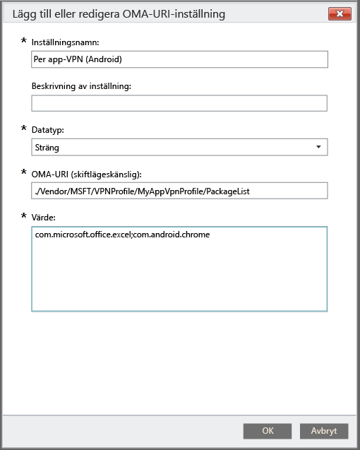

# Använda en anpassad princip för att skapa en VPN-profil per app för Android-enheter

Du kan skapa en VPN-profil per app för enheter som kör Android 5.0 och senare som hanteras av Intune. Börja med att skapa en VPN-profil som använder anslutningstypen Pulse Secure. Skapa sedan en princip för anpassad konfiguration som associerar VPN-profilen med specifika appar. 

När du har distribuerat principen till din Android-enhet eller användargrupper ska användarna starta PulseSecure VPN. PulseSecure kommer sedan att endast att ge trafik från de angivna apparna tillåtelse att använda den öppna VPN-anslutningen.

> [!NOTE]
>
> Endast anslutningstypen Pulse Secure stöds för den här profilen.

### Steg 1: Skapa en VPN-profil

1. I [Microsoft Intune-administratörskonsolen](https://manage.microsoft.com) väljer du **Princip** > **Lägg till princip**.
2. Du väljer en mall för den nya principen genom att expandera **Android** och välja **VPN-profil (Android 4 och senare)**.
3. I mallen väljer du **Pulse Secure** som **Anslutningstyp**.
4. Slutför och spara VPN-profilen. Mer information om VPN-profiler finns i [VPN-anslutningar](../deploy-use/vpn-connections-in-microsoft-intune.md).

> [!NOTE]
>
> Anteckna VPN-profilnamnet som ska användas i nästa steg. Till exempel MyAppVpnProfile.

### Steg 2: Skapa en princip för anpassad konfigurering

   1. I Intune-administratörskonsolen väljer du **Princip** > **Lägg till princip** > **Android** > **Anpassad konfiguration** > **Skapa princip**.
   2. Ange ett namn för principen.
   3. Välj **Lägg till** under **OMA-URI-inställningar**.
   4. Ange ett namn på inställningen.
   5. Ange **Sträng** för **Datatyp**.
   6. För **OMA-URI** anger du strängen: **./Vendor/MSFT/VPN/Profile/*Namn*/PackageList**, där *Namn* är det VPN-profilnamn som du antecknade i steg 1. I vårt exempel skulle strängen vara **./Vendor/MSFT/VPN/Profile/MyAppVpnProfile/PackageList**.
   7.   För **Värde** skapar du en semikolonavgränsad lista över paket som ska associeras med profilen. Om du exempelvis vill att Excel och webbläsaren Google Chrome ska använda VPN-anslutningen anger du **com.microsoft.office.excel;com.android.chrome**.

#### Ange applistan som svartlistad eller vitlistad (valfritt)
  Du kan ange en lista över appar som *inte* kan använda VPN-anslutning med hjälp av värdet **SVARTLISTAT**. Alla andra appar ansluter via VPN.
Du kan också använda värdet **VITLISTAT** för att ange en lista över appar som *kan* använda VPN-anslutning. Appar som inte finns med i listan kan inte ansluta via VPN.
  1.    Välj **Lägg till** under **OMA-URI-inställningar**.
  2.    Ange ett namn på inställningen.
  3.    Ange **Sträng** som **Datatyp**.
  4.    För **OMA-URI** använder du följande sträng: **./Vendor/MSFT/VPN/Profile/*Namn*/Läge**, där *Namn* är den VPN-profil som du antecknade i steg 1. I vårt exempel skulle strängen vara **./Vendor/MSFT/VPN/Profile/MyAppVpnProfile/Mode**.
  5.    Ange **SVARTLISTAT** eller **VITLISTAT** som **Värde**.

### Steg 3: Distribuera båda principerna

Du måste distribuera *båda* principerna för *samma* Intune-grupp.

1.  På arbetsytan **Princip** markerar du den princip som du vill distribuera och väljer sedan **Hantera distribution**.
2.  I dialogrutan **Hantera distribution** :
    -   **Om du vill distribuera principen** väljer du eller flera grupper som du vill distribuera principen till. Välj sedan **Lägg till** > **OK**.
    -   **Om du vill stänga dialogrutan utan att distribuera principen** väljer du **Avbryt**.

En statssammanfattning och varningar på sidan **Översikt** på arbetsytan **Principer** identifierar problem med principer som kräver din uppmärksamhet. Dessutom visas en statussammanfattning på arbetsytan **Instrumentpanel**.

<!--HONumber=Aug16_HO5-->

