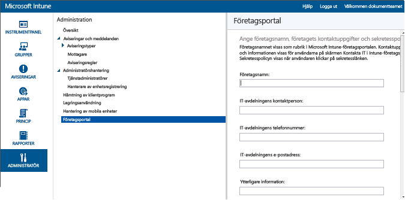

# Krav för hantering av mobila enheter i Intune
Om du vill låta medarbetarna registrera mobila enheter (däribland [Android](set-up-android-management-with-microsoft-intune.md), [iOS och Mac](set-up-ios-and-mac-management-with-microsoft-intune.md), [Windows Phone](set-up-windows-phone-management-with-microsoft-intune.md) och [Windows PC](set-up-windows-device-management-with-microsoft-intune.md)) i Intune eller om du vill hantera företagsägda enheter måste du aktivera registrering av enheter. Om du vill tillåta registrering måste du ange en utfärdare för hantering av mobila enheter (MDM), konfigurera Intunes företagsportal, tilldela licenser och aktivera registrering för enhetsplattformen.

## Ange auktoritet för hantering av mobila enheter
Utfärdaren för hantering av mobila enheter definierar den hanteringstjänst som har behörighet att hantera en uppsättning enheter. Alternativen för MDM-utfärdare innefattar själva Intune och Configuration Manager med Intune. Om Configuration Manager anges som utfärdare för hanteringen kan inga andra tjänster användas för hantering av mobila enheter.

>[!IMPORTANT]
> Överväg noggrant om du vill hantera mobila enheter endast med hjälp av Intune (onlinetjänst) eller System Center Configuration Manager med Intune (lokal programvarulösning i samband med onlinetjänsten). När du har angett utfärdare för hantering av mobila enheter går det inte att ändra detta.

1.  Gå till [Microsoft Intune-administratörskonsolen](http://manage.microsoft.com) och välj **Admin** &gt; **Hantering av mobila enheter**.

2.  Klicka på **Ange auktoritet för hantering av mobila enheter** i **Uppgiftslistan**. Dialogrutan **Ange MDM-auktoritet** öppnas.

    

3.  Intune begär bekräftelse på att du vill ha Intune som MDM-utfärdare. Markera kryssrutan och välj sedan **Ja** om du vill hantera mobila enheter med Microsoft Intune.

## Konfigurera Intune-företagsportalen

Intune-företagsportalen är den plats där användare kan komma åt företagets data och utföra vanliga aktiviteter som att registrera enheter, installera appar och hitta information för att få hjälp från IT-avdelningen.

> [!TIP]
> När du anpassar företagsportalen gäller konfigurationerna både företagsportalens webbplats och företagsportalens appar.

Genom att anpassa företagsportalen kan du skapa en välbekant miljö för dina slutanvändare. Om du vill göra det loggar du bara in på [Microsoft Intune-administratörskonsolen](https://manage.microsoft.com) som klient eller tjänstadministratör, väljer **Admin** &gt; **Företagsportal** och konfigurerar inställningarna för företagsportalen.

### Företagets kontaktinformation och sekretesspolicy

Företagsnamnet visas som företagsportalens rubrik. Kontaktuppgifterna och informationen visas för användarna på skärmen Kontakta IT på företagsportalen. Sekretesspolicyn visas när användaren klickar på sekretesslänken.

|Fältnamn|Högsta längd|Mer information|
    |----------|------------------------|----------------|
    |Företag|40|Det här namnet visas som företagsportalens rubrik. **Obs**! Använd endast alfanumeriska tecken. Specialtecken kan inte användas i fältet.|
    |IT-avdelningens kontaktperson|40|Det här namnet visas på sidan **Kontakta IT-avdelningen**.|
    |IT-avdelningens telefonnummer|20|Det här numret visas på sidan **Kontakta IT-avdelningen**.|
    |IT-avdelningens e-postadress|40|Den här adressen visas på sidan **Kontakta IT-avdelningen**. Du måste ange en giltig e-postadress i formatet **alias@domännamn.com**.|
    |Ytterligare information|120|Den här informationen visas på sidan **Kontakta IT-avdelningen**.|
    |URL till företagets sekretesspolicy|79|Du kan ange en egen sekretesspolicy för ditt företag som visas när användaren klickar på en länk på företagsportalen. Du måste ange en giltig URL i formatet https://www.contoso.com.|

### Supportkontakter
Supportwebbplatsen visas för användarna på företagsportalen så att de kan få tillgång till onlinesupport.

|Fältnamn|Högsta längd|Mer information|
    |----------|------------------------|----------------|
    |URL till supportwebbplatsen|150|Om du har en supportwebbplats som du vill att slutanvändarna ska använda, anger du webbadressen här. URL:en måste ha formatet https://www.contoso.com. Om du inte anger någon webbadress kommer inget att visas på sidan **Kontakta IT** på företagsportalen.|
    |Namn på webbplats|40|Det här är det egna namnet som visas för supportwebbplatsens URL. Om du bara anger URL:en till en supportwebbplats utan något eget namn visas **Gå till IT-webbplatsen** på sidan **Kontakta IT** på företagsportalen.|

### Varumärkesanpassning

Du kan anpassa företagsportalen med företagets logotyp, företagets namn, temafärg och bakgrund.

|Fältnamn|Mer information|
    |----------|----------------|
    |Temafärg|Välj en temafärg som ska användas på företagsportalen.|
    |Infoga företagslogotyp|Om du aktiverar det här alternativet kan du ladda upp företagets logotyp så att den visas på företagsportalen. Du kan ladda upp två logotyper: en logotyp som visas när företagsportalens bakgrund är vit och en logotyp som visas när företagsportalens bakgrund har din valda temafärg. En logotyp måste vara en PNG- eller JPG-fil med en högsta upplösning på 400 × 100 bildpunkter och en största storlek på 750 kB.|
    |Välj en bakgrund för företagsportalappen i [!INCLUDE[win8_client_2](../includes/win8_client_2_md.md)]|Den här inställningen påverkar bara bakgrunden i [!INCLUDE[win8_client_2](../includes/win8_client_2_md.md)]-företagsportalappen.|

När du har sparat ändringarna kan du använda länkarna längst ned på sidan **Företagsportal** i administratörskonsolen för att gå till företagsportalen. Dessa länkar kan inte ändras. När en användare loggar in visar dessa länkar dina prenumerationer på företagsportalen.

## Tilldela en Intune-användarlicens

Du använder **hanteringsportalen för Office 365** för att manuellt lägga till molnbaserade användare och tilldela licenser till både molnbaserade användarkonton och konton som synkroniseras från din lokala Active Directory till Azure Active Directory (Azure AD).

1.  Logga in på [hanteringsportalen för Office 365](https://portal.office.com/Admin/Default.aspx) med dina klientadministratörsuppgifter.

2.  Välj det användarkonto som du vill tilldela Intune-användarlicensen till och markera kryssrutan **Microsoft Intune** i egenskaperna för användarkontot.

3.  Nu läggs användarkontot till i Microsoft Intune-användargruppen, vilket beviljar användaren behörighet att använda tjänsten och registrera sina enheter för hantering.

## Konfigurera enhetshantering
När du har konfigurerat MDM-utfärdare måste du konfigurera enhetshantering för de operativsystem som organisationen vill ha stöd för. Stegen för att konfigurera enhetshantering varierar beroende på operativsystem. I Android OS krävs till exempel inte att du gör någonting i Intune-administratörskonsolen. Å andra sidan kräver Windows och iOS en förtroenderelation mellan enheter och Intune för att tillåta hantering.

Ställ in hantering för följande plattformar:
- [Android](set-up-android-management-with-microsoft-intune.md)
- [iOS och Mac](set-up-ios-and-mac-management-with-microsoft-intune.md)
- [Windows-datorer och bärbara datorer](set-up-windows-device-management-with-microsoft-intune.md)
- [Windows 10 Mobile och Windows Phone](set-up-windows-phone-management-with-microsoft-intune.md)

Du kan också:
 - Använda [kontot för enhetsregistreringshanterare](enroll-corporate-owned-devices-with-the-device-enrollment-manager-in-microsoft-intune.md) för att registrera flera enheter.
 - [Ange företagsägda enheter med hjälp av IMEI-nummer](specify-corporate-owned-devices-with-international-mobile-equipment-identity-imei-numbers.md) för att registrera enheter och målprincip.

<!--HONumber=Sep16_HO3-->

