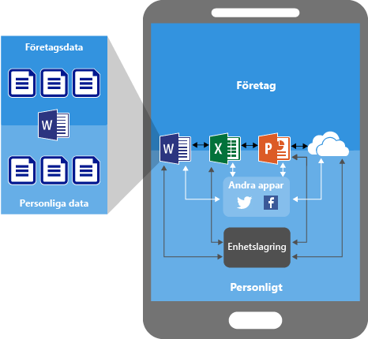
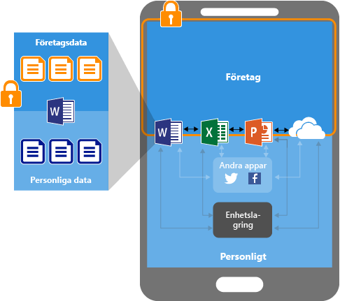
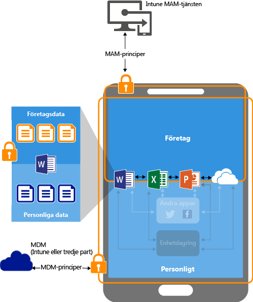
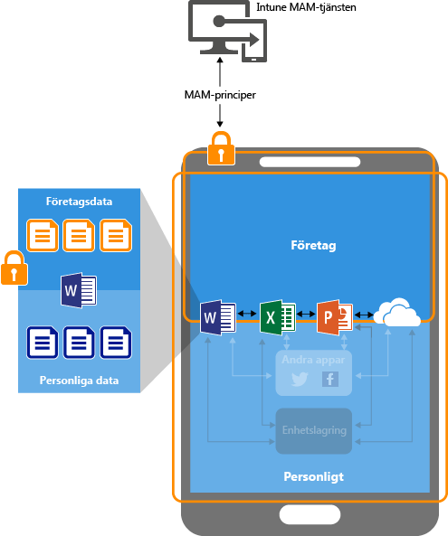

# Skydda appdata med hanteringsprinciper för mobila appar med Microsoft Intune

## Hur du kan skydda appdata
Dina anställda använder mobila enheter för både personliga och arbetsrelaterade uppgifter.  Samtidigt som du vill se till att de anställda kan vara produktiva vill du även förhindra dataförlust, både avsiktlig och oavsiktlig.  Dessutom vill du kunna skydda företagsdata som nås med enheter även i de fall då de inte hanteras av dig.

Du kan använda Intunes hanteringsprinciper för mobila appar (MAM) för att skydda företagets data. Eftersom Intunes MAM-principer kan användas oberoende av en hanteringslösning för mobila enheter (MDM) kan du använda dem för att skydda företagets data både om du registrerar eller inte registrerar enheter i en enhetshanteringslösning. Genom att implementera **principer på appnivå** kan du begränsa åtkomsten till företagsresurser och hålla data inom IT-avdelningens kontroll.

MAM-principer stöder appar som körs på:
> [!IMPORTANT]
> Du kan skapa hanteringsprinciper för mobila appar för Office-mobilappar som ansluter till Office 365-tjänster. MAM-principer stöds inte för appar som ansluter till lokala Exchange- eller SharePoint-tjänster.

- **Enheter som hanteras och är registrerade i Microsoft Intune**. Enheter i den här kategorin är vanligtvis företagsägda enheter.

-   **Enheter som hanteras och som är registrerade i en hanteringslösning för mobila enheter från tredje part**.   Enheter i den här kategorin är vanligtvis företagsägda enheter.

  > [!NOTE]
  > Principer för mobilapphantering ska inte användas med tredje parts mobilapphantering eller lösningar för säkra behållare.

-   **Enheter som inte hanteras**.  Enheter i den här kategorin är vanligtvis personalägda enheter som inte hanteras eller som inte är registrerade i Intune eller andra MDM-lösningar.

**De främsta fördelarna med att använda MAM-principer är:**

-   Skydda företagets data på appnivå.  Eftersom mobilapphantering inte kräver enhetshantering kan du skydda företagets data på både hanterade och ohanterade enheter. Eftersom hanteringen är uppbyggd kring användaridentiteten krävs ingen enhetshantering.

-   Slutanvändarens produktivitet påverkas inte och principerna tillämpas inte när appen används i en privat kontext.  Principerna tillämpas endast i arbetssammanhang, vilket ger dig möjlighet att skydda företagets data utan att röra personliga data.

Det finns ytterligare fördelar med att använda MDM med MAM-principer. Företag kan använda MAM med och utan MDM på samma gång. En medarbetare kan till exempel använda en telefon som utfärdats av företaget, samt en personlig surfplatta.  I det här fallet registreras företagets telefon i MDM och skyddas av MAM-principer, och den personliga enheten skyddas endast av MAM-principer.

- **MDM ser till att enheten är skyddad**.  Du kan till exempel behöva en PIN-kod för att få åtkomst till enheten, eller så kan du distribuera hanterade appar till enheten. Du kan också distribuera appar till enheter via MDM-lösningen, vilket ger dig större kontroll över apphanteringen.

- **MAM-principer ser till att det finns skydd på appnivå**. Du kan till exempel kräva en PIN-kod för att öppna en app i arbetssammanhang eller om data kan delas mellan appar, eller förhindra att företagets appdata sparas till en personlig lagringsplats.

### MAM-principer stöds för närvarande på:
-   iOS 8.1 eller senare

-   Android 4 eller senare

Windows-enheter stöds inte för tillfället.
##  Hur MAM-principer skyddar appdata

####  Appar utan MAM-principer:

När appar används utan begränsningar kan företagsrelaterade och personliga data blandas.  Företagsdata kan hamna på platser som personlig lagring eller överföras till appar som du inte har kontroll över, vilket leder till dataförlust. Pilarna i diagrammet visar hur data flyttas utan begränsningar mellan appar (företagsdata och personliga data) och till lagringsplatser.

### Dataskydd med MAM-principer:

Du kan använda MAM-principer för att förhindra att företagets data sparas till enhetens lokala lagring och begränsa dataflyttningen till andra appar som inte skyddas av MAM-principer. Exempel på inställningar för MAM-principer är:
- Principer för dataflytt som **Förhindra spara som**, **Begränsa klipp ut, kopiera och klistra in**.
- Inställningar för åtkomstprinciper som **Kräv enkel PIN för åtkomst** eller **Blockera hanterade appar från att köras på jailbrokade eller rotade enheter**.

### Dataskydd med MAM-principer på enheter som hanteras av en MDM-lösning:

**För enheter som har registrerats i en MDM-lösning**-

Bilden ovan visar de skyddslager som MDM och MAM-principer erbjuder tillsammans.

MDM-lösningen:

-   Registrerar enheten

-   Distribuerar appar till enheten

-   Tillhandahåller fortlöpande enhetskompatibilitet och hantering

**MAM-principer ger extra värde genom att:**

-   Hjälpa till att skydda företagsdata från att läcka till konsumentappar och tjänster

-   Använda begränsningar (Spara som, Urklipp, PIN-kod osv.) för mobilappar

-   Rensa företagsdata från appar utan att ta bort dessa appar från enheten

### Dataskydd med MAM-principer för enheter utan registrering

Diagrammet ovan visar hur dataskyddsprinciper fungerar på appnivå utan MDM.

För BYOD-enheter som inte har registrerats i någon MDM-lösning kan MAM-principer skydda företagets data på appnivå.
Det finns dock vissa begränsningar som du bör känna till, t.ex.:

-   Du kan inte distribuera appar till enheten.  Slutanvändaren måste hämta apparna från butiken.

-   Du kan inte etablera certifikatprofiler på enheterna.

-   Du kan inte etablera företagets Wi-Fi- och VPN-inställningar på enheterna.

## Flera identiteter

Med appar som stöder flera identiteter kan du använda olika konton – arbete och privat – för att få åtkomst till samma appar när MAM-principer tillämpas och apparna används i arbetskontexten.  

Om slutanvändaren exempelvis startar appen OneDrive med ett arbetskonto kan han eller hon inte flytta filerna till en personlig lagringsplats. Om slutanvändaren däremot använder OneDrive med ett personligt konto kan han eller hon kopiera och flytta data från sin personliga OneDrive utan begränsningar.  

En detaljerad förklaring av användningen av appar som är associerade med MAM-principer, och hur appar med stöd för flera identiteter gör det möjligt att tillämpa MAM-principer endast i arbetskontexten, finns i avsnittet [Använda appar med stöd för flera identiteter](end-user-experience-for-mam-enabled-apps-with-microsoft-intune.md#using-apps-with-multi-identity-support)

Alla mobila Office-appar stöder multiidentitet.

##  Nästa steg
[Förbered dig för att konfigurera hanteringsprinciper för mobilappar](get-ready-to-configure-mobile-app-management-policies-with-microsoft-intune.md)

[Skapa och distribuera hanteringsprinciper för mobilappar med Microsoft Intune](create-and-deploy-mobile-app-management-policies-with-microsoft-intune.md)

<!--HONumber=Jun16_HO4-->

