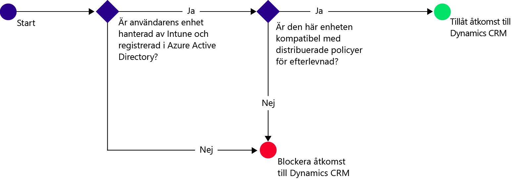
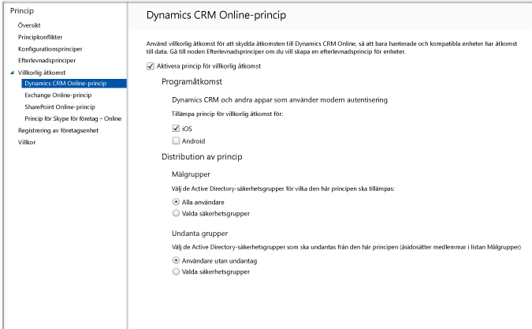

# Begränsa e-poståtkomst till Dynamics CRM Online med Intune
Du kan kontrollera åtkomsten till Microsoft Dynamics CRM Online från iOS- och Android-enheter med villkorlig åtkomst i Microsoft Intune.  Villkorlig åtkomst i Intune består av två komponenter:
* [Principen för enhetsefterlevnad](introduction-to-device-compliance-policies-in-microsoft-intune.md) som enheten måste uppfylla för att anses vara kompatibel.
* [Principen för villkorlig åtkomst](restrict-access-to-email-and-o365-services-with-microsoft-intune.md) där du anger de villkor som enheten måste uppfylla för att komma åt tjänsten.

Om du vill ha mer information om hur villkorlig åtkomst fungerar läser du artikeln [Begränsa åtkomsten till e-post, O365 och andra tjänster](restrict-access-to-email-and-o365-services-with-microsoft-intune.md).

[!IMPORTANT] Om du vill distribuera villkorlig åtkomst måste du ha prenumerationer för Intune och Azure Active Directory Premium och användarna måste ha licens för båda produkterna. **Enterprise Mobility + Security-prenumerationen (EMS)** innehåller både Intune- och Azure Active Directory Premium-prenumerationer. Mer information finns på [sidan med priser för Enterprise Mobility](https://www.microsoft.com/en-us/cloud-platform/enterprise-mobility-pricing). Om du inte har EMS-prenumerationen kan du skaffa en Azure Active Directory Premium-prenumeration. Mer information finns på [sidan med priser för Azure Active Directory](https://azure.microsoft.com/en-us/pricing/details/active-directory/). 

När en målanvändare försöker använda Dynamics CRM-appen på sin enhet görs följande utvärdering:

Enheten som behöver åtkomst till Dynamics CRM Online måste:
* Vara en **Android**- eller **iOS**-enhet.
* Vara **registrerad** i Microsoft Intune.
* Vara **kompatibel** med alla distribuerade efterlevnadsprinciper för Microsoft Intune.

Enhetens tillstånd lagras i Azure Active Directory som beviljar eller blockerar åtkomst baserat på de villkor du anger.

Om ett villkor inte är uppfyllt, kommer användaren att visas ett följande meddelanden när de loggar in:
* Om enheten inte är registrerad för Microsoft Intune, eller i Azure Active Directory, visas ett meddelande med instruktioner om hur du installerar företagsportalsappen och registrerar dig.
* Om enheten inte är godkänd visas ett meddelande som leder användaren till webbplatsen för Microsoft Intunes företagsportal eller företagsportalsappen där de kan hitta information om problemet och hur det kan åtgärdas.

## Konfigurera villkorlig åtkomst för Dynamics CRM Online  
### Steg 1: Konfigurera Active Directory-säkerhetsgrupper

Konfigurera säkerhetsgrupper för Azure Active Drive Directory för villkorlig åtkomstpolicy innan du börjar. Du kan konfigurera dessa grupper i **administrationscenter för Office 365**. Dessa grupper används för att bestämma målanvändare eller undantagna användare för principen. När en användare är angiven som mål för en policy, måste varje enhet de använder vara godkänd för att få åtkomst till resurser.

Du kan ange två typer av grupper för Dynamics CRM-principen:
* **Målgrupper** – Innehåller grupper med användare som principen ska gälla för.
* **Undantagna grupper** – Innehåller användargrupper som är undantagna från principen.

Om en användare finns i båda grupperna, kommer de att vara befriade från policyn.

### Steg 2: Ställ in och distribuera en efterlevnadsprincip
[Skapa](create-a-device-compliance-policy-in-microsoft-intune.md) och [distribuera](deploy-and-monitor-a-device-compliance-policy-in-microsoft-intune.md) en efterlevnadsprincip för alla enheter som påverkas av principen. Detta motsvarar alla enheter som används av användarna i Målgrupper.

> [!NOTE]
> Medan efterlevnadsprinciper distribueras till Microsoft Intune-grupper är principer för villkorlig åtkomst avsedda för Azure Active Directory-säkerhetsgrupper.

> [!IMPORTANT]
> Om du inte har distribuerat någon efterlevnadsprincip behandlas enheterna som kompatibla.

När du är klar, fortsätt till Steg 3.
### Steg 3: Konfigurera Dynamics CRM-principen
Konfigurera sedan policyn som kräver att enbart hanterade och godkända enheter kan komma åt Dynamics CRM. Denna policy kommer att lagras i Azure Active Directory.

1.  I Microsoft Intune-administratörskonsolen väljer du **Princip > Villkorlig åtkomst > Dynamics CRM Online-princip**.

  

2.  Välj **Aktivera princip för villkorlig åtkomst**.
3.  Under **Programåtkomst** kan du välja att använda principen för villkorlig åtkomst för:
  * **iOS**
  * **Android**
4.  Under **Målgrupper**, välj **Modifiera** för att välja de Azure Active Directory-säkerhetsgrupper som principen ska gälla för. Du kan välja att omfatta alla användare eller bara en viss grupp med användare.
5.  Under **Undantagna Grupper** kan du alternativt välja **Modifiera** om det finns säkerhetsgrupper i Azure Active Directory som ska vara undantagna principen.
6.  När du är klar väljer du **Spara**.

Nu har du konfigurerat villkorlig åtkomst för Dynamics CRM. Du behöver inte använda den villkorliga åtkomstpolicyn, den träder i kraft omedelbart.
##  Övervaka efterlevnaden och villkorlig åtkomstpolicy

I arbetsytan **Grupper** , kan du se statusen för villkorlig åtkomst för dina enheter.

Välj en mobil enhetsgrupp och klicka på **enheter** -fliken, där väljer du något av följande **Filter**:
* **Enheter som inte är ADD-registrerade** – Enheterna blockeras från Dynamics CRM.
* **Enheter som inte uppfyller kraven** – Enheterna blockeras från Dynamics CRM.
* **Enheter som är AAD-registrerade och uppfyller kraven** – Enheterna kan komma åt Dynamics CRM.

##  Nästa steg
[Begränsa åtkomsten till Exchange Online](restrict-access-to-exchange-online-with-microsoft-intune.md)

[Begränsa åtkomsten till Exchange on-premises](restrict-access-to-exchange-onpremises-with-microsoft-intune.md)
[Begränsa åtkomsten till SharePoint Online](restrict-access-to-sharepoint-online-with-microsoft-intune.md)

[Begränsa åtkomsten till Skype för företag – Online](restrict-access-to-skype-for-business-online-with-microsoft-intune.md)

<!--HONumber=Oct16_HO1-->

