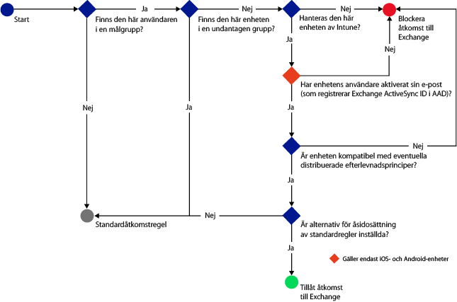
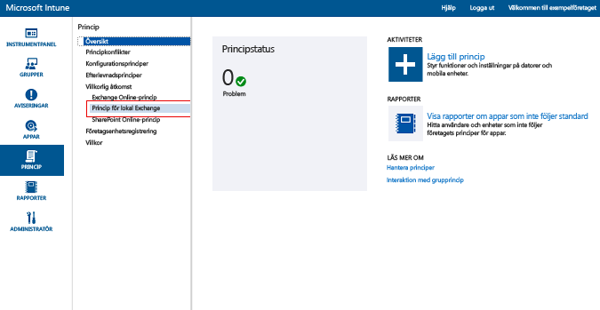
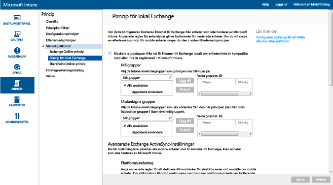

# Begränsa e-poståtkomsten till Exchange On-premises och äldre Exchange Online Dedicated med Microsoft Intune

Om du har en Exchange Online Dedicated-miljö och vill veta om du har den nya eller gamla konfigurationen kontaktar du din kontoansvariga.

Du kontrollerar e-poståtkomsten till Exchange On-premises eller till den äldre Exchange Online Dedicated-miljön genom att konfigurera villkorlig åtkomst till Exchange On-premises i Intune.
Mer information om hur villkorlig åtkomst fungerar finns i artikeln [Begränsa åtkomsten till e-post och O365-tjänster]( restrict-access-to-email-and-o365-services-with-microsoft-intune.md).

**Innan** du konfigurerar villkorlig åtkomst kontrollerar du följande:

-   Din Exchange-version måste vara **Exchange 2010 eller senare**. Matrisen för Exchange Server-klientåtkomstservern (CAS) stöds.

-   Du måste använda den **lokala Exchange Connector**, som ansluter [!INCLUDE[wit_nextref](../includes/wit_nextref_md.md)] till Microsoft Exchange On-premises. Den här anslutningen gör att du kan hantera enheter via [!INCLUDE[wit_nextref](../includes/wit_nextref_md.md)]-konsolen. Mer information om anslutningsappen finns i avsnittet om [Intunes lokala Exchange-anslutningsapp](intune-on-premises-exchange-connector.md).

    -   Intune-konsolens lokala Exchange Connector är specifik för din Intune-klientorganisation och kan inte användas med andra innehavare. Kontrollera också att Exchange-anslutningsappen för din klient är installerad **på endast en dator**.

        Den här anslutningen bör hämtas från Intune-administrationskonsolen.  En genomgång av hur du konfigurerar den lokala Exchange-anslutningen finns i avsnittet om hur du [konfigurerar den lokala Exchange Connector-anslutningen för lokal eller värdbaserad Exchange](intune-on-premises-exchange-connector.md).

    -   Anslutningen kan installeras på valfri dator, förutsatt att datorn kan kommunicera med Exchange-servern.

    -   Anslutningen stöder **Exchange CAS-miljön**. Tekniskt sett kan du installera anslutningen på Exchange CAS-servern direkt om du vill, men det rekommenderas inte eftersom det ökar belastningen på servern.
    När du konfigurerar anslutningen måste du ställa in den så att den kommunicerar med en av Exchange CAS-servrarna.

-   **Exchange ActiveSync** måste konfigureras med certifikatbaserad autentisering eller genom att användaren anger autentiseringsuppgifter.

Innan en användare kan ansluta till sin e-post när principer för villkorlig åtkomst har konfigurerats och tillämpats på användaren måste användarens **enhet**:

-  Antingen **registreras** med [!INCLUDE[wit_nextref](../includes/wit_nextref_md.md)] eller vara en domänansluten dator.

-  **Registreras i Azure Active Directory**. Dessutom måste klientens Exchange ActiveSync-ID registreras med Azure Active Directory.

  AAD DRS aktiveras automatiskt för Intune och Office 365-kunder. Kunder som redan har använt AD FS Device Registration Service ser inte registrerade enheter i sina lokala Active Directory-kataloger. **Detta gäller inte för Windows-datorer och Windows Phone-enheter**.

-   Vara **kompatibel** med eventuella [!INCLUDE[wit_nextref](../includes/wit_nextref_md.md)]-efterlevnadsprinciper som distribuerats till enheten

Följande diagram illustrerar flödet som används av principer för villkorlig åtkomst för Exchange On-premises för att utvärdera om enheter ska tillåtas eller blockeras.

 Om en princip för villkorlig åtkomst inte uppfylls visas något av följande meddelanden när användaren loggar in:

- Om enheten inte är registrerad i [!INCLUDE[wit_nextref](../includes/wit_nextref_md.md)] eller i Azure Active Directory visas ett meddelande med instruktioner för att installera företagsportalappen, registrera enheten och aktivera e-post. Den här processen associerar även enhetens Exchange ActiveSync-ID med enhetsposten i Azure Active Directory.

-   Om enheten inte är kompatibel visas ett meddelande som leder användaren till [!INCLUDE[wit_nextref](../includes/wit_nextref_md.md)]-företagsportalens webbplats eller till företagsportalappen, som innehåller mer information om problemet och hur det kan åtgärdas.

## Stöd för mobila enheter
-   Windows Phone 8 och senare

-   Intern e-postapp för iOS.

-   Intern e-post-app på Android 4 eller senare
> [!NOTE]
> Microsoft Outlook-appen for Android and iOS stöds inte.

## Stöd för datorer

Programmet **E-post** i Windows 8 och senare (om det har registrerats med [!INCLUDE[wit_nextref](../includes/wit_nextref_md.md)])

##  Konfigurera en princip för villkorlig åtkomst

1.  I [Microsoft Intune-administrationskonsolrn](https://manage.microsoft.com) väljer du **Princip** > **Villkorlig åtkomst** > **Exchange On-premises-princip**.

2.  Konfigurera principen med de inställningar du behöver: 

  - **Blockera e-postappar från att få åtkomst till Exchange On-premises om enheten inte är kompatibel med eller inte är registrerad på Microsoft Intune:** Om du väljer det här alternativet kan inte enheter som inte hanteras av [!INCLUDE[wit_nextref](../includes/wit_nextref_md.md)] eller som inte är kompatibla med en efterlevnadsprincip komma åt Exchange-tjänster.

  - **Åsidosätt standardregel – Tillåt att registrerade och kompatibla enheter alltid får åtkomst till Exchange:** Om du väljer det här alternativet kan enheter som är registrerade i Intune och kompatibla med efterlevnadsprinciper komma åt Exchange.  
  Den här regeln åsidosätter **standardregeln**, vilket innebär att även om du ställer in **standardregeln** för att blockera åtkomstförsök eller sätta dem i karantän så kommer registrerade och kompatibla enheter fortfarande att kunna få åtkomst till Exchange.

  - **Målgrupper:** Välj de [!INCLUDE[wit_nextref](../includes/wit_nextref_md.md)]-användargrupper som måste registrera sina enheter med [!INCLUDE[wit_nextref](../includes/wit_nextref_md.md)] innan de kan komma åt Exchange.

  - **Undantagna grupper:** Välj de [!INCLUDE[wit_nextref](../includes/wit_nextref_md.md)]-användargrupper som är undantagna från principen för villkorlig åtkomst. Användare i den här listan undantas även om de också finns med i listan **Målgrupper**.

  - **Plattformsundantag:** Välj **Lägg till regel** om du vill konfigurera en regel som definierar åtkomstnivåer för angivna familjer och modeller av mobila enheter. Eftersom dessa enheter kan tillhöra vilken typ som helst kan du även konfigurera enhetstyper som inte stöds av [!INCLUDE[wit_nextref](../includes/wit_nextref_md.md)].

  - **Standardregel:** För en enhet som inte omfattas av någon av de andra reglerna kan du välja att ge enheten åtkomst till Exchange, blockera den eller placera den i karantän. När du ställer in regeln för att tillåta åtkomst för enheter som är registrerade och kompatibla beviljas e-poståtkomst automatiskt för iOS-, Windows- och Samsung KNOX-enheter. Slutanvändaren behöver inte gå igenom någon särskild process för att få sin e-post.  Slutanvändare av Android-enheter som inte kör Samsung KNOX får ett karantänmeddelande med stegvisa anvisningar för att verifiera registreringen och efterlevnaden innan de kan komma åt e-posten. Om du ställer in regeln för att blockera åtkomst eller sätta den i karantän blir alla enheter blockerade från att få åtkomst till Exchange oavsett om de redan har registrerats i Intune eller inte. Om du vill förhindra att registrerade och kompatibla enheter påverkas av den här regeln markerar du **Åsidosätt standardregel**.
>[!TIP]
>Om din avsikt är att först blockera alla enheter innan du beviljar åtkomst till e-posten väljer du regeln Blockera åtkomst eller Karantän. Standardregeln gäller för alla enhetstyper. Det betyder att även enhetstyper som du konfigurerar som plattformsundantag och som inte stöds av [!INCLUDE[wit_nextref](../includes/wit_nextref_md.md)] påverkas.

  - **Meddelande till användare:** Förutom e-postmeddelandet som skickas från Exchange skickar Intune ett e-postmeddelande med stegvisa anvisningar för att låsa upp enheten. Du kan redigera standardmeddelandet och anpassa det efter dina behov. Eftersom Intunes e-postmeddelande med instruktionerna skickas till användarens Exchange-postlåda kan användaren använda en enhet som inte är blockerad eller en annan metod för att komma åt Exchange och läsa meddelandet om enheten hinner blockeras innan användaren får e-postmeddelandet. Detta är särskilt viktigt om **standardregeln** har konfigurerats att blockera eller placera enheter i karantän.  I så fall måste slutanvändaren besöka sin appbutik, ladda ned Microsofts företagsportalapp och registrera sin enhet. Detta gäller iOS-, Windows- och Samsung KNOX-enheter.  För enheter som inte kör Samsung KNOX måste du skicka karantänmeddelandet till ett alternativt e-postkonto, som slutanvändaren sedan måste kopiera till sin blockerade enhet för att slutföra registrerings- och efterlevnadsprocessen.
  > [!NOTE]
  > För att Exchange ska kunna skicka e-postmeddelandet måste du ange det konto som ska användas för att skicka meddelandet.
  >
  > Mer information finns i [Konfigurera lokal Exchange-anslutning för lokal eller värdbaserad Exchange](intune-on-premises-exchange-connector.md).

3.  När du är klar väljer du **Spara**.

-   Du behöver inte använda den villkorliga åtkomstpolicyn, den träder i kraft omedelbart.

-   När en användare har konfigurerat en Exchange ActiveSync-profil kan det ta 1–3 timmar innan enheten blockeras (om den inte hanteras av [!INCLUDE[wit_nextref](../includes/wit_nextref_md.md)]).

-   Om en blockerad användare sedan registrerar enheten med [!INCLUDE[wit_nextref](../includes/wit_nextref_md.md)] och åtgärdar efterlevnadsproblemet avblockeras e-poståtkomsten inom två minuter.

-   Om användaren avregistrerar sig från [!INCLUDE[wit_nextref](../includes/wit_nextref_md.md)] kan det ta 1–3 timmar innan enheten blockeras.

**Några exempelscenarier på hur du konfigurerar principer för villkorlig åtkomst för att begränsa enhetsåtkomsten finns i [exempelscenarier för att begränsa e-poståtkomst](restrict-email-access-example-scenarios.md).**

## Nästa steg
[Begränsa åtkomsten till SharePoint Online](restrict-access-to-sharepoint-online-with-microsoft-intune.md)

[Begränsa åtkomsten till Skype för företag – Online](restrict-access-to-skype-for-business-online-with-microsoft-intune.md)

<!--HONumber=Jul16_HO4-->

