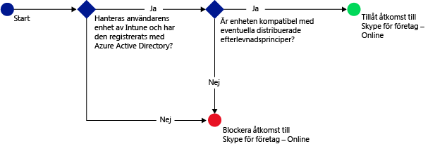
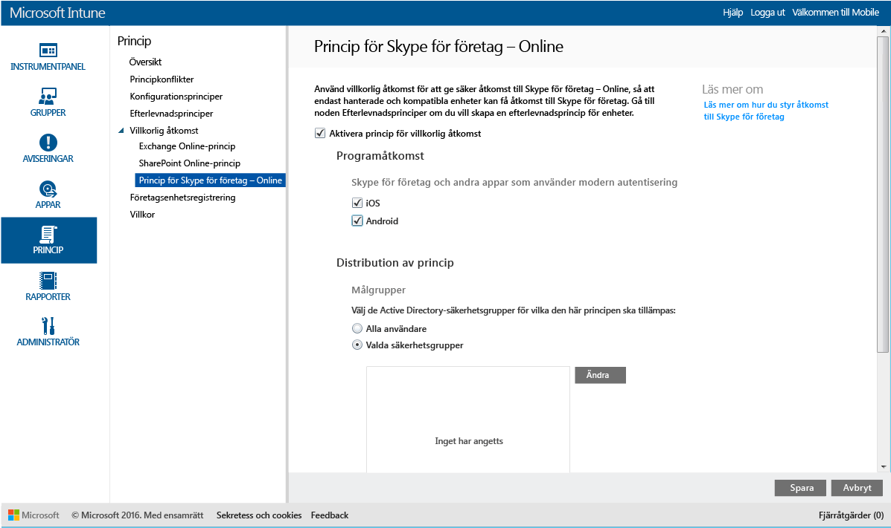

# Begränsa åtkomsten till Skype för företag – Online med Microsoft Intune
Använd principen för villkorlig åtkomst för  **Skype för företag – Online** om du vill kontrollera åtkomsten till Skype för företag – Online.
Villkorlig åtkomst består av två komponenter:
- Principen för enhetsefterlevnad som enheten måste uppfylla för att anses vara kompatibel.
- Principen för villkorlig åtkomst där du anger de villkor som enheten måste uppfylla för att komma åt tjänsten.
Mer information om hur villkorlig åtkomst fungerar finns i artikeln [Begränsa åtkomsten till e-post och O365-tjänster](restrict-access-to-email-and-o365-services-with-microsoft-intune.md).

När en målanvändare försöker använda Skype för företag – Online på sin enhet görs följande utvärdering:

**Innan** du konfigurerar en princip för villkorlig åtkomst för Skype för företag – Online måste du:
- Ha en **prenumeration på Skype för företag – Online** och tilldela användare Skype för Business Online-licenser.
- Ha en **Enterprise Mobility + Security- eller Azure Active Directory Premium-prenumeration**, och användarna måste ha licens för EMS eller Azure AD. Mer information finns på [sidan med priser för Enterprise Mobility](https://www.microsoft.com/en-us/cloud-platform/enterprise-mobility-pricing) eller [sida med priser för Azure Active Directory](https://azure.microsoft.com/en-us/pricing/details/active-directory/). 

-   [Aktivera modern autentisering](https://docs.microsoft.com/en-us/intune/deploy-use/restrict-access-to-skype-for-business-online-with-microsoft-intune) för Skype för företag – Online.
-  Alla dina slutanvändare måste använda **Skype för företag – Online**. Om du har en distribution med både Skype för företag – Online och Skype för företag lokalt tillämpas inte principen för villkorlig åtkomst på slutanvändarna.

    Enheten som behöver åtkomst till Skype för företag – Online måste:

-   Vara en **Android**- eller **iOS**-enhet.

-   Vara **registrerad** med [!INCLUDE[wit_nextref](../includes/wit_nextref_md.md)].

-   Vara **kompatibel** med eventuella [!INCLUDE[wit_nextref](../includes/wit_nextref_md.md)]-efterlevnadsprinciper.

Enhetens tillstånd lagras i Azure Active Directory som beviljar eller blockerar åtkomst baserat på de villkor du anger.

Om ett villkor inte är uppfyllt, kommer användaren att visas ett följande meddelanden när de loggar in:

-   Om enheten inte är registrerad i [!INCLUDE[wit_nextref](../includes/wit_nextref_md.md)], eller i Azure Active Directory, så visas ett meddelande med instruktioner som beskriver hur användaren installerar företagsportalappen och registrerar sig.

-   Om enheten inte är kompatibel visas ett meddelande som leder användaren till [!INCLUDE[wit_nextref](../includes/wit_nextref_md.md)]-företagsportalens webbplats eller till företagsportalappen som innehåller mer information om problemet och hur det kan åtgärdas.

## Konfigurera villkorlig åtkomst för Skype för företag – Online

### Steg 1: Konfigurera Active Directory-säkerhetsgrupper
Konfigurera säkerhetsgrupper för Azure Active Drive Directory för villkorlig åtkomstpolicy innan du börjar. Du kan konfigurera dessa grupper i **administrationscenter för Office 365**. Dessa grupper används för att bestämma målanvändare eller undantagna användare för principen. När en användare är angiven som mål för en policy, måste varje enhet de använder vara godkänd för att få åtkomst till resurser.

Du kan ange två typer av grupper för principen för Skype för företag – Online:

-   **Målgrupper** – Innehåller grupper med användare som principen ska gälla för.

-   **Undantagna grupper** – Innehåller användargrupper som är undantagna från principen.

Om en användare finns i båda grupperna, kommer de att vara befriade från policyn.

### Steg 2: Ställ in och distribuera en efterlevnadsprincip
[Skapa](create-a-device-compliance-policy-in-microsoft-intune.md) och [distribuera](deploy-and-monitor-a-device-compliance-policy-in-microsoft-intune.md) en efterlevnadsprincip för alla enheter som påverkas av principen. Detta motsvarar alla enheter som används av användarna i **Målgrupper**.

> [!NOTE]
> Medan efterlevnadsprinciper distribueras till [!INCLUDE[wit_nextref](../includes/wit_nextref_md.md)]-grupper är principer för villkorlig åtkomst avsedda för Azure Active Directory-säkerhetsgrupper.

> [!IMPORTANT]
> Om du inte har distribuerat någon efterlevnadsprincip behandlas enheterna som kompatibla.

När du är klar, fortsätt till **Steg 3**.

### Steg 3: Konfigurera principen för Skype för företag – Online
Nu ska du konfigurera principen så att endast hanterade och kompatibla enheter kan komma åt Skype för företag – Online. Denna policy kommer att lagras i Azure Active Directory.

####
1.  I [Microsoft Intune Administrationskonsol](https://manage.microsoft.com) klickar du på **Princip** > **Villkorlig åtkomst** > **Princip för Skype för företag – Online**.

2.  Välj **Aktivera princip för villkorlig åtkomst**.

3.  Under **Programåtkomst** kan du välja att använda principen för villkorlig åtkomst för:

    -   **iOS**

    -   **Android**

4.  Under **Målgrupper**, klicka på **Modifiera** för att välja de Azure Active Directory säkerhetsgrupper som policyn ska gälla för. Du kan välja att omfatta alla användare eller bara en viss grupp med användare.

5.  Under **Undantagna Grupper**, kan du alternativt klicka på **Modifiera** om det finns säkerhetsgrupper i Azure Active Directory som ska vara undantagna policyn.

6.  När du är klar klicka på **Spara**.

Nu har du konfigurerat villkorlig åtkomst för Skype för företag – Online. Du behöver inte använda den villkorliga åtkomstpolicyn, den träder i kraft omedelbart.

## Övervaka efterlevnaden och villkorlig åtkomstpolicy
I arbetsytan **Grupper** , kan du se statusen för villkorlig åtkomst för dina enheter.

Välj en mobil enhetsgrupp och klicka på **enheter** -fliken, där väljer du något av följande **Filter**:

* **Enheter som inte är registrerade i AAD** – Dessa enheter blockeras från Skype för företag – Online.

* **Enheter som inte är kompatibla** – Dessa enheter blockeras från Skype för företag – Online.

* **Enheter som är registrerade i AAD och kompatibla** – Dessa enheter kan komma åt Skype för företag – Online.

<!--HONumber=Oct16_HO1-->

