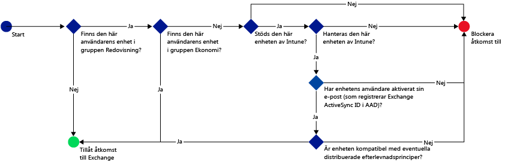
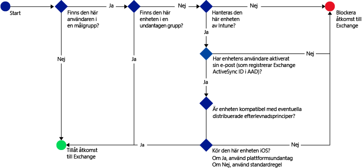
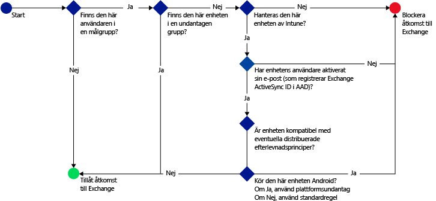

# Begränsa åtkomsten till e-post med Microsoft Intune: Exempelscenarier

## Förhindra att användare kommer åt Exchange Online från icke-kompatibla enheter.
### Krav för scenario
- Alla användare i Active Directory-säkerhetsgruppen **Bokföring** måste hindras från att komma åt Exchange Online om deras enhet inte är kompatibel med en efterlevnadsprincip som du har distribuerat.
- Om det finns användare i den här gruppen vars enheter inte stöds av [!INCLUDE[wit_nextref](../includes/wit_nextref_md.md)]måste de hindras från att komma åt Exchange Online på den enheten.
- Användare i Active Directory-säkerhetsgruppen **Finans** måste undantas från principen, även om de även ingår i säkerhetsgruppen **Bokföring**.

För att åstadkomma detta konfigurerar du en princip för villkorlig åtkomst för Exchange Online med följande inställningar:

-   Välj **Aktivera princip för villkorlig åtkomst**.

- Välj önskade plattformar för att tillåta åtkomst från appar med modern autentisering.
- För Exchange ActiveSync-appar väljer du **Blockera inkompatibla enheter på plattformar som stöds av Microsoft Intune** och **Blockera alla andra enheter på plattformar som inte stöds av Microsoft Intune.**
-   I **Målgrupp** väljer du användargruppen **Bokföring** under **Valda säkerhetsgrupper**.

-   I **Undantagna grupper** väljer du användargruppen **Finans** under **Valda säkerhetsgrupper**.

Följande flöde används för att bestämma vilka enheter som kan komma åt Exchange Online:

## Alla iOS-enheter som har åtkomst till Exchange On-premises måste hanteras av Intune
### Krav för scenario
- Endast enheter som kör iOS ska kunna komma åt Exchange On-premises.
- Enheterna måste dessutom vara registrerade i Intune och uppfylla reglerna för efterlevnadsprinciper innan de kan användas för att komma åt Exchange.

Du åstadkommer detta genom att konfigurera följande princip för villkorlig åtkomst för Exchange On-premises med följande inställningar:

-   Välj alternativet **Blockera e-postappar från att få åtkomst till Exchange On-premises om enheten inte är kompatibel med eller inte är registrerad på Microsoft Intune**. När du väljer det här alternativet aktiveras principen för villkorlig åtkomst, vilket innebär att alla enheter måste vara registrerade i Microsoft Intune och uppfylla reglerna för efterlevnadsprinciper för att kunna komma åt Exchange.

-   För avancerade Exchange Active Sync-inställningar skapar du:

  -   Ett plattformsundantag som gör att enheter som kör iOS får tillgång till Exchange.   

  -   En standardregel som anger att enheter som inte omfattas av regeln för plattformsundantag ska blockeras från åtkomst till Exchange. Den här regeln ser till att enheter som inte kör iOS inte kan komma åt Exchange.

Följande flöde används för att bestämma vilka enheter som kan få tillgång till Exchange:

## Inga Android-enheter kan komma åt Exchange On-premises.
### Krav för scenario
- Alla Android-enheter ska blockeras från att komma åt Exchange.
- Alla andra enheter som stöds kan få åtkomst till Exchange under förutsättning att de hanteras av [!INCLUDE[wit_nextref](../includes/wit_nextref_md.md)].

Du åstadkommer detta genom att konfigurera en princip för villkorlig åtkomst för Exchange On-premises med följande inställningar:

-   Välj alternativet **Blockera e-postappar från att få åtkomst till Exchange On-premises om enheten inte är kompatibel med eller inte är registrerad på Microsoft Intune**. När du väljer det här alternativet måste alla enheter vara registrerade i Intune och uppfylla reglerna för efterlevnadsprinciper.

- För avancerade Exchange Active Sync-inställningar skapar du:
  -   Ett plattformsundantag som blockerar enheter som kör Android från att komma åt Exchange. Den här regeln kontrollerar att Android-enheter inte kan användas för att komma åt Exchange.

  -   Standardregel som anger att enheter som inte omfattas av andra regler ska beviljas åtkomst till Exchange. Den här standardregeln ser till att enheter som kör andra plattformar än Android, men som stöds av Microsoft Intune, kan användas för att få åtkomst till Exchange. De måste dock vara registrerade i Intune och uppfylla reglerna för efterlevnadsprinciper.

Följande flöde används för att bestämma vilka enheter som kan få tillgång till Exchange:

<!--HONumber=Jul16_HO5-->

