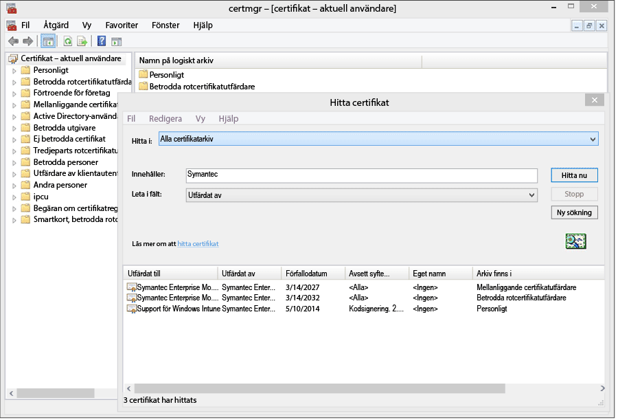
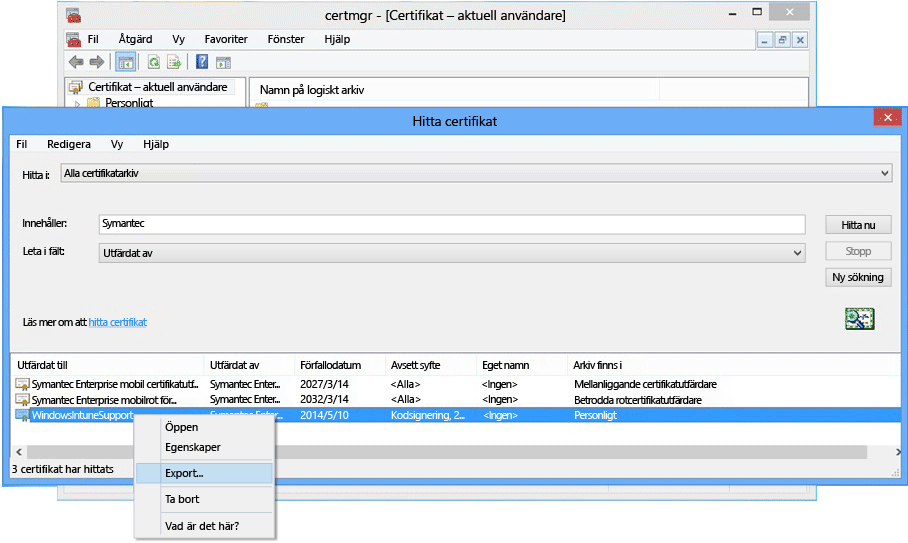

---
# required metadata

title: Konfigurera hantering av Windows Phone 8.0 med Microsoft Intune | Microsoft Intune
description:
keywords:
author: NathBarn
manager: jeffgilb
ms.date: 04/28/2016
ms.topic: article
ms.prod:
ms.service: microsoft-intune
ms.technology:
ms.assetid: 61e9b6c3-8795-49b0-8ab2-a9a05ee3ea1f

# optional metadata

#ROBOTS:
#audience:
#ms.devlang:
ms.reviewer: jeffgilb
ms.suite: ems
#ms.tgt_pltfrm:
#ms.custom:

---

# Konfigurera enhetshantering för Windows Phone 8.0

Innan du kan hantera mobila enheter som använder Windows Phone med Intune måste du konfigurera hanteringen. [Om du skapar en DNS-CNAME-post](set-up-windows-phone-management-with-microsoft-intune.md) blir det lättare för användarna att ansluta till Intune-företagsportalen. Windows Phone 8.0 kräver ett Symantec-certifikat för att upprätta en krypterad IP-anslutning mellan enheter och Intune. Ett certifikat krävs även för att signera branschspecifika företagsappar.

-   **Windows Phone 8.1 och Windows 10 Mobile** kräver bara ett certifikat om:

    -   Du vill distribuera företagsportalappen med Intune

    -   Du ska distribuera affärsspecifika appar (med separat inläsning).

-   **Windows Phone 8** – krävs


  > [!IMPORTANT]
  > Symantec-certifikatet som används för att hantera vissa Windows- och Windows Phone-enheter [måste förnyas regelbundet](renew-a-symantec-code-signing-certificate.md)..

Kraven för konfiguration av enhetshantering för mobila enheter som använder Windows Phone beror på hur du kommer att hantera enheter.  Genom att skapa två CNAME-poster i företagets DNS gör du registrering enklare för användare. Om användarna kommer att ladda ned företagsportalappen från butiken behöver du efter att du konfigurerat DNS-inställningarna endast konfigurera företagsportalen och informera användarna om hur de registrerar sig.  För Windows Phone 8.0 eller Windows Phone 8.1 där du ska distribuera företagsportalen behöver du ett Symantec-certifikat för att kodsignera appen.

## Ange konfigurationskraven för Windows Phone-hantering
1.  **Konfigurera Intune**
    Om du inte redan gjort det förbereder du hanteringen av mobila enheter genom att definiera **Microsoft Intune** som [utfärdare av mobilenhetshantering](https://technet.microsoft.com/library/mt346013.aspx) och genom att konfigurera MDM.

2.  **Ange ett DNS-alias för registreringsserverns adress** (valfritt)

    Ett DNS-alias (CNAME-post) gör det enklare för användare att registrera sina enheter genom att automatiskt fylla i servernamnet under registrering.

    1.  I [Intune-administrationskonsolen](http://manage.microsoft.com) klickar du på **Administration** &gt; **Hantering av mobila enheter** &gt; **Windows Phone**.

    2.  Ange webbadressen till företagswebbplatsens verifierade domän i rutan **Ange ett verifierat domännamn** och klicka sedan på **Testa automatisk identifiering**.

    3.  Skapa **CNAME**-DNS-resursposter för din företagsdomän. CNAME-resursposten måste innehålla följande information:

        |Värdnamn|Pekar på|TTL|
        |-------------|-------------|-------|
        |enterpriseenrollment.company_domain.com|enterpriseenrollment.manage.microsoft.com |1 timme|
        |enterpriseregistration.company_domain.com|enterpriseregistration.windows.net|1 timme|
        Om ditt företags webbplats exempelvis är contoso.com, skulle du skapa en CNAME-post i DNS-servern som omdirigerar EnterpriseEnrollment.contoso.com till manage.microsoft.com. Om det finns fler än en verifierad domän, skapar du en CNAME-post för varje domän.

        -   `manage.microsoft.com` – Stöder en omdirigering till Intune-tjänsten med domänidentifiering från e-postens domännamn.

        -   `enterpriseregistration.windows.net` – Stöder arbetsplatsanslutning för mobila enheter. Det stöder också villkorad åtkomst för Windows 8.1

    

3.  **Certifikathantering för att stödja appsignering**
    [Krävs för Windows Phone 8.0 och Windows Phone 8.1 som inte får åtkomst till Windows Phone Store och/eller behöver branschspecifika appar.]

    För att stödja företagsportalapplikationen för Windows Phone 8.0 och distribuera företagsappar till Windows Phone 8.1 måste du få ett **kodsigneringscertifikat från Symantec**. Du kan inte använda ett certifikat utfärdat av en egen certifikatutfärdare eftersom endast Symantec-certifikatet är betrott av Windows Phone-enheter. Detta certifikat krävs för att:

    -   Signera en företagsportalapp för distribution till [!INCLUDE[winphone8_client_1](../includes/winphone8_client_1_md.md)] för registrering och telefonhantering

    -   Signera affärsappar så att [!INCLUDE[wit_nextref](../includes/wit_nextref_md.md)] kan distribuera dem till Windows Phone-enheter

    Stegen nedan hjälper dig att få nödvändiga certifikat och signera företagsportalappen. Du behöver ett Windows Phone Dev Center-konto och du behöver köpa ett Symantec-certifikat.

    1.  **Gå med i Windows Phone Dev Center**
        Gå med i [Windows Phone Dev Center](http://go.microsoft.com/fwlink/?LinkId=268442) genom att använda företagskontots information när du loggar in för att köpa ditt företagskonto. Den här begäran måste godkännas av en företagsrepresentant innan du får ett signeringscertifikat med kod.

    2.  **Få ett företagscertifikat från Symantec**
        Köpa ett certifikat från [Symantec-webbplatsen](http://go.microsoft.com/fwlink/?LinkId=268441) med hjälp av ditt Symantec-ID. När du har köpt certifikatet får den företagsgodkännare som du angav i ditt Windows Phone Dev Center-konto ett e-postmeddelande där personen ombeds godkänna certifikatförfrågan. Du hittar mer information om kraven för Symantec-certifikat under [Varför Windows Phone kräver ett Symantec-certifikat](https://technet.microsoft.com/en-us/library/dn764959.aspx#BKMK_Symantec) Vanliga frågor och svar om registrering av Windows-enhet.

    3.  **Importera certifikat**
        När din begäran har godkänts, kommer du att få ett e-postmeddelande som innehåller instruktioner om hur du importerar certifikat. Följ anvisningarna i e-postmeddelandet för att importera certifikaten.

    4.  **Verifiera importerade certifikat**
        Du kan kontrollera att certifikaten har importerats genom att gå till snapin-modulen **Certifikat**, högerklicka på **Certifikat** och välja **Sök efter certifikat**. I fältet **Innehåller** skriver du ”Symantec” och klickar på **Sök nu**. De certifikat som du har importerat ska visas i resultaten.

        

    5.  **Exportera ett signerat certifikat**
        När du har kontrollerat att certifikaten finns kan du exportera .pfx-filen så att du kan signera företagsportalen. Välj Symantec-certifikatet med kodsigneringen **avsett syfte**. Högerklicka på det kodsignerade certifikatet och välj **Exportera**.

        

        I guiden **Exportera certifikat** väljer du **Ja, exportera den privata nyckeln** och klickar sedan på **Nästa**. **Välj Personal Information Exchange – PKCS #12 (.PFX)** och markera **Ta med om möjligt alla certifikat i certifieringssökvägen**. Slutför guiden. Mer information finns i [Exportera certifikat med privat nyckel](http://go.microsoft.com/fwlink/?LinkID=203031).

    6.  **Ladda ned och signera företagsportalappen**

        Stöd för registrering av Windows Phone kräver att Windows Phone 8.0-företagsportalappen signeras och överförs till Intune.

        1.  **Ladda ned företagsportalen**
            Ladda ned [Intune-företagsportalen för Windows Phone](http://go.microsoft.com/fwlink/?LinkId=268440) från Download Center. Standardplatsen för installation är `C:\Program Files (x86)\Microsoft Corporation\Windows Intune Company Portal for Windows Phone`.

        2.  **Ladda ned Windows Phone 8.0 SDK**
            Ladda ned [Windows Phone SDK](http://go.microsoft.com/fwlink/?LinkId=615570).

        3.  **Kodsignera filen för företagsportalappen**
            Använd appen XAPSignTool som medföljer SDK, för att signera företagsportalen med den .pfx-fil som du skapade från Symantec-certifikatet. Mer information finns i [Signera en företagsapp med XapSignTool](http://go.microsoft.com/fwlink/?LinkID=280195).

    7.  **Ladda upp företagsportalappen till Intune**
        Överför den signerade appfilen för företagsportalen och ditt kodsigneringscertifikat för att göra appen tillgänglig för dina slutanvändare.

        1.  I [Intune-administrationskonsolen](http://manage.microsoft.com) klickar du på **Administration** &gt; **Windows Phone**.

        2.  Klicka på **Överför signerad appfil** och logga in med ditt administratörs-ID för Intune.

        3.  På sidan för **Installation av programvara** **anger du platsen för programvaruinstallationsfiler** och bläddrar till platsen för den kodsignerade företagsportalappen (.xap för Windows Phone 8.0 eller .appx för Windows Phone 8.1).

            Om du utvärderar Intune och överför en kodsignerad appfil från ett Intune-utvärderingskonto avmarkerar du kryssrutan **Använd den företagsportalapp som signerats av exempelkodsigneringscertifikatet från Symantec**.

        4.  Lägg till certifikatfilen (.pfx) som du exporterade till **Kodsigneringscertifikat** och skapa ett lösenord för certifikatet.

        5.  På sidan **Beskrivning av programvara** fyller du i fälten. Kom ihåg att användarna ser den här informationen på sina enheter när de visar information om appen i företagsportalen.

        6.  Slutför guiden. Användare som registrerar en Windows Phone 8.0-enhet kommer nu att få företagsportalappen på sina enheter under registreringen. Windows Phone 8.1-användare kan installera företagsportalappen från butiksversionen av företagsportalen.  Om Windows Phone 8.1-enheter blockeras från Windows Phone Store eller om du vill distribuera företagsportalappen med Intune, måste du ladda ned och signera Windows Phone 8.1-företagsportalappen (SSP.appx).

4.  **Förklara för användarna hur de kommer åt företagets resurser med företagsportalen**
    Dina användare behöver information om hur de registrerar sina enheter och om vad som händer när de registrerat dem för hantering. [Vad du ska berätta för slutanvändare om att använda Microsoft Intune](what-to-tell-your-end-users-about-using-microsoft-intune.md)

## Distribuera Windows Phone 8.1-företagsportalappen
Du kan distribuera företagsportalappen till Windows Phone 8.1-enheter med Intune i stället för att installera från Windows Phone Store. Du måste fortfarande aktivera registrering av enheter som använder Windows Phone med stegen ovan och Symantec-certifikatet. Du måste sedan ladda ned Windows Phone 8.1-företagsportalappen och signera den med ditt Symantec-certifikat.  Detta är bara nödvändigt om användarna inte kommer att använda företagsbutiken och du vill distribuera företagsportalen till Windows Phone 8.1-enheter.


1.  **Ladda ned företagsportalen**

    Ladda ned [Microsoft Intune-företagsportalappen för Windows Phone 8.1](http://go.microsoft.com/fwlink/?LinkId=615799) från Download Center och kör den självuppackande filen(.exe). Denna fil innehåller två filer:

    -   CompanyPortal.appx – Installationsappen för företagsportalen för Windows Phone 8.1

    -   WinPhoneCompanyPortal.ps1 – Ett Powershell-skript som du kan använda för att signera företagsportalappfilen så att den kan användas för Windows Phone 8.1-enheter

2.  **Ladda ned Windows Phone SDK**
    Ladda ned [Windows Phone SDK 8.0](http://go.microsoft.com/fwlink/?LinkId=615570) (http://go.microsoft.com/fwlink/?LinkId=268439) och installera SDK:t på din dator. Detta SDK behövs för att generera en token för programregistrering.

3.  **Generera en AETX-fil**
    Generera en tokenfil (.aetx) för programregistrering från Symantec PFX-filen med AETGenerator.exe, en del av Windows Phone SDK 8.0. Instruktioner om hur du skapar en AETX-fil hittar du på [Hur man genererar en tokenfil för programregistrering för Windows Phone](https://msdn.microsoft.com/library/windows/apps/jj735576.aspx)

4.  **Ladda ned Windows SDK för Windows 8.1**
    Ladda ned och installera [Windows Phone SDK](http://go.microsoft.com/fwlink/?LinkId=613525) (http://go.microsoft.com/fwlink/?LinkId=613525). Observera att det Powershell-skript som medföljer företagsportalappen använder standardinstallationsplatsen, `${env:ProgramFiles(x86)}\Windows Kits\8.1`. Om du installerar någon annanstans måste du inkludera platsen i en cmdlet-parameter.

5.  **Kodsignera appen med PowerShell**
    Öppna **Windows Powershell** som administratör på värddatorn där Windows SDK och Symantec-certifikatet med mobil kodsignering för företag installerats, navigera till Sign-WinPhoneCompanyPortal.ps1-filen och kör skriptet.

    **Exempel 1**

    ```
    .\Sign-WinPhoneCompanyPortal.ps1 -InputAppx 'C:\temp\CompanyPortal.appx' -OutputAppx 'C:\temp\CompanyPortalEnterpriseSigned.appx' -PfxFilePath 'C:\signing\cert.pfx' -PfxPassword '1234' -AetxPath 'C:\signing\cert.aetx'
    ```
    Detta exempel signerar CompanyPortal.appx i C:\temp\ och skapar CompanyPortalEnterpriseSigned.appx. Det skulle använda PFX-lösenordet 1234 och läsa publicerings-ID:t från PFX-filen. Det läser även företags-ID:t från cert.aetx-filen.

    **Exempel 2**

    ```
    .\Sign-WinPhoneCompanyPortal.ps1 -InputAppx 'C:\temp\CompanyPortal.appx' -OutputAppx 'C:\temp\CompanyPortalEnterpriseSigned.appx' -PfxFilePath 'C:\signing\cert.pfx' -PfxPassword '1234' -PublisherId 'OID.0.9.2342.19200300.100.1.1=1000000001, CN="Test, Inc.", OU=Test 1' -EnterpriseId 1000000001
    ```
    Detta exempel signerar CompanyPortal.appx i C:\temp\ och skapar CompanyPortalEnterpriseSigned.appx. Det skulle använda PFX-lösenordet 1234 och använda det angivna publicerings-ID:t.

    **Parametrar:**

    -   `-InputAppx` – Den lokala sökvägen till filen CompanyPortal.appx med enkla citattecken. Till exempel 'C:\temp\CompanyPortal.appx'

    -   `-OutputAppx` – Den lokala sökvägen och filnamnet för den signerade företagsportalappen med enkla citattecken. Till exempel 'C:\temp\CompanyPortalEnterpriseSigned.appx'

    -   `-PfxFilePath` – Den lokala sökvägen och filnamnet för den exporterade PFX-filen för Symantec-certifikatet. Till exempel 'C:\signing\cert.pfx'

    -   `-PfxPassword` – Det lösenord som används för att signera PFX-filen med enkla citattecken. Till exempel '1234'

    -   `-AetxPath` – Den lokala sökvägen till AETX-filen som används för att läsa företags-ID:t om företagsargumentet inte har definierats. Antingen detta argument eller företags-ID måste tillhandahållas. Till exempel 'C:\signing\cert.aetx'

    -   `-PublisherId` – Publicerings-ID för företaget. Om det ej finns, används ämnes-fältet i Symantec-certifikatet med mobil kodsignering för företag. Till exempel 'OID.0.9.2342.19200300.100.1.1=1000000001, CN="Test, Inc.", OU=Test 1'

    -   `-SdkPath` – Sökvägen till rotkatalogen för Windows SDK för Windows 8.1. Detta argument är frivilligt och är som standard ${env:ProgramFiles(x86)}\Windows Kits\8.1.

    -   `-EnterpriseId` – Företags-ID:t. Antingen detta argument eller 'AetxPath' måste tillhandahållas. Om det här argumentet inte anges, läses företags-ID:t från AETX-filen. Till exempel, 1000000001

6.  Distribuera Windows Phone 8.1-företagsportalappen (SSP.appx).

    > [!IMPORTANT]
    > Ssp.xap och företagsportalen från Store kan installeras på samma gång, vilket kan vara förvirrande för användaren. Om du vill att alla användare ska använda ssp.xap skapar du en blockerad app för Store-versionen av företagsportalen. Om du vill att alla Windows Phone 8.1-enheter ska använda Store-versionen av företagsportalen finns tre alternativ:
    >
    > -   Om du inte läser in appar separat och inte behöver stöd för Windows Phone 8.0, överför du inte den signerade ssp.xap.
    > -   Om du behöver separat inlästa appar och om det inte finns några Windows Phone 8-enheter registrerade, ändrar du den automatiskt skapade ssp.xap-distributionen från ”tillgänglig” till ”avinstallera”.
    > -   Om du måste installera separat inlästa appar, registrera Windows Phone 8.0-enheter samt hämta ssp.xap, skapar du en ny programvarudistribution av ssp.xap och distribuerar den med åtgärden **avinstallera** . Windows Phone 8.0-enheter stöder inte framtvingad installation eller avinstallation av appar, så de kommer att ignorera distributionen. Windows Phone 8.1-enheter stöder avinstallationsåtgärden och tar bort ssp.xap.


<!--HONumber=May16_HO1-->


