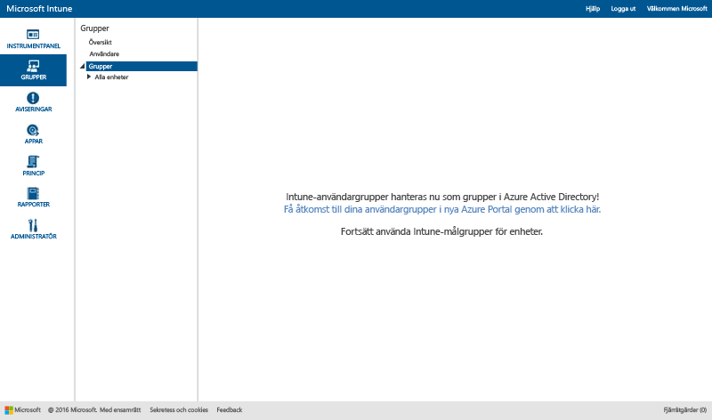

# Använda grupper för att hantera användare och enheter i Microsoft Intune

I det här avsnittet beskrivs hur man skapar grupper i Intune. Det innehåller även information om hur hanteringen av grupper kommer att ändras under de kommande månaderna. 

>[!IMPORTANT]
>
>Om du öppnar arbetsytan Grupper i Intune-portalen och ser en länk till Azure Active Directory (Azure AD)-portalen så använder du redan den *nya* metoden som Azure AD-säkerhetsgrupper använder för grupphantering i Intune. Metoden beskrivs i [Meddelande om kommande förbättringar till administratörsupplevelsen för grupper](#notice-of-upcoming-improvements-to-the-admin-experience-for-groups). Klicka på länken till Azure AD-portalen för att skapa och hantera grupper.
>
> 
>
>Om du inte ser länken till Azure AD-portalen använder du fortfarande den *aktuella* metoden för grupphantering som beskrivs i [Skapa grupper för att hantera användare och enheter med Microsoft Intune](#Create-groups-to-manage-users-and-devices-with-Microsoft-Intune) i det här avsnittet.

## Meddelande om kommande förbättringar till administratörsupplevelsen för grupper

Ni har talat om för oss att ni vill ha en enhetlig grupperings- och målanpassningsupplevelse med Enterprise Mobility + Security. Vi lyssnade. Baserat på era synpunkter kommer vi snart att konvertera Intune-grupper till Azure Active Directory-baserade säkerhetsgrupper. Den här förändringen skapar en enhetlig grupphantering i Intune och Azure Active Directory (Azure AD). Detta innebär att du inte behöver duplicera grupper mellan tjänsterna. Det kommer dessutom tillhandahålla utökningsbarhet via alternativen att använda Windows PowerShell och Microsoft Graph.

### Hur påverkar det här mig nu?
Den här ändringen påverkar inte dig nu. Men det här är vad som är på gång:

-   Från september 2016 kommer nya konton som har etablerats efter den månatliga tjänsteuppdateringen att använda Azure AD-säkerhetsgrupper i stället för Intune-användargrupper.   
-   I oktober 2016 kommer nya konton som har etablerats efter den månatliga tjänsteuppdateringen att hantera både användarbaserade grupper och enhetsbaserade grupper i Azure AD-portalen. Befintliga kunder kommer inte att påverkas.
-   I november 2016 kommer Intune-produktteamet att börja migrera befintliga kunder till den nya Azure AD-baserade grupphantering. Alla aktuella användargrupper och enhetsgrupper som finns i Intune kommer att migreras till Azure AD-säkerhetsgrupper. Vi kommer att genomföra migreringen batchvis med start i november 2016. Vi påbörjar inte migreringen förrän vi kan minimera dess inverkan på ditt dagliga arbete, och vi förväntar oss att kunna utföra den utan att det påverkar slutanvändarna. Vi kommer även att meddela dig innan vi migrerar dina konton.

### Hur och när kommer jag att migrera till den nya upplevelsen?
Vi kommer att migrera befintliga Intune-kunder under en viss tidsperiod. Vi håller på att färdigställa schemat för migreringen och kommer att uppdatera det här avsnittet med mer information om ett par veckor. Vi kommer att skicka ett meddelande till dig innan du migreras. Om du har några frågor angående migreringen kan du kontakta vårt migreringsteam på [intunegrps@microsoft.com](mailto:intunegrps@microsoft.com). Mer information om hur grupper kommer att migreras finns i [Migrera grupper till Azure Active Directory](migrating-groups-to-azure-active-directory.md).

### Vad händer med mina befintliga användargrupper och enhetsgrupper?
 De användargrupper och enhetsgrupper som du har skapat i Intune kommer att migreras till Azure AD-säkerhetsgrupper. Standardgrupper i Intune, till exempel gruppen Alla användare, migreras endast om du använder dem i distributioner vid tidpunkten för migreringen. Migrering kan vara mer komplext för vissa grupper. Vi meddelar dig om ytterligare steg krävs för migrering i din organisation.

### Vilka nya funktioner kommer att vara tillgängliga för mig?
Här är de nya funktionerna vi kommer att introducera med migreringen från Intune till Azure Active Directory:

-    Azure AD-säkerhetsgrupper stöds i Intune för alla typer av distributioner.
-    Azure AD-säkerhetsgrupper stöder gruppering av enheter och användare.
-    Azure AD-säkerhetsgrupper kommer att ha stöd för dynamiska grupper som har Intune-enhetsattribut. Till exempel kommer du att kunna gruppera enheter dynamiskt baserat på plattform, till exempel iOS. När en ny iOS-enhet registreras i din organisation läggs den därmed automatiskt till i den dynamiska iOS-enhetsgruppen.
-    Du kommer att ha en delad administratörsupplevelse med grupphantering i Azure AD och Intune.
- Intune-tjänstadministratörsrollen kommer att läggas till i Azure AD så att Intune-tjänstadministratörer kan utföra grupphanteringsuppgifter i Azure AD.

### Vilka Intune-funktioner kommer inte att vara tillgängliga?
Även om grupphanteringen kommer att vara bättre kommer vissa Intune-funktioner inte att vara tillgängliga efter att din organisation har migrerats från Intune-grupper till säkerhetsgrupper för Azure AD.

#### Funktionen Hantering av grupper

-   Efter migreringen kommer du inte att kunna undanta medlemmar eller grupper när du skapar en ny grupp. Men med dynamiska grupper i Azure AD kan du använda attribut för att skapa avancerade regler som kan användas för att undanta medlemmar baserat på kriterier som du själv väljer.
-   Grupperna Användare utan grupp och Enheter utan grupp kommer inte att stödas. Vi kommer inte att migrera dessa grupper från Intune till Azure AD.

#### Gruppberoende funktioner

-   Rollen Tjänstadministratör kommer inte att ha behörighet att **hantera grupper**.
-   Du kommer inte att kunna gruppera Exchange ActiveSync-enheter. Gruppen Alla Exchange ActiveSync-hanterade enheter kommer att konverteras från en grupp till en rapport.
-  Pivotering med grupper i rapporter kommer inte att vara tillgängligt.
-  Anpassade meddelanderegler för specifika grupper kommer inte att vara tillgängligt.

### Vad kan jag göra för att förbereda mig för den här ändringen?
 Vi har rekommendationer som underlättar övergången:

- Ta bort alla oönskade eller onödiga Intune-grupper före migreringen.
- Utvärdera din användning av undantag i grupper och fundera på om du kan ändra dina grupper så att du inte behöver använda undantag.
-  Om det finns administratörer i organisationen som inte har behörighet att skapa grupper i Azure AD kan du be Azure AD-administratören att lägga till dem i rollen Intune-tjänstadministratör i Azure AD.

## Använda grupper för att hantera användare och enheter med Microsoft Intune

I det här avsnittet beskrivs hur du skapar Intune-grupper i Intune-administratörskonsolen.

Du kan skapa och hantera grupper i arbetsytan **Grupper** i Microsoft Intune-administratörskonsolen. Översiktssidan **Grupper** visar statussammanfattningar som kan hjälpa dig att identifiera och prioritera problem som kräver din uppmärksamhet. Statussammanfattningar täcker följande områden:

-   Aviseringar
-   Programuppdateringar
-   Slutpunktsskydd
-   Princip
-   Programvaruhantering

Din grupphierarki visar också statussammanfattningar som hjälper dig att identifiera och lösa problem för medlemmar i en vald grupp.

## Skapa grupper

> [!TIP]
> När du skapar grupper bör du tänka på hur du ska tillämpa de olika principerna. Du kan t.ex. ha principer som är specifika för ett operativsystem för en enhet och principer som är specifika för olika roller i din organisation eller till organisationsenheter som du redan har definierat i Active Directory. Det kan vara praktiskt att ha separata enhetsgrupper för iOS, Android och Windows, och användargrupper som är specifika för olika organisationsroller.
>
> Du vill förmodligen även skapa en standardprincip som gäller för alla grupper och enheter och som fastställer de grundläggande kompatibilitetskraven för din organisation. Sedan kan du skapa mer specifika principer för de bredaste användar- och enhetskategorierna. Du kan till exempel skapa e-postprinciper för vart och ett av enhetsoperativsystemen.
>
> Var noga när du ger dina principer namn, namnge dem så att det blir lätt att identifiera dem efteråt. Ett exempel på ett bra beskrivande principnamn är **WP e-postprincip för hela företaget**.
>
> Varje gång du skapar en begränsande princip vill du sannolikt informera användarna. När du har skapat de mer allmänna grupperna och principerna bör du vara noga med hur du skapar mindre grupper, så att du minskar risken för onödig information.

### Skapa en enhetsgrupp

1.  I Intune-administratörskonsolen klickar du på **Grupper** &gt; **Översikt** &gt; **Skapa grupp**.

2.  Ange ett namn och en beskrivning (valfritt) för gruppen och välj sedan en enhetsgrupp som den överordnade gruppen. Välj **Nästa**.

3.  På sidan **Definierar medlemskapskriterier** markerar du typen av enheter som du vill inkludera i gruppen. Du har ytterligare alternativ för gruppkonfiguration baserat på de typer av enheter som du kan välja att inkludera:

    -   **Dator**. Välj om du vill inkludera alla medlemmar i den överordnade gruppen och välj de organisationsenheter som du vill ta med eller undanta samt domäner ska tas med eller undantas. Du kan hitta information om organisationsenheter och domänen för en dator i förteckningen.

    -   **Mobil**. Välj om du vill ta med mobila enheter som hanteras av Intune, mobila enheter som hanteras av Exchange ActiveSync, eller båda.

    -   **Alla enheter**. Det här alternativet inkluderar alla enheter utan undantag, baserat på vilket kriterium som helst.

4.  På sidan **Definiera direkt medlemskap** klickar du på **Bläddra** för att ta med eller utesluta enskilda enheter. Om du väljer enheter som inte ingår i den överordnade gruppen du angav lägger Intune automatiskt till enheterna till den överordnade gruppen.

5.  På sidan **Sammanfattning** granskar du dina val och väljer sedan **Slutför**.

Den nyskapade gruppen visas i listan **Grupper** under den överordnade gruppen på arbetsytan **Grupper**. Det är här du även kan redigera eller ta bort gruppen.

### Skapa en enhetsgrupp

1.  I Intune-administratörskonsolen klickar du på **Grupper** &gt; **Översikt** &gt; **Skapa grupp**.

2.  Ange ett namn och en beskrivning (valfritt) för gruppen och välj sedan en användargrupp som den överordnade gruppen. Välj **Nästa**.

3.  På sidan **Definiera medlemskapskriterier** kan du välja om alla medlemmar i den överordnade gruppen ska inkluderas eller om du vill börja med en tom grupp. Du kan sedan ta med eller utesluta medlemmar baserat på säkerhetsgrupper för användare som du antingen konfigurerar manuellt i [administrationscenter för Office 365](http://go.microsoft.com/fwlink/?LinkId=698854) eller synkroniserar från Active Directory. Om medlemskap i en säkerhetsgrupp ändras kan även medlemskapet i användargrupperna som är baserat på säkerhetsgruppen ändras.

    > [!IMPORTANT]
    > Om din grupp innehåller medlemmar från specifika säkerhetsgrupper eller hanterar-grupper och du exkluderar medlemmar från vissa grupper tas medlemmarna du ursprungligen inkluderade för närvarande bort. Om du vill skapa en grupp som både har inkluderade medlemmar och exkluderade medlemmar, rekommenderar vi att du först skapar en överordnad grupp som innehåller de inkluderade medlemmarna. Skapa sedan en underordnad grupp för den överordnade gruppen. Ta med de exkluderade medlemmar i den nya underordnade gruppen. Använd sedan den underordnade gruppen för att hantera Intune-principer, profiler och app-distribution.

    > [!NOTE]
    > Du kan skapa grupper baserad på den hanterare som användarna rapporterar till i Azure-portalen. Den här typen av grupper är dynamiska, och den kommer att ändras då anställda läggs till eller tas bort från en hanterares team i Azure Active Directory. Hur du skapar en Azure-grupp baserat på en hanterares namn beskrivs i [Använda attribut för att skapa avancerade regler](https://azure.microsoft.com/en-us/documentation/articles/active-directory-accessmanagement-groups-with-advanced-rules/) i avsnittet **Konfigurera en grupp som en ”Hanterar”-grupp**.

4.  På sidan **Definiera direkt medlemskap** klickar du på **Bläddra** för att ta med eller utesluta enskilda användare. Om du väljer användare som inte ingår i den överordnade gruppen som du angav läggs enheterna automatiskt till den överordnade gruppen. Alternativet att manuellt lägga till en användare finns längst ned i dialogrutan **Välj medlemmar**. Detta är praktiskt om du vill lägga till en användare som ännu inte har en registrerad enhet.

5.  På sidan **Sammanfattning** granskar du dina val och väljer sedan **Slutför**.

Den nyskapade gruppen visas i listan **Grupper** under den överordnade gruppen på arbetsytan **Grupper**. Det är här du även kan redigera eller ta bort gruppen.

> [!TIP]
> Säkerhetsgrupper är en bra resurs att använda när du ska fylla användargrupper. Eftersom säkerhetsgrupper definierar vem som har åtkomst till vilka resurser så kan de lätt överföras till Intune-användargrupper. Säkerhetsgrupper som synkroniseras från Active Directory till Azure Active Directory, eller som skapats direkt i Azure Active Directory via administrationscenter för Office 365 eller Azure-portalen, kan användas för att skapa användargrupper i Intune.

## Filtrera administratörsvyer efter roller
I filtrerade gruppvyer kan du anpassa vad en IT-administratör kan se baserat på administratörens roll. Du kan även begränsa vilka grupper som varje IT-administratör kan hantera. Detta kan vara användbart när:

-   Du vill att dina IT-administratörer endast ska kunna distribuera objekt till särskilda användare och enheter
-   Du vill att din IT-administratörer endast ska kunna se de grupper som är relevanta för den administratören

Du kan konfigurera filtrerade gruppvyer för administratörer i Intune-administratörskonsolen. Mer information finns i [Vad du behöver veta innan du startar Microsoft Intune](/intune/get-started/what-to-know-before-you-start-microsoft-intune).

När en tjänstadministratör distribuerar programvaran eller principerna, eller kör rapporter, kan administratören endast se och välja de grupper som du har angett om du har konfigurerat filtrerade gruppvyer för administratören. Administratören kan inte heller se statusinformation på dessa sidor i administratörskonsolen:

-   **Systemöversikt**
-   **Översikt över grupper**
-   **Endpoint Protection-översikt**
-   **Översikt över aviseringar**
-   **Översikt över programvara**
-   **Uppgifter**

### För att skapa en filtrerad gruppvy

1.  I Intune-administratörskonsolen väljer du **Admin** &gt; **Administratörshantering** &gt; **Tjänstadministratörer**.

2.  Välj tjänstadministratören som du vill skapa en filtrerad gruppvy för och välj sedan **Hantera grupper**.

3.  I dialogrutan **Markera de grupper som visas för den här tjänstadministratören** lägger du till de grupper som tjänstadministratören kommer att få åtkomst till och väljer sedan **OK**.

När du har konfigurerat de filtrerade gruppvyerna kommer IT-administratörerna att kunna se och välja de grupper som du angett.

## Hantera grupper
När du har skapat dina grupper kan du fortsätta att hantera dem enligt organisationens behov.

Du kan ändra gruppers namn eller beskrivning samt vilka som ingår i gruppen.

Du kan ta bort en grupp som inte längre tjänar organisationens behov. Om du tar bort en grupp så innebär det inte att du tar bort de användare som tillhör gruppen.

## Nästa steg
Kontrollera **Avsett värde** och **Status** för att kontrollera de praktiska effekterna av din design när du har skapat dina grupper och principer.

### För att kontrollera din design

1. Välj vilken enhet som helst från en enhetsgrupp och bläddra igenom informationskategorierna överst på sidan.
2. Välj **Princip**. Du ser något som liknar denna skärmbild från en Android-enhets principinställningar.

Varje princip har ett **Avsett värde** och en **Status**. Det avsedda värdet är vad du hade för avsikt att uppnå när du tilldelade principen. Statusen är vad du uppnår när samtliga principer som gäller för enheten och de begränsningar och krav som gäller för maskinvara och operativsystem bedöms tillsammans. På den här skärmbilden ser du två tydliga exempel:

-   **Tillåt enkla lösenord** har getts värdet **Ja**, vilket kan ses i kolumnen **Avsett värde** , men dess **Status** är **Saknas**. Detta beror på det faktum att enkla lösenord inte stöds för Android-enheter.
-   På samma sätt tillämpas inte det utökade principobjektet **E-postinställningar för iOS-enheter** på den här enheten eftersom det är en Android-enhet.

> [!NOTE]
> Kom ihåg att om två principer som har olika begränsningsnivåer tillämpas på samma enhet eller användare, så tillämpas i praktiken den mer restriktiva principen.

<!--HONumber=Oct16_HO1-->

