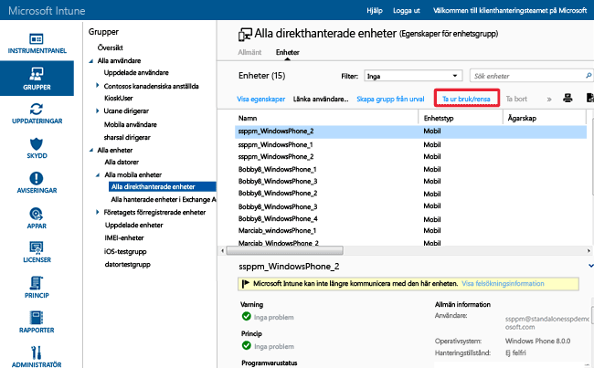

# Skydda data med fullständig eller selektiv rensning med Microsoft Intune
Precis som med enheter kommer du någon gång att vilja eller behöva [dra tillbaka appar](retire-apps-using-microsoft-intune.md) som du har distribuerat till datorer och mobila enheter eftersom de inte längre behövs. Du kanske också vill ta bort företagsdata från enheten. Du kan göra detta med funktionerna för fullständig och selektiv rensning i Intune. Eftersom mobila enheter kan lagra känslig företagsinformation och ge åtkomst till många företagsresurser kan du skicka ett fjärrensningskommando från Intune som rensar en borttappad eller sluten enhet. Dessutom kan användare skicka ett fjärrensningskommando från Intune för privatägda enheter som har registrerats i Intune.

  > [!NOTE]
  > Den här artikeln handlar enbart om hur du rensar enheter som hanteras av Intune. Du kan också använda [Azure Preview Portal](https://portal.azure.com) om du vill [rensa företagsdata från appar](wipe-managed-company-app-data-with-microsoft-intune.md).

## Fullständig rensning

**Fullständig rensning** återställer enheten till fabriksinställningarna och tar bort alla företags- och användarrelaterade data och inställningar. Enheten tas bort från Intune. En fullständig rensning är praktisk om du vill återställa en enhet innan du ger den till en ny användare eller om enheten har tappats bort eller blivit stulen.  **Var försiktig med att välja fullständig rensning. Det går inte att återställa data på enheten**.

## Selektiv rensning

En **selektiv rensning** tar bort företagets data inklusive eventuella MAM-data (Mobile App Management), inställningar och e-postprofiler från en enhet. Med en selektiv rensning lämnas användarens personliga data på enheten. Enheten tas bort från Intune. I följande tabell beskrivs, enligt plattform, vilka data som tas bort och hur data som lämnas kvar på enheten påverkas vid en selektiv rensning.

**iOS**

|Datatyp|iOS|
|-------------|-------|
|Företagsappar och associerade data som installerats av Intune.|Apparna avinstalleras. Data som hör till företagsappar tas bort.  Appdata från Microsoft-appar som använder mobilapphantering tas bort. Appen tas inte bort.|
|Inställningar|Konfigurationer som ställts in av Intune-principer tillämpas inte längre och användarna kan ändra inställningarna.|
|Profilinställningar för Wi-Fi och VPN|Borttaget|
|Certifikatprofilinställningar|Certifikat tas bort och återkallas.|
|Hanteringsagenten|Hanteringsprofilen tas bort.|
|E-post|E-postprofiler som etablerats via Intune tas bort och cachelagrad e-post på enheten tas bort.|
|Frånkoppling från Azure Active Directory (AAD)|AAD-posten tas bort|
|Kontakter | Kontakter som synkroniseras direkt från appen till den interna adressboken tas bort.  Kontakter som synkroniseras från den interna adressboken till en annan extern källa kan inte rensas.    För närvarande stöds endast Outlook-appen.

**Android**

|Datatyp|Android|Android Samsung KNOX|
|-------------|-----------|------------------------|
|Webblänkar|Tas bort.|Borttaget|
|Google Play-appar som inte hanteras|Appar och data förblir installerade|Appar och data förblir installerade|
|Branschspecifika appar som inte hanteras|Appar och data förblir installerade|Apparna avinstalleras och lokala data i appen tas därmed bort. Inga data utanför appen (SD-kortet osv.) tas bort.|
|Google Play-appar som hanteras|Appdata tas bort. Appen tas inte bort. Data som skyddas med MAM-kryptering utanför appen (SD-kortet osv.) förblir krypterade och oanvändbara men tas inte bort.|Appdata tas bort. Appen tas inte bort. Data som skyddas med MAM-kryptering utanför appen (SD-kortet osv.) förblir krypterade men tas inte bort.|
|Branschspecifika appar som hanteras|Appdata tas bort. Appen tas inte bort. Data som skyddas med MAM-kryptering utanför appen (SD-kortet osv.) förblir krypterade och oanvändbara men tas inte bort.|Appdata tas bort. Appen tas inte bort. Data som skyddas med MAM-kryptering utanför appen (SD-kortet osv.) förblir krypterade men tas inte bort.|
|Inställningar|Konfigurationer som ställts in av Intune-principer tillämpas inte längre och användarna kan ändra inställningarna.|Konfigurationer som ställts in av Intune-principer tillämpas inte längre och användarna kan ändra inställningarna.|
|Profilinställningar för Wi-Fi och VPN|Borttaget|Borttaget|
|Certifikatprofilinställningar|Certifikat återkallas, men tas inte bort.|Certifikat tas bort och återkallas.|
|Hanteringsagenten|Behörigheten som enhetsadministratör återkallas.|Behörigheten som enhetsadministratör återkallas.|
|E-post|E-post som tagits emot av Microsoft Outlook-appen för Android tas bort.|E-postprofiler som etablerats via Intune tas bort och cachelagrad e-post på enheten tas bort.|
|Frånkoppling från Azure Active Directory (AAD)|AAD-posten tas bort|AAD-posten tas bort|
|Kontakter | Kontakter som synkroniseras direkt från appen till den interna adressboken tas bort.  Kontakter som synkroniseras från den interna adressboken till en annan extern källa kan inte rensas.    För närvarande stöds endast Outlook-appen.|Kontakter som synkroniseras direkt från appen till den interna adressboken tas bort.  Kontakter som synkroniseras från den interna adressboken till en annan extern källa kan inte rensas.    För närvarande stöds endast Outlook-appen.

**Windows**

|Datatyp|Windows 8.1 (MDM) och Windows RT 8.1|Windows RT|Windows Phone 8 och Windows Phone 8.1|Windows 10|
|-------------|----------------------------------------------------------------|--------------|-----------------------------------------|--------|
|Företagsappar och associerade data som installerats av Intune.|Filer som skyddas av EFS får sin nyckel återkallad och användaren kommer inte att kunna öppna filerna.|Företagsappar tas inte bort.|Appar som ursrpungligen installerats via företagsportalen avinstalleras. Data som hör till företagsappar tas bort.|Apparna avinstalleras och nycklarna för separat inläsning tas bort.|
|Inställningar|Konfigurationer som ställts in av Intune-principer tillämpas inte längre och användarna kan ändra inställningarna.|Konfigurationer som ställts in av Intune-principer tillämpas inte längre och användarna kan ändra inställningarna.|Konfigurationer som ställts in av Intune-principer tillämpas inte längre och användarna kan ändra inställningarna.|Konfigurationer som ställts in av Intune-principer tillämpas inte längre och användarna kan ändra inställningarna.|
|Profilinställningar för Wi-Fi och VPN|Borttaget|Borttaget|Stöds inte|Borttaget|
|Certifikatprofilinställningar|Certifikat tas bort och återkallas.|Certifikat tas bort och återkallas.|Stöds inte|Certifikat tas bort och återkallas.|
|E-post|Tar bort e-post som är EFS-aktiverad (krypterande filsystem) vilket inkluderar e-postprogrammet för Windows-e-post och bifogade filer.|Stöds inte|E-postprofiler som etablerats via Intune tas bort och cachelagrad e-post på enheten tas bort.|Tar bort e-post som är EFS-aktiverad (krypterande filsystem) vilket inkluderar e-postprogrammet för Windows-e-post och bifogade filer. Tar bort e-postkonton som etablerats av Intune.|
|Frånkoppling från Azure Active Directory (AAD)|Nej|Nej|AAD-posten tas bort|Inte tillämpligt. Windows 10 har inte stöd för selektiv rensning för Azure Active Directory-anslutna enheter|

### Fjärrensa en enhet från Intune-administrationskonsolen

1.  Välj vilka enheter som ska rensas. Du hittar dem antingen efter användare eller enhet.

    -   **Efter användare:**

        1.  Gå till [Intune-administratörskonsolen](https://manage.microsoft.com/) och välj **Grupper** &gt; **Alla användare**.

        2.  Välj namnet på den användare vars mobila enhet du vill rensa. Välj **Visa egenskaper**.

        3.  Öppna sidan **Egenskaper** för användaren, välj **Enheter** och välj sedan namnet på den mobila enhet som du vill rensa. Håll ned Ctrl och klicka om du vill välja flera enheter samtidigt.

    -   **Efter enhet:**

        1.  Gå till [Intune-administratörskonsolen](https://manage.microsoft.com/) och välj **Grupper** &gt; **Alla mobila enheter**.

      

        2.  Välj **Enheter** och välj sedan namnet på den mobila enhet som du vill rensa. Håll ned Ctrl och klicka om du vill välja flera enheter samtidigt.

2.  Välj **Ta ur bruk/rensa**.

3.  Ett meddelande visas där du uppmanas att bekräfta att du vill dra tillbaka enheten

    -   Om du vill utföra en **Selektiv rensning** som bara tar bort företagets appar och data väljer du **Ja**.

    -   Om du vill utföra en **fullständig rensning** som rensar alla appar och data och återställer enheten till fabriksinställningarna väljer du **Rensa enheten innan den tas ur bruk**. Den här åtgärden gäller för alla plattformar förutom Windows 8.1. **Du inte kan återställa data som tagits bort vid en fullständig rensning**.

Det tar mindre än 15 minuter att sprida rensningen över alla enhetstyper.

## Rensa EFS-aktiverat innehåll (Encryption File System)
Selektiv radering av EFS-krypterat innehåll stöds av Windows 8.1 och Windows RT 8.1. Följande gäller för en selektiv radering av EFS-aktiverat innehåll:

-   Endast program och data som skyddas med krypterande filsystem (EFS) som använder samma Internetdomän som Intune-kontot raderas selektivt. Mer information finns i [Selektiv Windows-rensning för hantering av enhetsdata](http://technet.microsoft.com/library/dn486874.aspx).

-   Om några ändringar görs i domänen som är associerade med EFS, kan ändringarna ta upp till 48 timmer innan program och data som använder den nya domänen kan rensas selektivt.

-   Alla domäner som är registrerade i Intune rensas.

De data och program som för närvarande stöds av EFS-selektiv rensning är:

-   E--postprogrammet för Windows

-   Arbetsmappar

-   Filer och mappar som krypterats med EFS. Mer information finns i [Metodtips för krypterande filsystem (EFS)](http://support.microsoft.com/kb/223316).

-   Om organisationen upprätthåller sin identitet i Active Directory, måste verktyget Katalogsynkronisering (DirSync) användas för att synkronisera uppgifter i AAD för att selektiv rensning av EFS ska fungera korrekt.  Mer information om DirSync finns i [Directory Sync Scenario](http://technet.microsoft.com/library/dn441212.aspx) i dokumentationen för Azure Active Directory.

## Övervaka återställnings-, rensnings- och borttagningsåtgärder
Hämta en rapport över enheter som har dragits tillbaka, rensats eller tagits bort samt information om vem som utförde åtgärden:

1.  Gå till [Intune-administratörskonsolen](https://manage.microsoft.com/) och välj **Rapporter** &gt; **Rapporter om enhetshistorik**.

2.  Ange ett start- och slutdatum för rapporten och välj sedan **Visa rapport**.

### Se även
[Dra tillbaka enheter](retire-devices-from-microsoft-intune-management.md)

[Windows Selective Wipe for Device Data Management](http://technet.microsoft.com/library/dn486874.aspx)

<!--HONumber=Jun16_HO4-->

