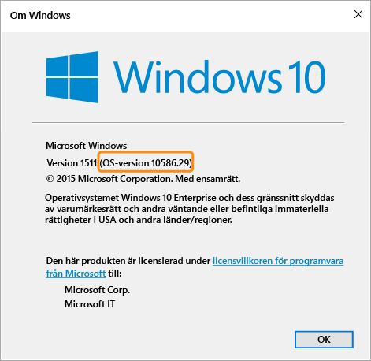

# Inställningar för efterlevnadsprinciper för Windows-enheter i Microsoft Intune

Principinställningarna som beskrivs i det här avsnittet gäller enheter som kör Windows-operativsystem. Vilken specifik Windows-version som stöds anges i avsnitten nedan.

Om du letar efter information om andra plattformar väljer du något av följande:
> [!div class="op_single_selector"]
- [Inställningar för efterlevnadsprinciper för iOS-enheter](ios-compliance-policy-settings-in-microsoft-intune.md)
- [Inställningar för efterlevnadsprinciper för Android-enheter](android-compliance-policy-settings-in-microsoft-intune.md)

## Inställningar för efterlevnadsprinciper för Windows Phone-enheter
Inställningarna i det här avsnittet stöds på Windows Phone 8.1 och senare.

## Inställningar för systemsäkerhet
### Lösenord
- **Kräv lösenord för att låsa upp mobila enheter:** Ställ in på **Ja** för att ställa in så att användare måste ange ett lösenord för att få åtkomst till sina enheter.

- **Tillåt enkla lösenord:** Ställ in på **Ja** för att låta användarna skapa enkla lösenord som '**1234**'eller'**1111**'.

-  **Minsta längd på lösenord:** Ange det minsta antal siffror eller tecken som användarens lösenord måste innehålla.
- **Lösenordstyp som krävs**: Ange om användarna måste skapa ett **alfanumeriskt** eller **numeriskt lösenord**.

  För enheter som kör Windows och som nås med ett Microsoft-konto utvärderas efterlevnadsprincipen inte korrekt om Minsta längd på lösenord är större än åtta tecken eller om Minsta antal teckenuppsättningar är större än två.

- **Minsta antal teckenuppsättningar:** Om alternativet för **Krav på lösenordstyp** är **Alfanumeriskt** anger den här inställningen det minsta antal teckenuppsättningar som lösenordet måste innehålla. De fyra teckenuppsättningarna är:
  -   Gemener
  -   Versaler
  -   Symboler
  -   Siffror

  Om du anger en hög siffra för den här inställningen kräver det att användarna skapar lösenord som är mer komplexa. För enheter som kör Windows och som nås med ett Microsoft-konto utvärderas efterlevnadsprincipen inte korrekt om Minsta längd på lösenord är större än åtta tecken eller om Minsta antal teckenuppsättningar är större än två.
- **Minuter av inaktivitet innan lösenord måste anges:** Anger efter hur lång tids inaktivitet som användaren måste ange lösenordet igen.

- **Lösenordets giltighetstid (dagar):** Ange antalet dagar tills användarens lösenord upphör att gälla och användaren måste ange ett nytt lösenord.

- **Spara lösenordshistorik:** Använd den här inställningen i kombination med **Förhindra återanvändning av tidigare lösenord** om du inte vill att användaren ska kunna återanvända tidigare använda lösenord.

- **Förhindra återanvändning av tidigare lösenord**: Om **Spara lösenordshistorik** har valts anger du hur många tidigare använda lösenord som inte får återanvändas.
- **Kräv lösenord när enheten lämnar inaktivt läge:** Den här inställningen bör användas tillsammans med inställningen **Minuter av inaktivitet innan lösenord måste anges**. Användarna uppmanas att ange ett lösenord för att få åtkomst till en enhet som har varit inaktiv under den tid som anges i inställningen **Minuter av inaktivitet innan lösenord måste anges**.

  **Den här inställningen gäller endast Windows 10 Mobile-enheter.**
### Kryptering
- **Kräv kryptering på den mobila enheten:** Välj **Ja** för den här inställningen om du vill kräva att enheten ska krypteras för att ansluta till resurser.

## Inställningar för enhetens hälsotillstånd
- **Kräv att enheter ska rapporteras som felfria:** Du kan ange en regel för att kräva att **Windows 10 Mobile**-enheter rapporteras som felfria i nya eller befintliga efterlevnadsprinciper.  Om den här inställningen är aktiverad utvärderas Windows 10-enheter via hälsoattesteringstjänsten (HAS) för följande datapunkter:
  -  **BitLocker är aktiverat:** Om BitLocker är aktiverat kan enheten skydda data mot obehörig åtkomst när datorn är avstängd eller försätts i viloläge. Med Windows BitLocker-diskkryptering krypteras alla data på volymen för Windows-operativsystemet. BitLocker använder TPM-modulen för att skydda Windows-operativsystemet och användardata och ser till att datorn inte manipuleras, även om du lämnar den obevakad, tappar bort den eller om den blir stulen. Om datorn är utrustad med en kompatibel TPM använder BitLocker TPM för att låsa krypteringsnycklarna som skyddar data. Därför kan inte nycklarna användas förrän TPM har verifierat datorns tillstånd
  -  **Kodintegritet är inte aktiverat:** Kodintegritet är en funktion som kontrollerar integriteten för en drivrutin eller systemfil varje gång den läses in i minnet. Kodintegritetsfunktionen kontrollerar om en osignerad drivrutin eller systemfil läses in i kerneln, eller om en systemfil har ändrats av skadlig programvara som körs av ett användarkonto med administratörsbehörighet.
  - **Säker start är aktiverat:** När säker start är aktiverat tvingas systemet att starta i ett fabriksinställt betrott läge. När säker start är aktiverat måste huvudkomponenterna som används för att starta datorn dessutom ha rätt kryptografiska signaturer som är betrodda av den organisation som tillverkade enheten. UEFI-baserad inbyggd programvara kontrollerar detta innan den låter datorn starta. Om filer har manipulerats som gör att signaturen skadas, så startar inte datorn.

  Mer information om hur hälsoattesteringstjänsten fungerar finns i avsnittet om [kryptografiprovidern för hälsoattesteringstjänsten](https://msdn.microsoft.com/library/dn934876.aspx).
##  Inställningar för enhetsegenskaper
- **Lägsta operativsystemversion som krävs:** När en enhet inte uppfyller minimikraven för versionen av operativsystemet rapporteras den som inkompatibel.
    En länk med information om hur du uppgraderar visas. Slutanvändaren kan välja att uppgradera enheten och kan sedan komma åt företagets resurser.

- **Högsta tillåtna version av operativsystemet:** När en enhet använder en senare version av operativsystemet än den som angetts i regeln blockeras åtkomsten till företagsresurser och användaren ombeds kontakta sin IT-administratör. Enheten kan inte användas för att komma åt företagsresurser förrän regeln för att tillåta versionen av operativsystemet har ändrats.

## Inställningar för efterlevnadsprinciper för Windows-datorer
Inställningarna i det här avsnittet stöds på Windows-datorer.
## Inställningar för systemsäkerhet
### Lösenord
- **Minsta längd på lösenord:** – Stöds i Windows 8.1.

  Ange det minsta antal siffror eller tecken som användarens lösenord måste innehålla.

  För enheter som nås med ett Microsoft-konto utvärderas efterlevnadsprincipen inte korrekt om **Minsta längd på lösenord** är längre än åtta tecken eller om **Minsta antal teckenuppsättningar** är större än två.

- **Krav på lösenordstyp:** – Stöds på Windows RT, Windows RT 8.1 och Windows 8.1

  Ange om användarna måste skapa ett **alfanumeriskt** eller **numeriskt** lösenord.

- **Minsta antal teckenuppsättningar:** – Stöds på Windows RT, Windows RT 8.1 och Windows 8.1. Om alternativet för **Krav på lösenordstyp** är **Alfanumeriskt** anger den här inställningen det minsta antal teckenuppsättningar som lösenordet måste innehålla. De fyra teckenuppsättningarna är:
  -   Gemener
  -   Versaler
  -   Symboler
  -   Siffror: Om du anger en hög siffra för den här inställningen kräver det att användarna skapar lösenord som är mer komplexa.

  För enheter som nås med ett Microsoft-konto utvärderas efterlevnadsprincipen inte korrekt om **Minsta längd på lösenord** är längre än åtta tecken eller om **Minsta antal teckenuppsättningar** är större än två.
- **Minuter av inaktivitet innan lösenord måste anges:** – Stöds på Windows RT, Windows RT 8.1 och Windows 8.1

  Ange efter hur lång tids inaktivitet som användaren måste ange sitt lösenord igen.

- **Lösenordets giltighetstid (dagar):** –Stöds på Windows RT, Windows RT 8.1 och Windows 8.1.

  Ange antalet dagar tills användarens lösenord upphör att gälla och användaren måste ange ett nytt lösenord.

- **Spara lösenordshistorik:** – Stöds på Windows RT, Windows RT och Windows 8.1.

  Använd den här inställningen i kombination med **Förhindra återanvändning av tidigare lösenord** om du inte vill att användaren ska kunna återanvända tidigare använda lösenord.
- **Förhindra återanvändning av tidigare lösenord:** – Stöds på Windows RT, Windows RT 8.1 och Windows 8.1

  Om **Spara lösenordshistorik** har valts anger du hur många tidigare använda lösenord som inte får återanvändas.

## Inställningar för enhetens hälsotillstånd
- **Kräv att enheter ska rapporteras som felfria:** – Stöds på Windows 10-enheter.
Du kan ange en regel för att begära att Windows 10-enheter rapporteras som felfria i nya eller befintliga efterlevnadsprinciper.  Om den här inställningen är aktiverad utvärderas Windows 10-enheter via hälsoattesteringstjänsten (HAS) för följande datapunkter:
  -  **BitLocker är aktiverat:** Om BitLocker är aktiverat kan enheten skydda data mot obehörig åtkomst när datorn är avstängd eller försätts i viloläge. Med Windows BitLocker-diskkryptering krypteras alla data på volymen för Windows-operativsystemet. BitLocker använder TPM-modulen för att skydda Windows-operativsystemet och användardata och ser till att datorn inte manipuleras, även om du lämnar den obevakad, tappar bort den eller om den blir stulen. Om datorn är utrustad med en kompatibel TPM använder BitLocker TPM för att låsa krypteringsnycklarna som skyddar data. Därför kan inte nycklarna användas förrän TPM har verifierat datorns tillstånd
  -  **Kodintegritet är inte aktiverat:** Kodintegritet är en funktion som kontrollerar integriteten för en drivrutin eller systemfil varje gång den läses in i minnet. Kodintegritetsfunktionen kontrollerar om en osignerad drivrutin eller systemfil läses in i kerneln, eller om en systemfil har ändrats av skadlig programvara som körs av ett användarkonto med administratörsbehörighet.
  - **Säker start är aktiverat:** När säker start är aktiverat tvingas systemet att starta i ett fabriksinställt betrott läge. När säker start är aktiverat måste huvudkomponenterna som används för att starta datorn dessutom ha rätt kryptografiska signaturer som är betrodda av den organisation som tillverkade enheten. UEFI-baserad inbyggd programvara kontrollerar detta innan den låter datorn starta. Om filer har manipulerats som gör att signaturen skadas, så startar inte datorn.
  - **Tidig lansering av program mot skadlig kod:** Tidig lansering av program mot skadlig kod (ELAM) ger skydd för datorer i nätverket när de startar och innan drivrutiner från tredje part initieras.

  Mer information om hur hälsoattesteringstjänsten fungerar finns i avsnittet om [kryptografiprovidern för hälsoattesteringstjänsten](https://msdn.microsoft.com/library/dn934876.aspx).

## Inställningar för enhetsegenskaper
- **Lägsta version av operativsystemet som krävs:** – Stöds på Windows 8.1 och Windows 10.

  Ange ”högre.lägre.version”-numret här. Versionsnumret måste motsvara den version som returneras av kommandot winver.

  Om en enhet har en tidigare version än den angivna operativsystemsversionen rapporteras den som inkompatibel. En länk med information om hur du uppgraderar visas. Slutanvändaren kan välja att uppgradera enheten och kan sedan komma åt företagets resurser.

- **Högsta tillåtna version av operativsystemet:** – Stöds på Windows 8.1 och Windows 10.

  När en enhet använder en senare version av operativsystemet än den som angetts i regeln blockeras åtkomsten till företagsresurser och användaren ombeds kontakta sin IT-administratör. Enheten kan inte användas för att komma åt företagsresurser förrän regeln för att tillåta versionen av operativsystemet har ändrats.

Du kan ta reda på vilken operativsystemversion som krävs för inställningarna **Lägsta version av operativsystemet som krävs** och **Högsta tillåtna version av operativsystemet** genom att köra kommandot **winver** från Kommandotolken. Kommandot winver returnerar den rapporterade versionen av operativsystemet.
- Datorer med Windows 8.1 returnerar en **6.3**-version.    Om regeln för operativsystemsversion är inställd på Windows 8.1 för Windows rapporteras enheten som inkompatibel även om den har Windows 8.1.
- För datorer som kör Windows 10 anger du versionen som ”10.0” + numret för operativsystemsversionen som returneras av kommandot winver. Det kan till exempel vara 10.0.10586.
> 

<!--HONumber=Oct16_HO3-->

