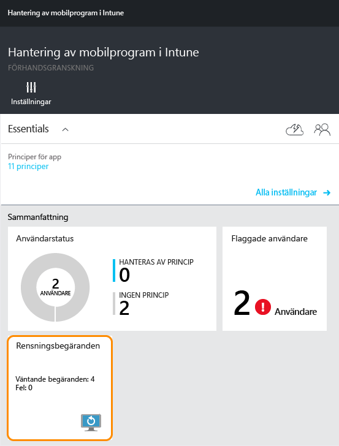
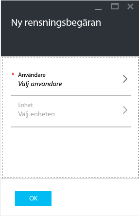
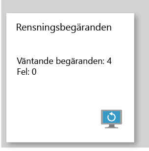

# Rensa hanterade företagsdata från appar med Microsoft Intune
Om en enhet tappas bort eller blir stulen eller om medarbetaren som använder enheten slutar på företaget vill du förmodligen ta bort företagets appdata från enheten. Men du kanske inte vill ta bort personliga data på enheten, särskilt inte om enheten ägs av medarbetaren.

Om du bara vill ta bort vissa företagsdata från appar skapar du en rensningsbegäran genom att följa stegen som beskrivs i **Skapa en rensningsbegäran** i det här avsnittet.  När begäran har slutförts tas företagets data bort från appen nästa gång den körs på enheten.
>[!NOTE]
> Kontakter som synkroniseras direkt från appen till den interna adressboken tas bort. Alla kontakter som synkroniseras från den interna adressboken till en annan extern källa kan inte rensas. Detta gäller för närvarande endast för Microsoft Outlook-appen.

## Skapa en rensningsbegäran

1.  Klicka på ikonen **Rensningsförfrågningar** i bladet **Hantering av mobilprogram i Intune** .

    

2.  Välj  **Ny rensningsförfrågan**.

    

3.  Välj **Användare** i bladet **Ny rensningsförfrågan** och välj den användare vars appdata du vill rensa i bladet **Användare** som öppnas.

4.  Välj **Enhet**.  När du gör det öppnas bladet **Enhet** som visar en lista över alla enheter som är associerade med den valda användaren.  Välj den enhet som du vill rensa.

5.  Nu är du tillbaka i bladet **Ny rensningsförfrågan**. Välj **OK** för att skicka en rensningsförfrågan. Tjänsten skapar och spårar en separat rensningsbegäran för varje skyddad app på enheten.

## Övervaka dina rensningsbegäranden
Bladet **Hantering av mobilprogram i Intune** innehåller en sammanfattad rapport på ikonen **Rensningsbegäran** .  Bladet visar den allmänna statusen och innehåller antalet väntande begäranden och misslyckade begäranden. Du kan få mer information genom att följa stegen nedan:

1.  Öppna bladet **Rensningsförfrågan** genom att välja rutan **Rensningsförfrågan** i bladet **Hantering av mobilprogram i Intune** .

2.  I bladet **Rensningsbegäran** ser du listan med dina begäranden grupperade efter användare.  Eftersom systemet skapar en rensningsbegäran för varje skyddad app som körs på enheten kan flera begäranden visas för en användare.  Statusen anger om en rensningsbegäran fortfarande är **väntande**, **misslyckad**eller **lyckad**.

### Se även
[Skydda appdata med principer för hantering av mobila appar ](protect-app-data-using-mobile-app-management-policies-with-microsoft-intune.md)

[Använda Azure Portal](azure-portal-for-microsoft-intune-mam-policies.md)

<!--HONumber=Jun16_HO4-->

