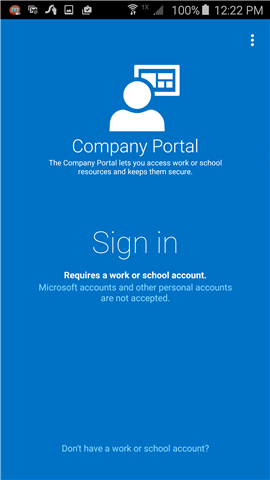
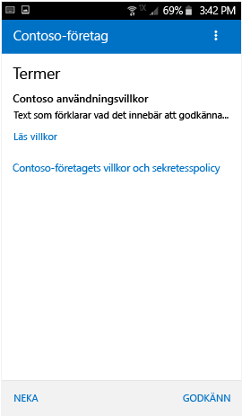
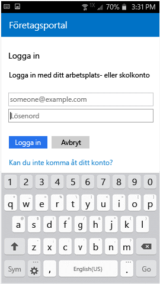

# Registrera en Android-enhet i Intune

Om företaget eller skolan använder Microsoft Intune kan du registrera din Android-enhet så att den får tillgång till företagets e-post, filer och andra resurser. Genom att registrera dina enheter kan IT-avdelningen hantera dessa arbets- eller skolresurser och skydda dem, samtidigt som du får friheten att använda den enhet du önskar för att utföra arbetet. Mer information om registrering finns i [Vad händer när jag installerar företagsportalappen och registrerar min enhet?](what-happens-if-you-install-the-Company-Portal-app-and-enroll-your-device-in-intune-android.md).

De här registreringsanvisningarna är för Samsung Knox Android-enheter och "ursprungliga" Android-enheter (inte Samsung Knox). Avgör om du har en Samsung Knox-enhet genom att välja **Inställningar** &gt; **Om enheten**. Om du inte ser orden "Knox version" i listan har du en ursprunglig Android-enhet.

Före eller efter registreringen kan du bli ombedd att välja en kategori som bäst beskriver hur du använder enheten. Din IT-administratör använder den här kategorin för att avgöra vilka appar du har åtkomst till.

Om du får ett felmeddelande när du försöker registrera enheten i Intune kan du [skicka registreringsfel till din IT-administratör](send-enrollment-errors-to-your-it-administrator-android.md).

**Registrera en Android-enhet:**

1.  Installera den kostnadsfria Intune-företagsportalsappen från [Google Play](http://play.google.com/store/apps/details?id=com.microsoft.windowsintune.companyportal).

2.  Öppna Microsoft Intune företagsportalapp.

3.  På företagsportalens skärm **Välkommen** trycker du på **Logga in** och loggar sedan in med ditt arbets- eller skolkonto.

       

4.  Om IT-administratören konfigurerar företagsvillkor trycker du på **GODKÄNN** för att godkänna villkoren.

    

5.  Logga in på företagsportalappen med ditt konto och lösenord för arbetet eller skolan och tryck på **Logga in**.

    

6.  Tryck på **BÖRJA** på skärmen **Konfiguration av företagsåtkomst**.

    

7.  På skärmen **Varför ska jag registrera enheten?** kan du läsa vad du kan göra när du har registrerat enheten. Tryck sedan på **FORTSÄTT**.

    

8.  Läs informationen om vad IT-administratören kan se och inte kan se på enheten och tryck sedan på **FORTSÄTT**.

    

9.  På skärmen **Vad kommer härnäst** läser du om vad som händer under registreringen och trycker sedan på **REGISTRERA**.

    

10.  Gör så här om du använder Android 6.0 eller senare. Annars går du till nästa steg.

    Följande meddelanden kan visas om IT-administratören har konfigurerat vissa principer:
    -   **Tillåt att företagsportalen kan ringa och hantera telefonsamtal?**

    

    Om det här meddelandet visas trycker du på **TILLÅT**. Det är säkert att trycka på TILLÅT, eftersom **Microsoft aldrig ringer eller hanterar dina telefonsamtal**! Google styr meddelandetexten och Microsoft kan inte ändra den. När du tillåter åtkomst tillåter du endast att enheten skriver dataloggar till enhetens SD-kort, vilket gör att du kan flytta dessa loggar med hjälp av en USB-kabel.

    Om du nekar åtkomst visas meddelandet igen nästa gång du loggar in på företagsportalen, men du kan inaktivera framtida meddelanden genom att trycka i kryssrutan **Fråga inte igen**.  Om användare senare bestämmer sig för att tillåta åtkomst kan de gå till **Inställningar** &gt; **Appar** &gt; **Företagsportal** &gt; **Behörigheter** &gt; **Telefon** och sedan aktivera behörigheten.

    -   **Tillåta att företagsportalappen får åtkomst till dina kontakter?**

    

    Om det här meddelandet visas trycker du på **TILLÅT**. Det är säkert att trycka på TILLÅT, eftersom **Microsoft aldrig bereder sig åtkomst till dina kontakter!** Google styr meddelandetexten och Microsoft kan inte ändra den. Om du beviljar åtkomst kan endast företagsportalappen skapa, använda och hantera ditt arbetskonto.

    Om du nekar åtkomst visas meddelandet igen nästa gång du trycker på **Skicka data**, men du kan inaktivera framtida meddelanden genom att markera kryssrutan **Fråga inte igen**. Om användare senare bestämmer sig för att tillåta åtkomst kan de gå till **Inställningar** &gt; **Appar** &gt; **Företagsportal** &gt; **Behörigheter** &gt; **Lagring** och sedan aktivera behörigheten.

11.  På skärmen **Aktivera enhetsadministratör** trycker du på **Aktivera**.

    

12.  Följ anvisningarna för att ange en PIN-kod eller ett lösenord. Om du redan har ställt in en PIN-kod eller ett lösenord på enheten, visas inte den här skärmen och du behöver inte ange en ny PIN-kod eller ett nytt lösenord.

    

13.  Om du använder en Samsung Knox-enhet trycker du på **Bekräfta**, så visas ett meddelande om att enheten registreras. Om du använder en ursprunglig Android-enhet observerar du skärmen nedan som visar att enheten registreras.

    

    Den här skärmen visar att enheten registreras.

    

14. När skärmen **Konfigurera företagsåtkomst** visas trycker du på **FORTSÄTT**. Om ett meddelande om att enheten är inkompatibel visas följer du anvisningarna för att åtgärda problemet. Tryck sedan på **FORTSÄTT**.

      

11. På skärmen **Konfigurering av företagsåtkomst har slutförts** trycker du på **KLAR**. Enheten har nu registrerats.

    

Innan du försöker installera företagsappar besöker du **Inställningar** &gt; **Säkerhet**, och aktiverar **Okända källor**. Om du inte aktiverar det här alternativet innan du försöker installera apparna visas meddelandet Installationen blockerades. Av säkerhetsskäl är enheten inställd på att blockera installationer av appar från okända källor. Du kan trycka på **Inställningar** i dialogrutan med felmeddelandet för att gå till alternativet **Okända källor**.

Behöver du fortfarande hjälp? Kontakta IT-administratören (kontaktinformation finns på [företagsportalens webbplats](http://portal.manage.microsoft.com)) eller skriv till Microsoft Android-teamet på wintunedroidfbk@microsoft.com.

<!--HONumber=Aug16_HO5-->

