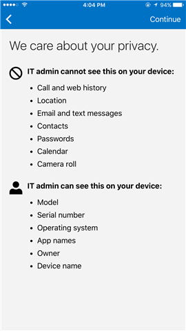
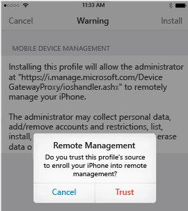

# Registrera din iOS-enhet i Intune

Om företaget eller skolan använder Microsoft Intune kan du registrera din iOS-enhet så att den får tillgång till företagets e-post, filer och andra resurser. Genom att registrera dina enheter kan IT-avdelningen hantera dessa arbets- eller skolresurser och skydda dem, samtidigt som du får friheten att använda den enhet du önskar för att utföra arbetet. Mer information om registrering finns i [Vad händer om du installerar företagsportalappen och registrerar enheten i Intune?](what-happens-if-you-install-the-company-portal-app-and-enroll-your-device-in-intune-ios.md).

Om du försöker registrera en Mac OS X-enhet kan du läsa [Registrera din Mac OS X-enhet i Intune](enroll-your-device-in-intune-mac-os-x.md).

**Registrera din iOS-enhet:**

1.  Följ stegen i [Installera och logga in på Intune-företagsportalappen](install-and-sign-in-to-the-intune-company-portal-app-ios.md).

2. Tryck på **Börja** på sidan **Konfiguration av företagsåtkomst**.

    

3. På skärmen **Varför ska jag registrera enheten?** kan du läsa vad du kan göra när du har registrerat enheten. Tryck sedan på **Fortsätt**.

    

4. Läs igenom listan över vad IT-administratören kan och inte kan se på den registrerade enheten och tryck på **Fortsätt**.

    

5.  På skärmen **Vad kommer härnäst** kan du läsa om vad som händer under registreringen. Tryck sedan på **Registrera**.

    

6.  Tryck på **Installera** på skärmen **Installera profil** och ange ditt lösenord om du uppmanas att göra det.

    

7.  Tryck på **Installera**.

        

8.  Tryck på **Installera** för att visa att du har läst varningen.

    

9.  Tryck på **Förtroende**.

    

10.  När skärmen ändras och visar att installationen av profilen är klar trycker du på **Klar**.

    

    Meddelandet "Registrerar enheten" visas på skärmen.

11.  När ett meddelande visas som frågar om du vill öppna sidan i företagsportalen trycker du på **Öppna**.

    

12. Tryck på **Fortsätt** på skärmen **Konfiguration av företagsåtkomst**. Om IT-administratören har konfigurerat ytterligare säkerhetskrav, t.ex. att ett lösenord måste anges, följer du anvisningarna på skärmen tills du uppfyller alla kompatibilitetskrav och kommer tillbaka till skärmen Konfiguration av företagsåtkomst. Tryck sedan på **Fortsätt**.

    

13. Tap **Klar**.

    

Enheten har nu registrerats i Intune och du kommer tillbaka till företagsportalappen.

Behöver du fortfarande hjälp? Kontakta IT-administratören. Titta efter kontaktuppgifter på [företagsportalens webbplats](http://portal.manage.microsoft.com).

### Se även
[Using your iOS or Mac OS X device with Intune](using-your-ios-or-mac-os-x-device-with-intune.md)

<!--HONumber=Jul16_HO4-->

