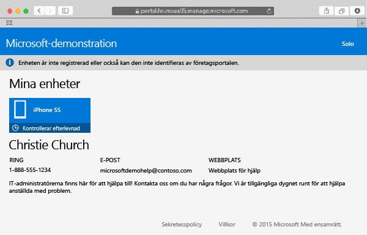

---
# required metadata

title: Registrera din Mac OS X-enhet i Intune | Microsoft Intune
description:
keywords:
author: Staciebarker
manager: jeffgilb
ms.date: 05/30/2016
ms.topic: article
ms.prod:
ms.service: microsoft-intune
ms.technology:
ms.assetid: 58eb0e7a-1321-4c66-a281-88fb01e72c1c

# optional metadata

ROBOTS:
#audience:
#ms.devlang:
ms.reviewer: esmich
ms.suite: ems
#ms.tgt_pltfrm:
#ms.custom:

---

# Registrera din Mac OS X-enhet i Intune

Genom att registrera Mac OS X-enheten i Intune kan du få åtkomst till företagets nätverk, din e-post och filer för arbetet och kan hämta företagsappar. Mer information om vad som händer när du registrerar din enhet finns i [Vad händer om man installerar företagsportalappen och registrerar enheten i Intune?](what-happens-if-you-install-the-company-portal-app-and-enroll-your-device-in-intune-ios.md).

Om du försöker registrera en iOS-enhet kan du läsa [Registrera din iOS-enhet i Intune](enroll-your-device-in-intune-ios.md).

Så här registrerar du din Mac OS X-enhet:

1.  Använd Safari som webbläsare, öppna [företagsportalens webbplats](https://portal.manage.microsoft.com) och tryck på meddelandefältet.

2.  Tryck på **Enheten är inte registrerad eller också kan den inte identifieras av företagsportalen**.

     

3.  Tryck på **Installera** för att starta registreringen av din enhet.

     

4.  Tryck på **Installera** i dialogrutan **Installera hanteringsprofil**. Om en dialogruta visas där du ombeds ange inloggningsinformation anger du ditt användarnamn och lösenord och trycker sedan på **Fortsätt** &gt; **Installera**.

     

    När du är klar med registreringen visas en hanteringsprofilsida som visar att profilen har verifierats.

     

Behöver du fortfarande hjälp? Kontakta IT-administratören. Titta efter kontaktuppgifter på [företagsportalens webbplats](http://portal.manage.microsoft.com).

### Se även
[Using your iOS or Mac OS X device with Intune](using-your-ios-or-mac-os-x-device-with-intune.md)

<!--HONumber=Jun16_HO2-->

