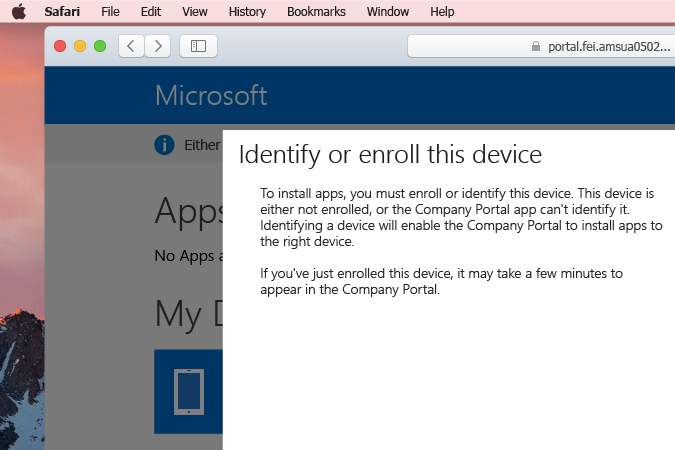

# Registrera din macOS-enhet i Intune

Genom att få åtkomst till din organisations appar, data och resurser är det möjligt för dig att göra ditt jobb. Om du använder en macOS-enhet på arbetet, innebär det installation av en __Hanteringsprofil__. Detta är bara en fil som konfigurerats av din IT-administratör och som läser in inställningar och åtkomstinformation till din Mac. Vill du veta mer? Ta reda på [vad som händer om du installerar företagsportalappen och registrerar din enhet i Intune](what-happens-if-you-install-the-company-portal-app-and-enroll-your-device-in-intune-ios.md)

  > [!NOTE]
  > Om du försöker registrera en iOS-enhet, till exempel en iPhone eller iPad, [prova de här instruktionerna i stället](enroll-your-device-in-intune-ios.md).

1. På din __Docka__, går du till __Safari__ och öppnar ett nytt fönster och öppnar sedan [företagsportalens webbplats](http://portal.manage.microsoft.com).
2. Logga in på företagsportalens webbplats med ditt arbets- eller skolkonto.

  [!INCLUDE[wit_nextref](../includes/end-user-password-guidance.md)]

3. När du loggar in visas alla tillgängliga __appar__, __Mina enheter__ och all tillgänglig __kontaktinformation__ för din IT-avdelning. Överst på sidan visas ett meddelande om att **enheten inte är registrerad eller att företagsportalen inte kan identifiera den. <u>Tryck här</u> för att välja en annan enhet.** Klicka på __Tryck här__.

 

4. Ett popup-fönster visas med en kort beskrivning av varför du ska __identifiera eller registrera den här enheten__. Granska det och klicka sedan på __Registrera__ för att fortsätta.

 

5. Ett andra popup-fönster visas med en kort beskrivning av vad som händer när du __registrerar enheten__. Granska det och klicka sedan på __Installera__ för att fortsätta.

 

  > [!NOTE]
  > Intune behöver åtkomst till datorn för att se till att enheten är säker nog för att få åtkomst till organisationens resurser. Ta reda på [vad som händer när du registrerar din enhet i Intune](what-happens-if-you-install-the-Company-Portal-app-and-enroll-your-device-in-intune-ios.md).

6. __Systeminställningar__ öppnas och frågar om du vill __Installera "Hanteringsprofil"?__ Klicka på __Installera__ för att fortsätta eller se mer information genom att klicka på __Visa profil__.

 

7. Ett macOS popup-fönster visas. Bekräfta att du vill göra ändringar genom att ange datorns __Användarnamn__ och __Lösenord__, klicka på __OK__. Detta installerar hanteringsprofilen på datorn.

 

8. Du kan se vissa ytterligare meddelanden från din Mac med mer information om profilen eller om du är säker på att du vill __Installera__. Klicka på __Fortsätt__ och __Installera__ för att fortsätta. När installationen är klar, kan du se din nyligen installerade __Hanteringsprofil__ i listan över __Enhetsprofilerna__.

 

Behöver du fortfarande hjälp? Kontrollera med din IT-administratör. Du hittar kontaktinformationen på [Företagsportalens webbplats](http://portal.manage.microsoft.com).

<!--HONumber=Feb17_HO2-->

