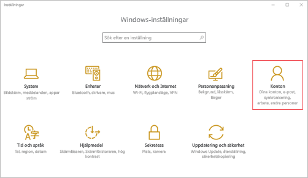

# Registrera din Windows 10 Mobile- eller Windows 10-enhet i Intune

Om företaget eller skolan använder Microsoft Intune kan du registrera dina enheter så att de får tillgång till företagets e-post, filer och andra resurser. Genom att registrera dina enheter kan organisationen skydda företagsdata. Mer information om registrering finns i [Vad händer om man installerar företagsportalappen och registrerar enheten i Intune?](what-happens-if-you-install-the-company-portal-app-and-enroll-your-device-in-intune-windows.md) och [Vad IT-administratören kan se och inte kan se på enheten](what-can-your-it-administrator-see-when-you-enroll-your-device-in-intune-windows.md).

Registrera din Windows 10 Mobile- eller Windows 10-enhet:

1.  Gå till Windows **Inställningar** och tryck på **Konton**.

    

2.  Ta en titt på de två följande skärmarna och se om någon av dem liknar vad du ser på din enhet. Följ de steg som gäller för den skärm som du ser på din enhet.

    Om denna skärm visas följer du stegen i [Steg att följa om du ser Åtkomst för arbete eller skola](#steps-to-follow-if-you-see-access-work-or-school).

    

    Om denna skärm visas följer du stegen i [Steg att följa om du ser Ditt konto](#steps-to-follow-if-you-see-your-account).

    

## Steg för att följa om du ser Åtkomst för arbete eller skola

1.  Tryck på **Åtkomst för arbete eller skola**.

    

2.  Ange din e-postadress på arbetet eller i skolan och tryck på **Nästa**.

    

3. Logga in på Intune med ditt arbets- eller skolkonto.

    

    Ett meddelande visas som anger att ditt företag eller din skola registrerar din enhet.

4. När sidan **Allt är klart!** trycker du på **Stäng**. Klart.

  

5. Om du vill kontrollera att anslutningen är korrekt går du tillbaka till **Inställningar**, och ser att ditt arbets- eller skolkonto listas.

    

Om du har följt stegen ovan, men ändå inte får åtkomst till din e-post eller dina filer på arbetet eller i skolan, så följ anvisningarna i [Felsökningssteg att följa för Åtkomst för arbete eller skola](troubleshoot-your-windows-10-device-windows.md#troubleshooting-steps-to-follow-if-you-see-access-work-or-school).

## Steg för att följa för Ditt konto

1.  Gå till Windows **Inställningar** och tryck på **Konton**.

    

2.  Tryck på **Ditt konto**.

    

3.  Tryck på **Lägg till ett arbetsplats- eller skolkonto**.

    

4.  Logga in med dina uppgifter för arbets- eller skolkontot.

    

Om du har följt stegen ovan, men ändå inte får åtkomst till din e-post, dina filer eller annan information på arbetet eller i skolan, så följ anvisningarna i [Felsökningssteg att följa för Ditt konto](troubleshoot-your-windows-10-device-windows.md#troubleshooting-steps-to-follow-if-you-see-your-account).

Vi rekommenderar också att du installerar appen Företagsportalen som gör att du lätt kan identifiera och ladda ner de företagsappar som är relevanta för dig och din arbetsroll. Företagsportalen kan ha installerats som en del i din registrering, beroende på hur ditt företag har konfigurerat Intune. Du kan kontrollera att du har appen genom att se om **Företagsportalen** finns i din applista. Om du inte ser Företagsportalen i app-listan kan du följa de här stegen för att installera den.

1.  Tryck på **Start** &gt; **Store**.

2.  Tryck på **Sök** och skriv in **Företagsportalen**.

3.  Tryck på **Företagsportal** &gt; **Installera** i listan över resultat.

4.  Tryck på antingen **Installera** eller på **Ledigt**. Vilket alternativ som visas beror på hur ditt företag har konfigurerat appen.

Behöver du fortfarande hjälp? Kontakta IT-administratören. Titta efter kontaktuppgifter på [företagsportalens webbplats](http://portal.manage.microsoft.com).

### Se även
[Att använda din Windowsenhet med Intune](using-your-windows-device-with-intune.md)

<!--HONumber=Aug16_HO3-->

