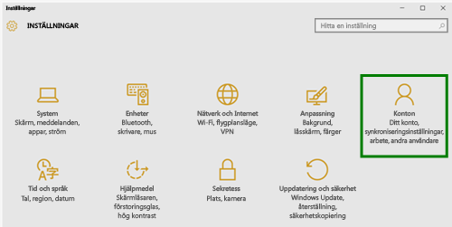
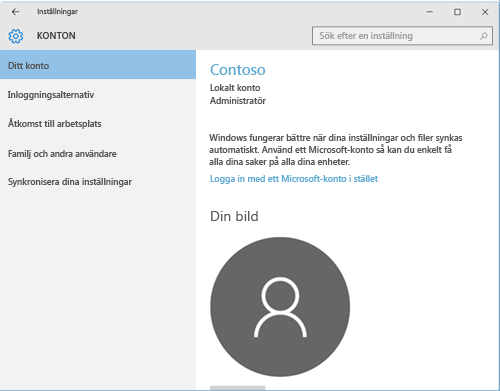
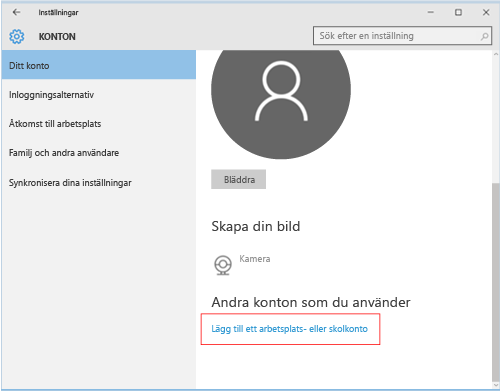
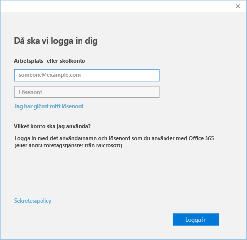

# Registrera din Windows 10 Mobile- eller Windows 10-enhet i Intune

Om företaget eller skolan använder Microsoft Intune kan du registrera dina enheter så att de får tillgång till företagets e-post, filer och andra resurser. Genom att registrera dina enheter kan organisationen skydda företagsdata. Mer information om registrering finns i [Vad händer om man installerar företagsportalappen och registrerar enheten i Intune?](what-happens-if-you-install-the-company-portal-app-and-enroll-your-device-in-intune-windows.md) och [Vad IT-administratören kan se och inte kan se på enheten](what-can-your-it-administrator-see-when-you-enroll-your-device-in-intune-windows.md).

Registrera din Windows 10 Mobile- eller Windows 10-enhet:

1.  Gå till Windows **Inställningar** och tryck på **Konton**.

    

2.  Tryck på **Ditt konto**.

    

3.  Tryck på **Lägg till ett arbetsplats- eller skolkonto**.

    

4.  Logga in med dina uppgifter för arbets- eller skolkontot.

    

Om du följde stegen ovan men ändå inte kan komma åt företagets eller skolans e-post, filer eller andra data går du tillbaka till **Konton** och trycker på **Åtkomst till arbetsplats**.

-   Ser du ditt konto för arbetet eller skolan? Grattis! Du är ansluten.

-   Om du inte ser ditt arbets- eller skolkonto trycker du på **Anslut** och loggar in med dina användaruppgifter.

Vi rekommenderar också att du installerar appen Företagsportalen som gör att du lätt kan identifiera och ladda ner de företagsappar som är relevanta för dig och din arbetsroll. Företagsportalen kan ha installerats som en del i din registrering, beroende på hur ditt företag har konfigurerat Intune. Du kan kontrollera att du har appen genom att se om **Företagsportalen** finns i din applista. Om du inte ser Företagsportalen i app-listan kan du följa de här stegen för att installera den.

1.  Tryck på **Start** &gt; **Store**.

2.  Tryck på **Sök** och skriv in **Företagsportalen**.

3.  Tryck på **Företagsportal** &gt; **Installera** i listan över resultat.

4.  Tryck på antingen **Installera** eller på **Ledigt**. Vilket alternativ som visas beror på hur ditt företag har konfigurerat appen.

Behöver du fortfarande hjälp? Kontakta IT-administratören. Titta efter kontaktuppgifter på [företagsportalens webbplats](http://portal.manage.microsoft.com).

### Se även
[Registrera din Windows-enhet i Intune](enroll-your-device-in-intune-windows.md) 
[Att använda din Windowsenhet med Intune](using-your-windows-device-with-intune.md)

<!--HONumber=Jul16_HO4-->

