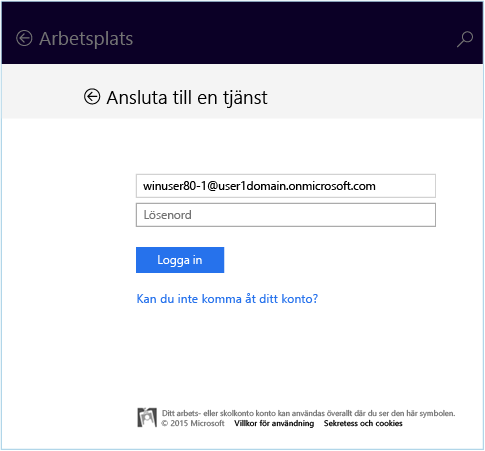
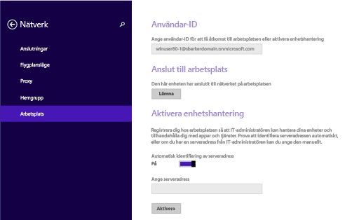
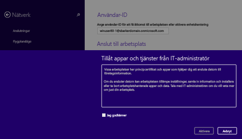
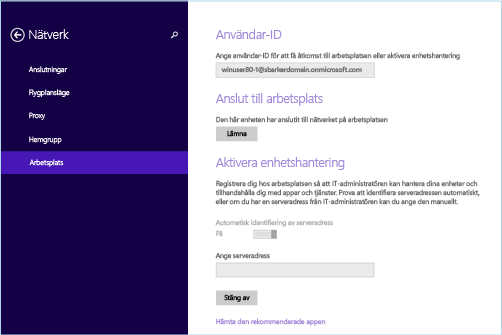

---
# required metadata

title: Registrera din Windows 8.1- eller Windows RT 8.1-enhet i Intune | Microsoft Intune
description:
keywords:
author: Staciebarker
manager: jeffgilb
ms.date: 04/28/2016
ms.topic: article
ms.prod:
ms.service: microsoft-intune
ms.technology:
ms.assetid: 28984f26-1070-4f7a-877c-669a59375c0c

# optional metadata

#ROBOTS:
#audience:
#ms.devlang:
ms.reviewer: jeffgilb
ms.suite: ems
#ms.tgt_pltfrm:
#ms.custom:

---

# Registrera din Windows 8.1- eller Windows RT 8.1-enhet i Intune

Om företaget eller skolan använder Microsoft Intune kan du registrera dina enheter så att de får tillgång till företagets e-post, filer och andra resurser. Genom att registrera dina enheter kan organisationen skydda företagsdata. Mer information om registrering finns i [Vad händer om man installerar företagsportalappen och registrerar enheten i Intune?](what-happens-if-you-install-the-company-portal-app-and-enroll-your-device-in-intune-windows.md)

och [Vad IT-administratören kan se och inte kan se på enheten](what-can-your-it-administrator-see-when-you-enroll-your-device-in-intune-windows.md)

1.  Registrera din Windows 8.1- eller Windows RT 8.1-enhet:

    

2.  nav-to-workplace

    Ange den e-postadress för arbetet eller skolan som hör ihop med ditt användar-ID, om så krävs, och tryck sedan på **Delta**

3.  Om ditt användar-ID inte krävs, används den e-postadress som du angav när du loggade in på enheten.

    

4.  type-password

    

5.  turn-on-device-management

    

    turn-on-allow-apps-services

    

enrollment-complete Vi rekommenderar också att du installerar appen Företagsportalen som gör att du lätt kan identifiera och ladda ner de företagsappar som är relevanta för dig och din arbetsroll. Företagsportalen kan ha installerats som en del i din registrering, beroende på hur ditt företag har konfigurerat Intune. Du kan kontrollera att du har appen genom att se om **Företagsportalen** finns i din applista.

1.  Om du inte ser Företagsportalen i app-listan kan du följa de här stegen för att installera den.

2.  Tryck på **Starta** &gt; **Store**

3.  Tryck på **Sök** och skriv in **företagsportal**

4.  Tryck på **Företagsportalen** i listan med resultat Tryck på antingen **Installera** eller på **Ledigt**.

### Vilket alternativ som visas beror på hur ditt företag har konfigurerat appen.
[Se även](enroll-your-device-in-intune-windows.md) 
[Registrera din Windows-enhet i Intune](using-your-windows-device-with-intune.md)

<!--HONumber=May16_HO2-->

