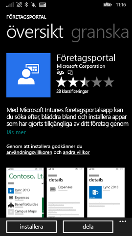
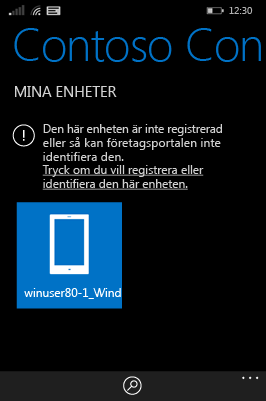
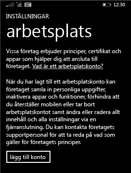

# Registrera din Windows Phone 8.1-enhet i Intune

Om företaget eller skolan använder Microsoft Intune kan du registrera dina enheter så att de får tillgång till företagets e-post, filer och andra resurser. Genom att registrera dina enheter kan organisationen skydda företagsdata. Mer information om registrering finns i [Vad händer om man installerar företagsportalappen och registrerar enheten i Intune?](what-happens-if-you-install-the-company-portal-app-and-enroll-your-device-in-intune-windows.md) och [Vad IT-administratören kan se och inte kan se på enheten](what-can-your-it-administrator-see-when-you-enroll-your-device-in-intune-windows.md).

Följ de anvisningar som gäller för företaget eller skolan för att registrera din Phone 8.1-enhet för Intune:

-   [Om ditt företag tillåter att du använder Företagsportalen från Windows Store](#if-your-company-lets-you-use-the-company-portal-from-the-windows-store)

-   [Om du inte tillåts åtkomst till Windows Store från din Windows Phone eller om du inte har ett Microsoft-konto](#if-you-are-not-allowed-to-access-the-windows-store-from-your-windows-phone-or-if-you-do-not-have-a-microsoft-account)

## Om ditt företag tillåter att du använder Företagsportalen från Windows Store
Installera Företagsportal-applikationen på din enhet:

1.  Tryck på **Start** &gt; **Store**.

2.  Tryck på **Sök** och skriv in **Företagsportalen**.

3.  Tryck på **Företagsportalen** i resultatlistan.

    

4.  Tryck på **Företagsportal** &gt; ** Installera**.

    

Registrera din enhet:

1.  Öppna appen **Microsoft Intune Företagsportal** på enheten.

2.  Skriv in dina inloggningsuppgifter. Du kan bli ombedd att acceptera ditt företags användarvillkor om tillämpligt.

3.  Svep till **Mina enheter**.

4.  Tryck på **Tryck för att registrera eller identifiera enheten**.

    

5.  Tryck på **Registrera enheten**.

    

6.  Tryck på **Lägg till konto**.

    

7.  Ange ytterligare information som begärs och tryck sedan på **logga in** för att slutföra registreringen. Du bör nu se ditt arbetsplatskonto i listan om du trycker på **Inställningar** &gt; **Arbetsplats**.

    

## Om du inte tillåts åtkomst till Windows Store från din Windows Phone eller om du inte har ett Microsoft-konto

1.  Tryck på **Inställningar** &gt; **Arbetsplats**.

2.  Tryck på **lägg till konto** och logga sedan in med ditt arbetskonto.

3.  Ange ytterligare information som begärs och tryck sedan på **logga in** för att slutföra registreringen.

4.  Om du uppmanas att installera företagets app eller Hub, se då till att rätt ruta är ikryssad och tryck på **klar**.

Om din IT-administratör har konfigurerat Företagsportalen för installation under registreringen visas Företagsportalen i din applista.

Behöver du fortfarande hjälp? Kontakta IT-administratören. Titta efter kontaktuppgifter på [företagsportalens webbplats](http://portal.manage.microsoft.com).

<!--HONumber=Sep16_HO3-->

