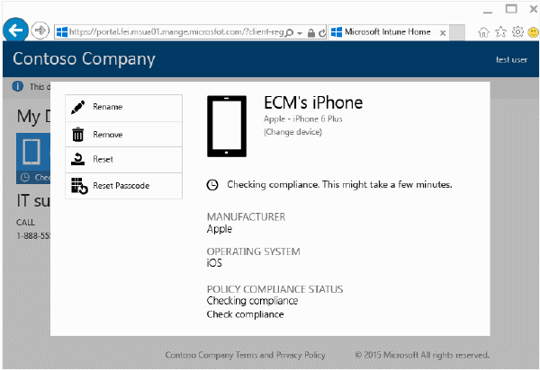

---
# required metadata

title: Återställa en enhet från företagsportalens webbplats | Microsoft Intune
description:
keywords:
author: Staciebarker
manager: jeffgilb
ms.date: 04/28/2016
ms.topic: article
ms.prod:
ms.service: microsoft-intune
ms.technology:
ms.assetid: d3182a85-328b-45b4-bf7a-9f6249984641

# optional metadata

#ROBOTS:
#audience:
#ms.devlang:
ms.reviewer: mamoriss
ms.suite: ems
#ms.tgt_pltfrm:
#ms.custom:

---

# Återställa en enhet från företagsportalens webbplats

Om du tappar bort din enhet eller om den blir stulen kanske du vill återställa den till fabriksinställningarna för att förhindra obehörig åtkomst till dina data. Du kan återställa enheten via en fjärranslutning med hjälp av [företagsportalens webbplats](http://portal.manage.microsoft.com). Företagsportalens webbplats är en webbsida som du kan använda för att hantera datorer och enheter som registrerats i Intune och för att utföra de flesta av de aktiviteter som du kan göra när du använder företagsportalappen.

Om du återställer en enhet kommer den inte längre att visas på företagsportalen och enheten återställs till fabriksinställningarna. 

Så här återställer du en enhet:

1.  Öppna [företagsportalens webbplats](http://portal.manage.microsoft.com) och tryck på den enhet vars namn du vill ändra.

2.  Tryck på **Återställ**.

    

Nu har enheten återställts.

Behöver du fortfarande hjälp? Kontakta IT-administratören. Titta efter kontaktuppgifter på [företagsportalens webbplats](http://portal.manage.microsoft.com).

### Se även
[Använda Intune-företagsportalens webbplats](using-the-intune-company-portal-website.md)

<!--HONumber=Jun16_HO2-->

