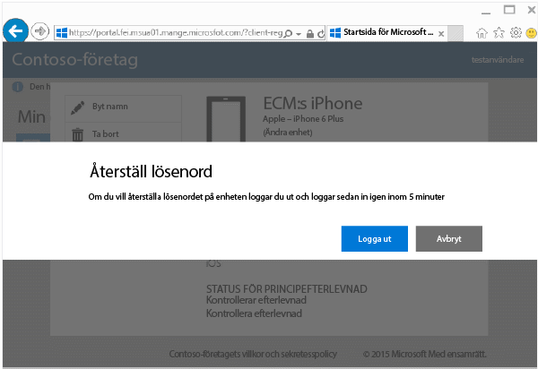
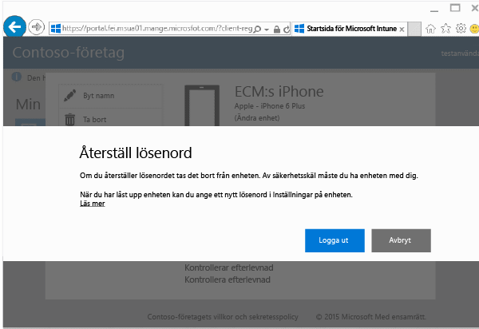

# Så återställer du enhetens lösenord från företagsportalens webbplats

Om du har tappat bort PIN-koden eller lösenordet för en enhet som du har registrerat i Intune kan du återställa det på [företagsportalens webbplats](http://portal.manage.microsoft.com). Du kan använda webbplatsen för företagsportalen för att hantera datorer och enheter som du har registrerat i Intune och för att utföra de flesta av de uppgifter som du kan utföra när du använder företagsportalappen.

> [!NOTE]
> Det kan hända att du inte kan se knappen **Återställ lösenord** på företagsportalens webbplats. Om du inte gör det måste du kontakta din IT-administratör för att få support via företagsportalens webbplats.

Så här återställer du lösenordet:

1.  Öppna [företagsportalens webbplats](http://portal.manage.microsoft.com) och välj den enhet vars lösenord du vill återställa.

2.  Välj **Återställ lösenord**.

    

3.  Välj **Logga ut** och logga sedan in igen med dina autentiseringsuppgifter för arbetet eller skolan. Du måste logga in igen inom fem minuter.

    

4.  Välj **Återställ lösenord**.

    

    I tabellen ser du hur **lösenordsåterställning** fungerar på din enhet.

    |Enhetstyp|Vad händer när du återställer|
    |------------|-----------|
    |Android|Tar bort det befintliga lösenordet och skapar ett tillfälligt lösenord som innehåller både bokstäver och siffror|
    |iOS|Tar bort det befintliga lösenordet men skapar inte ett tillfälligt lösenord. Om du använder Touch-IDs fingeravtryckskanner för att öppna din enhet eller för att utföra inköp måste du konfigurera det igen.|
    |Windows 10 Mobil|Tar bort det befintliga lösenordet och skapar ett tillfälligt lösenord som innehåller både bokstäver och siffror. Om du använder Windows Hello-ansiktsigenkänning för att logga in stöds det fortfarande.|
    |Windows Phone 8.1|Tar bort det befintliga lösenordet och skapar ett tillfälligt lösenord som endast innehåller siffror.|

    5.  Lås upp enheten och ange ett nytt lösenord eller ändra det tillfälliga lösenordet genom att gå till enhetens **Inställningar**.

    Om du vill visa ett meddelande som bekräftar att lösenordet har återställts klickar du på meddelandeflaggan längst upp till höger på företagsportalens webbplats.

Behöver du fortfarande hjälp? Kontakta IT-administratören. Titta efter IT-administratörens kontaktuppgifter på [företagsportalens webbplats](http://portal.manage.microsoft.com).

<!--HONumber=Jan17_HO4-->

