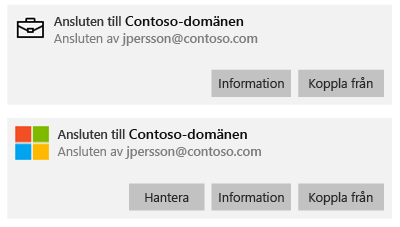
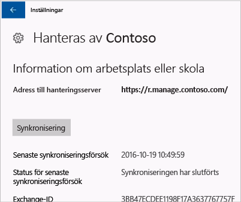

# Synkronisera Windows-enheten manuellt
Om installationen av appen tar för lång tid kan du testa att synkronisera Windows-enheten manuellt. Manuell synkronisering kan påskynda installationen.

Endast följande versioner stöds. Följ instruktionerna för din typ av enhet.

* [Windows 10 Mobil](#windows-10-mobile)
* [Windows 10 desktop](#windows-10-desktop)
* [Windows Phone 8.1](#windows-phone-8-1)

## Windows 10 Mobil
Så här synkroniserar du en Windows 10 Mobile-enhet manuellt för att påskynda en långsam appinstallation:

1. Gå till **Alla appar** > **Inställningar** > **Konton**.

    

2. Tryck på **Åtkomst till arbetsplats**.

    

3. Välj företagets namn under **Registrera dig för hantering av mobilenheter**.

    

4. Tryck på ikonen **Synkronisera**.

    

    Ett meddelande som anger att ditt konto synkroniseras visas längst upp på skärmen. Knappen **Synkronisera** är nedtonad tills synkroniseringen är klar.

## Windows 10 desktop
Det finns mer än en version av Windows 10, vilket innebär att det finns två uppsättningar steg. Om du är osäker på vilka steg du ska följa tittar du på skärmbilderna och följer de steg som liknar vad du ser på din enhet. 

1. Välj **Start**-knappen och sedan **Inställningar**.

    

2. Välj **Konton** på sidan **Inställningar**.

    

3. Ta en titt på följande två skärmar och se om någon av dem liknar den som visas på din enhet. Följ anvisningarna för den skärm som motsvarar den som visas på din enhet.

    Om du ser den här skärmen, som visar ”Åtkomst till arbete eller skola”, följer du anvisningarna i [Steg som du följer om du ser Åtkomst till arbete eller skola](#steps-to-follow-if-you-see-access-work-or-school).

    

    Om du ser den här skärmen, som visar ”Åtkomst till arbete”, följer du stegen i [Steg som du följer om du ser Åtkomst till arbete](#steps-to-follow-if-you-see-your-account).

     

### Steg för att följa om du ser Åtkomst för arbete eller skola

1. Välj **Åtkomst till arbete eller skola** på sidan **Konton**.

    

2. Välj ditt arbets- eller skolkonto. Beroende på hur IT-administratören har konfigurerat inställningarna kanske du ser två konton som liknar de i exemplet nedan. Ett konto visas med en portfölj och det andra med Microsoft-logotypen. 

    - Om du ser kontot med portföljen väljer du det och letar efter knappen **Information** under kontot. 
    - Om du bara ser kontot med Microsoft-logotypen väljer du kontot och letar efter knappen **Information** under kontot.

    

3. Välj knappen **Information**. En dialogruta öppnas som liknar den i exemplet nedan.

    

4. Välj knappen **Synkronisera**. Enheten kommer att synkroniseras med Intune.

### Steg som du följer om du ser Åtkomst till arbete
    
1. Välj **Åtkomst till arbetsplats** på sidan **Konton**.

    

2. Under avsnittet **Registrera dig för hantering av mobilenheter (MDM)** väljer du namnet på ditt företag.

    

3. Välj knappen **Synkronisera**.

    

   Knappen är nedtonad tills synkroniseringen är färdig.

## Windows Phone 8.1
Så här synkroniserar du en Windows Phone 8.1-enhet manuellt för att påskynda en långsam appinstallation:

1. Gå till **Alla appar** > **Inställningar** > **arbetsplats**.

    

2. Välj namnet på ditt företag.

    

3. Tryck på ikonen **Synkronisera**.

    

   Ett meddelande som anger att ditt konto synkroniseras visas längst upp på skärmen tills synkroniseringen är klar.

Behöver du fortfarande hjälp? Kontakta IT-administratören. Titta efter kontaktuppgifter på [företagsportalens webbplats](http://portal.manage.microsoft.com).

<!--HONumber=Oct16_HO3-->

