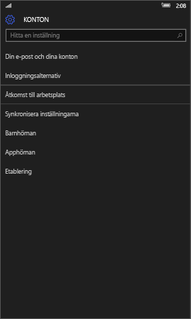
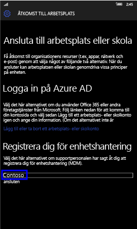
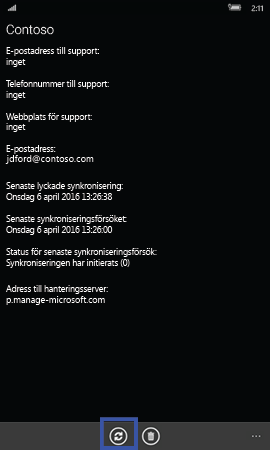
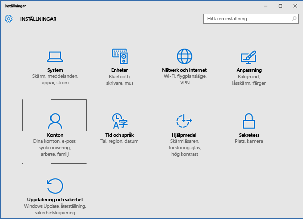
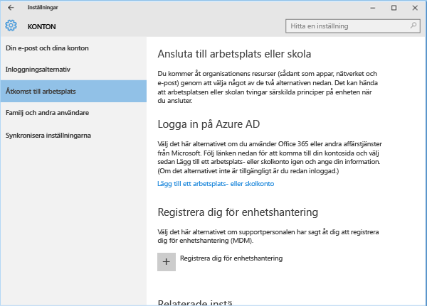
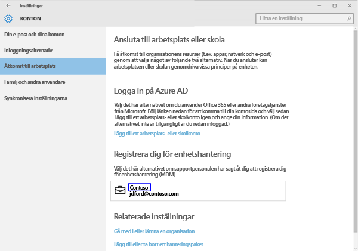
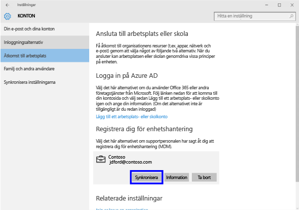
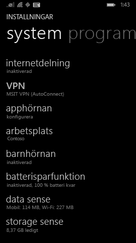
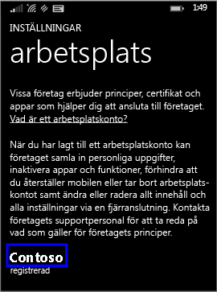
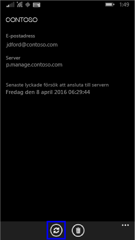

# Synkronisera Windows-enheten manuellt
Om appinstallationen tar för lång tid synkroniserar du Windows-enheten manuellt genom att följa anvisningarna nedan, vilket kan påskynda installationen. De enda versioner som stöds är de som visas. Använd den länk som visas i avsnittet ”I den här artikeln” ovan som matchar den typ av enhet som du har:

* [Windows 10 Mobil](#windows-10-mobile)
* [Windows 10 Desktop](#windows-10-desktop)
* [Windows Phone 8.1](#windows-phone-8-1)

## Windows 10 Mobil
Så här synkroniserar du en Windows 10 Mobile-enhet manuellt för att påskynda en långsam appinstallation:

1. Gå till **Alla appar** > **Inställningar** > **Konton**.

    

2. Tryck på **Åtkomst till arbetsplats**.

    

3. Under **Registrera dig för hantering av mobilenheter (MDM)** trycker du på företagets namn, som du ser nedan.

    

4. Tryck på ikonen **Synkronisera**.

    

    Ett meddelande som anger att ditt konto synkroniseras visas längst upp på skärmen. Knappen Synkronisera är nedtonad tills synkroniseringen är klar.

## Windows 10 desktop
Så här synkroniserar du en Windows 10 Desktop-enhet manuellt för att påskynda en långsam appinstallation:

1. Klicka på knappen **Start** som visas nedan och välj sedan **Inställningar**.

    

2. Välj **Konton** på sidan **Inställningar**.

    

3. Välj **Åtkomst till arbetsplats** på sidan **Konton**.

    

4. Under avsnittet **Registrera dig för hantering av mobilenheter (MDM)** klickar du på namnet på ditt företag, som du ser i blått nedan.

    

5. Välj knappen **Synkronisera**.

    

   Knappen är nedtonad tills synkroniseringen är klar.

## Windows Phone 8.1
Så här synkroniserar du en Windows Phone 8.1-enhet manuellt för att påskynda en långsam appinstallation:

1. Gå till **Alla appar** > **Inställningar** > **arbetsplats**.

    

2. Tryck på namnet på ditt företag, som du ser i blått nedan.

    

3. Tryck på ikonen **Synkronisera**.

    

   Ett meddelande som anger att ditt konto synkroniseras visas längst upp på skärmen tills synkroniseringen är klar.

Behöver du fortfarande hjälp? Kontakta IT-administratören. Titta efter kontaktuppgifter på [företagsportalens webbplats](http://portal.manage.microsoft.com).

### Se även
[Att använda din Windowsenhet med Intune](using-your-windows-device-with-intune.md)

<!--HONumber=Aug16_HO4-->

