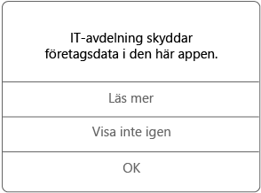

# Använda hanterade appar på iOS-enheten

Hanterade appar är appar som IT-administratören kan konfigurera för att skydda de företagsdata som du kan komma åt i appen. När du använder företagets data i en hanterad app på en iOS-enhet kan du märka att appen inte fungerar riktigt som du förväntat dig. Du kanske inte kan kopiera och klistra in skyddade företagsdata, eller så kanske du inte kan spara data på vissa platser.

Det kan också finnas flera hanterade appar som samverkar med varandra i enheten. Det gör att du kan utföra dina vardagsuppgifter samtidigt som företagets data skyddas. Om du till exempel öppnar en företagsfil i en hanterad app, och en annan hanterad app krävs för att visa filen, öppnas automatiskt den hanterade appen som gör att du kan visa filen. Om en nödvändig app inte är tillgänglig kanske du inte kan komma åt alla åtgärder. Du kanske inte kan öppna ett dokument eller använda en webblänk i ett hanterat dokument.

När du använder företagsdata i en hanterad app visas ett meddelande (se nedan) så att du vet att appen du öppnar är en hanterad app.

### Hur skaffar jag hanterade appar?
Du kan hämta hanterade appar på ett par olika sätt:

-   När enheten har registrerats i Microsoft Intune installerar du appen från företagsportalappen eller företagsportalwebbplatsen. Alternativt kan IT-administratören installera den på enheten. Läs mer om hur du registrerar i [Registrera din iOS-enhet i Intune](enroll-your-device-in-intune-ios.md) eller [Registrera din Mac OS X-enhet i Intune](enroll-your-device-in-intune-mac-os-x.md).

-   Du installerar en app från App Store och sedan loggar du in med ditt företagskonto som hanteras av Intune.

### Vad kan IT-administratören hantera i en app?
Här är några exempel på vad IT-administratören kan hantera i en app och hur det kan påverka din användning av företagsdata i enheten:

-   Åtkomst till vissa webbplatser

-   Överföring av data mellan appar

-   Spara filer

-   Kopiera och klistra in

-   Krav på åtkomst via PIN-kod

-   Din inloggning med företagets autentiseringsuppgifter

-   Möjligheten att säkerhetskopiera till molnet

-   Möjligheten att ta skärmdumpar

-   Krav på datakryptering

Kontakta IT-administratören om du vill ha mer information om hanterade appar på enheten. Titta efter kontaktuppgifter på [företagsportalens webbplats](http://portal.manage.microsoft.com).

<!--HONumber=Aug16_HO5-->

