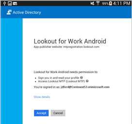

# Du uppmanas att installera Håll utkik efter arbete

Om du ser meddelandet "Lookout for Work är inte installerat eller aktiverat" som du kan se nedan, innebär det att IT-administratören kräver att du installerar appen Lookout for Work, som hjälper till att skydda din enhet genom att söka efter möjliga säkerhetshot.

**Vad du behöver göra för att lösa problemet:**

1.  Dra nedåt från överst på skärmen för att öppna meddelandefältet och tryck sedan på **Required application – Install Lookout for Work from Play Store (Nödvändigt program – Installera Lookout for Work från Play Store)**.

    

    Du kommer till installationssidan för Lookout for Work i Play Store.

2.  Installera Lookout for Work och tryck på **ACCEPTERA** så att Lookout for Work får åtkomst till din enhet.

    

3. Öppna Lookout for Work och tryck på **Aktivera**.

    

4. Tryck på **Logga in med ett arbetskonto** och ange det konto som du använder för att komma åt e-postmeddelanden, filer och andra data för ditt arbete eller skola.

    

5. Välj det konto som du använder för att komma åt filer och e-postmeddelanden för arbetet eller skolan och tryck sedan på **LÄGG TILL KONTO**.

    

6. Tryck på **Acceptera** för att ge Lookout for Work behörighet att logga in och läsa din profil.

    

    På skärmen visas att Lookout for Work ansluter till Lookout Security Cloud.

7. Granska informationen om hur Lookout skyddar din enhet och tryck sedan på **OK**.

    

    När följande skärmbild visas betyder det att Lookout är installerat och anslutet.

    

    Lookout for Work börjar direkt leta efter säkerhetshot på din enhet. Om inga hot hittas visas följande skärmbild.

    

    Skärmen Information om efterlevnad på företagsportalen visar att du nu uppfyller företagets säkerhetskrav.

    

    Om Lookout for Work hittar ett säkerhetshot på enheten, visas instruktioner om hur du löser problemet.

Behöver du fortfarande hjälp? Kontakta IT-administratören. Titta efter kontaktuppgifter på [företagsportalens webbplats](http://portal.manage.microsoft.com).

<!--HONumber=Sep16_HO2-->

