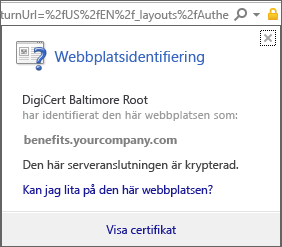
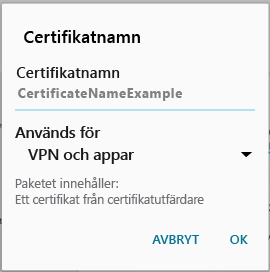

# Enheten saknar ett certifikat som krävs

## Enheten saknar ett certifikat som normalt är installerat på telefonen
Om din Android-enhet inte har registrerats i Intune och den saknar ett certifikat som normalt är installerat på telefonen kan du inte logga in i Android-företagsportalappen. Följande meddelande visas när du försöker logga in:

Lösa problemet och hämta certifikatet som krävs:

1.  I en webbläsare navigerar du till den här [Digicert-certifikatsidan](https://www.digicert.com/digicert-root-certificates.htm).

2.  Sök efter och ladda ned Baltimore CyberTrust-rotcertifikatet (https://www.digicert.com/CACerts/BaltimoreCyberTrustRoot.crt).

3.  Dra nedåt från överkanten för att öppna meddelanden och tryck på **BaltimoreCyberTrustRoot.crt** i listan med meddelanden.

4.  I dialogrutan **Namnge certifikatet** godkänner du standardcertifikatnamnet.

5. Kontrollera att **Autentiseringsuppgift** är inställt på **Används för VPN och appar** och tryck sedan på **OK**.

    

6. Stäng webbläsaren och företagsportalappen.

7. Öppna företagsportalappen igen. Du bör nu kunna logga in på företagsportalappen. Kontakta IT-administratören om du behöver hjälp.

## Enheten saknar ett certifikat som krävs av IT-administratören
Om din Android-enhet inte har registrerats i Intune och den saknar ett certifikat som krävs av IT-administratören kan du inte logga in på Android-företagsportalappen. Följande meddelande visas när du försöker logga in:

>[!NOTE]
> Om du redan har sett ett meddelande om att certifikat saknas och följt stegen i [Enheten saknar ett certifikat som normalt är installerat på telefonen](#your-device-is-missing-a-certificate-that-usually-comes-installed-on-your-phone) är det ok. Det är ett annat meddelande och certifikat, så du kan följa stegen i det här avsnittet och hämta certifikatet som saknas.

Det finns två steg som du behöver utföra för att lösa problemet och hämta certifikatet som krävs:

- Identifiera det saknade certifikatet i företags- eller skoldatorn.
- Hämta det saknade certifikatet via Internet på enheten.

### Identifiera det saknade certifikatet i företags- eller skoldatorn

1. Öppna Internet Explorer på en dator. Kontakta IT-administratören om du inte har en dator som kan användas för detta ändamål. IT-administratörens kontaktuppgifter hittar du på [företagsportalens webbplats](http://portal.manage.microsoft.com).

2. Öppna [företagsportalens webbplats](http://portal.manage.microsoft.com) och logga in med autentiseringsuppgifterna för ditt arbets- eller skolkonto.

3. Klicka på hänglåssymbolen (se nedan) längst till höger i adressfältet i webbläsaren. Om du inte ser hänglåssymbolen avbryter du och kontaktar IT-administratören. Låset innebär att du är inloggad på ett säkert sätt. Om du ser symbolen är det bara att fortsätta.

    

4. Klicka på **Visa certifikat**.

    

5. Välj fliken **Certifieringssökväg** i dialogrutan **Certifikat** och leta sedan reda på certifikatet du behöver hämta via Internet. Namnet på certifikatet du behöver finns på samma plats som certifikatet som är markerat på skärmbilden ovan.

### Hämta och installera det saknade certifikatet på din Android-enhet

1. Använd en sökmotor, till exempel Bing eller Google, och sök efter namnet på det saknade certifikatet som du identifierade i föregående avsnitt. Certifikatet kan ha olika tillägg, till exempel .crt eller .pem.

2. Hämta rotcertifikatet från webbplatsen.

3. När certifikatet har hämtats drar du ned från enhetens övre kant för att öppna meddelandena. Tryck sedan på namnet på certifikatet i meddelandelistan.

4. I dialogrutan **Namnge certifikatet** som visas nedan godkänner du standardcertifikatnamnet.

5. Kontrollera att **Autentiseringsuppgift** är inställt på **Används för VPN och appar** och tryck sedan på **OK**.

    

6. Stäng företagsportalappen.

7. Öppna företagsportalappen igen. Du bör nu kunna logga in på företagsportalappen. Kontakta IT-administratören om du behöver hjälp.

Om du ser samma meddelande om att ett certifikat saknas som visas ovan, och du redan har utfört stegen ovan, betyder det troligtvis att det finns ett annat certifikat som du behöver ta hjälp av IT-administratören för att installera. Kontakta och ge IT-administratören den här [länken](/intune/troubleshoot/troubleshoot-device-enrollment-in-intune#android-certificate-issues) till anvisningar för att lösa problemet.

<!--HONumber=Aug16_HO5-->

