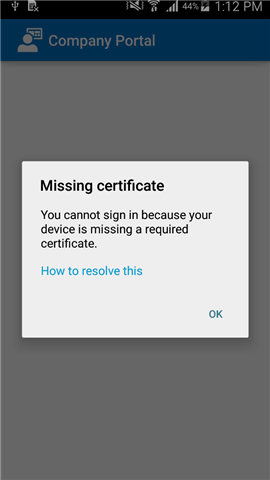
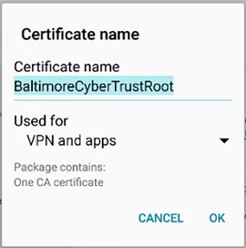

---
# required metadata

title: Enheten saknar ett certifikat som krävs | Microsoft Intune
description:
keywords:
author: staciebarker
manager: jeffgilb
ms.date: 05/31/2016
ms.topic: article
ms.prod:
ms.service: microsoft-intune
ms.technology:
ms.assetid: 9081b1d8-50e8-4bc2-ba37-766421364213

# optional metadata

#ROBOTS:
#audience:
#ms.devlang:
ms.reviewer: arnab
ms.suite: ems
#ms.tgt_pltfrm:
#ms.custom:

---

# Enheten saknar ett certifikat som krävs
Om din Android-enhet inte har registrerats i Intune och den saknar ett certifikat som normalt är installerat på telefonen kan du inte logga in i Android-företagsportalappen. Följande meddelande visas när du försöker logga in:

Lösa problemet och hämta certifikatet som krävs:

1.  I en webbläsare navigerar du till den här [Digicert-certifikatsidan](https://www.digicert.com/digicert-root-certificates.htm).

2.  Sök efter och ladda ned Baltimore CyberTrust-rotcertifikatet (https://www.digicert.com/CACerts/BaltimoreCyberTrustRoot.crt).

3.  Dra nedåt från överkanten för att öppna meddelanden och tryck på **BaltimoreCyberTrustRoot.crt** i listan med meddelanden.

4.  I dialogrutan **Namnge certifikatet** godkänner du standardcertifikatnamnet.

5. Kontrollera att **Autentiseringsuppgift** är inställt på **Används för VPN och appar** och tryck sedan på **OK**.

    

6. Stäng webbläsaren och företagsportalappen.

7. Öppna företagsportalappen igen. Du bör nu kunna logga in på företagsportalappen. Kontakta IT-administratören om du behöver hjälp.

Behöver du fortfarande hjälp? Kontakta IT-administratören. Titta efter kontaktuppgifter på [företagsportalens webbplats](http://portal.manage.microsoft.com).

<!--HONumber=Jun16_HO2-->

