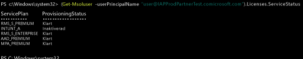

# Hantera Intune-licenser
Innan användarna kan logga in för att använda Intune-tjänsten eller registrera sina enheter för hantering måste du först tilldela varje användare en licens för Intune-prenumerationen med hjälp av [Office 365-portalen](http://go.microsoft.com/fwlink/p/?LinkId=698854). När de har tilldelats en licens visas användarnas namn i Intune-administrationskonsolen. Användare kan sedan registrera upp till femton enheter.

Organisationer som använder Microsoft EMS (Enterprise Mobility Suite) kanske har användare som bara behöver Azure Active Directory Premium eller Intune-tjänster i EMS-paketet. Du kan tilldela det eller en delmängd tjänster med hjälp av [Azure Active Directory PowerShell-cmdlets](https://msdn.microsoft.com/library/jj151815.aspx). Mer information finns i [Hantera Intune-licenser med PowerShell](start-with-a-paid-subscription-to-microsoft-intune-step-4-posh.md).

## Så här tilldelas Intune-licenser
När användarkonton synkroniseras från din lokala Active Directory eller läggs till manuellt i din molntjänstprenumeration via [Office 365-portalen](http://go.microsoft.com/fwlink/p/?LinkId=698854) så tilldelas de inte en Intune-licens automatiskt. I stället måste en Intune-klientadministratör senare redigera användarkontot och tilldela en licens till användaren från Office 365-portalen.

Om din prenumeration delar Azure AD med andra molntjänster som är associerade med din prenumeration har du också tillgång till användare som har lagts till i dessa tjänster. Dessa användare har ingen licens till [!INCLUDE[wit_nextref](../includes/wit_nextref_md.md)] förrän du tilldelar licenser till var och en av dem.

> [!TIP]
> Om alternativet för att tilldela eller återkalla en licens till [!INCLUDE[wit_nextref](../includes/wit_nextref_md.md)] är inaktiverat kan din prenumeration inkludera alternativ för volymlicensiering, t.ex. alternativen som är tillgängliga när du använder [Enterprise Mobility Suite](https://www.microsoft.com/en-us/server-cloud/enterprise-mobility/overview.aspx). Information om hur du tilldelar eller återkallar licenser finns i dokumentationen för dina licensalternativ.

## Tilldela en Intune-användarlicens

Du använder [Office 365-portalen](http://go.microsoft.com/fwlink/p/?LinkId=698854) för att manuellt lägga till molnbaserade användare och tilldela licenser till både molnbaserade användarkonton och konton som synkroniseras från din lokala Active Directory till Azure AD.

1.  Logga in på [Office 365-portalen](http://go.microsoft.com/fwlink/p/?LinkId=698854) med dina klientadministratörsuppgifter och välj sedan **Personer** > **Alla användare**.

2.  Välj det användarkonto som du vill tilldela Intune-användarlicensen till och välj antingen **Microsoft Intune** (fristående) eller **Enterprise Mobility Suite**.

3.  Användarkontot har nu de nödvändiga behörigheterna som krävs för att använda tjänsten och registrera enheter för hantering.

### Använda PowerShell för att hantera EMS-användarlicenser selektivt
Organisationer som använder Microsoft EMS (Enterprise Mobility Suite) kanske har användare som bara behöver Azure Active Directory Premium eller Intune-tjänster i EMS-paketet. Du kan tilldela det eller en delmängd tjänster med hjälp av [Azure Active Directory PowerShell-cmdlets](https://msdn.microsoft.com/library/jj151815.aspx).

Om du vill tilldela användarlicenser för EMS-tjänster öppnar du PowerShell som administratör på en dator där [Azure Active Directory-modulen för Windows PowerShell](https://msdn.microsoft.com/library/jj151815.aspx#bkmk_installmodule) är installerad. Du kan installera PowerShell på en lokal dator eller på en AD FS-server.

Du måste skapa en ny definition av licens-SKU:n som bara gäller önskade tjänstplaner. Det gör du genom att inaktivera planer som du inte vill använda. Du kan till exempel skapa en definition av licens-SKU:n som inte tilldelar en Intune-licens. Om du vill visa en lista över tjänster som är tillgängliga skriver du:

    (Get-MsolAccountSku | Where {$_.SkuPartNumber -eq "EMS"}).ServiceStatus

Du kan köra följande kommando om du vill undanta Intune-tjänstplanen. Du kan använda samma metod om du vill utöka till en hel säkerhetsgrupp eller använda mer detaljerade filter.

**Exempel 1** Skapa en ny användare på kommandoraden och tilldela en EMS-licens utan att aktivera Intune-delen av licensen:

    Connect-MsolService

    New-MsolUser -DisplayName “Test User” -FirstName FName -LastName LName -UserPrincipalName user@<TenantName>.onmicrosoft.com –Department DName -UsageLocation US

    $CustomEMS = New-MsolLicenseOptions -AccountSkuId "<TenantName>:EMS" -DisabledPlans INTUNE_A
    Set-MsolUserLicense -UserPrincipalName user@<TenantName>.onmicrosoft.com -AddLicenses <TenantName>:EMS -LicenseOptions $CustomEMS

Kontrollera med:

    (Get-MsolUser -UserPrincipalName "user@<TenantName>.onmicrosoft.com").Licenses.ServiceStatus

**Exempel 2** Inaktivera Intune-delen av EMS-licensen för en användare som redan har tilldelats en licens:

    Connect-MsolService

    Set-MsolUserLicense -UserPrincipalName user@<TenantName>.onmicrosoft.com -RemoveLicenses IAPProdPartnerTest:EMS

    $CustomEMS = New-MsolLicenseOptions -AccountSkuId "<TenantName>:EMS" -DisabledPlans INTUNE_A
    Set-MsolUserLicense -UserPrincipalName user@<TenantName>.onmicrosoft.com -AddLicenses <TenantName>:EMS -LicenseOptions $CustomEMS

Kontrollera med:

    (Get-MsolUser -UserPrincipalName "user@<TenantName>.onmicrosoft.com" .Licenses.ServiceStatus

### Nästa steg
Gratulerar! Du är nu klar med steg 4 i *snabbstartsguiden för Intune*.
>[!div class="step-by-step"]

>[&larr; **Synkronisera användare i Intune**](.\start-with-a-paid-subscription-to-microsoft-intune-step-2.md)     [**Ordna användare och enheter** &rarr;](.\start-with-a-paid-subscription-to-microsoft-intune-step-5.md)  

<!--HONumber=Jul16_HO5-->

