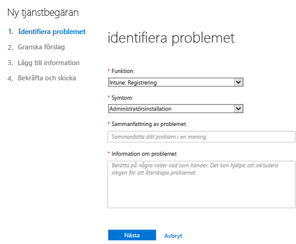
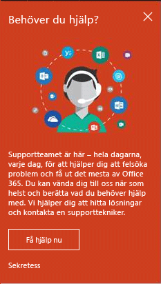
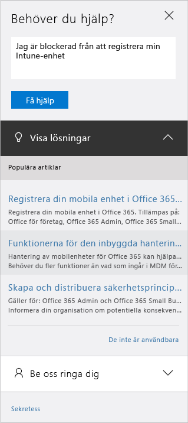

# Ta reda på hur du kan få administratörssupport för Microsoft Intune

Microsoft tillhandahåller global teknisk, förförsäljnings-, fakturerings- och prenumerationssupport för Microsoft Intune. Support är tillgängligt både online och per telefon för såväl betal- som utvärderingsprenumerationer. Teknisk support online finns på engelska och japanska. Telefonsupport och faktureringssupport online är tillgänglig på fler språk.

Support för Intune, och för Intune när det används med Configuration Manager, är kostnadsfritt. Premier Support-kunder debiteras en avgift för procedurfrågor (t.ex. hur man gör för att konfigurera en Intune-funktion).

## Skapa en tjänstbiljett online

1.  Logga in på [administrationscentret för Office 365](https://portal.office.com) med dina Intune-autentiseringsuppgifter.
    >[!NOTE]
    >
    >Premier Support-kunder kan öppna ett Intune-supportärende på [Premier Support-sidan](https://support.microsoft.com/en-us/premier/contacts).

2.  Välj **administratörspanelen**.
3.  Öppna ett ärende genom att välja **Support** till vänster under **Support**.

    

    >[!NOTE]
    >  Det här meddelandet visas för kunder som har eller har haft ett O365-konto med 100 licenser eller färre. Om du ser det så gå till [Skapa en supportbiljett med alternativa metoder](#create-a-support-ticket-with-alternate-methods).

    > 

    -   Välj **Fakturerings- och produktinfo** för fakturerings-, licensierings- och kontoproblem.

    -   För alla andra Intune-problem väljer du **Hantering av mobilenheter**.

    > [!NOTE]
    > Klicka på **mer** längst ned i listan om du vill visa alla kategorier.

3.  Följ anvisningarna för att öppna supportärendet.

### Skapa en supportbiljett med alternativa metoder

Följ den här metoden om din supportsida ser ut så här:

1. Välj **Behöver hjälp**.
2. Ge en beskrivning av problemet i textrutan och välj sedan **Få hjälp**.

    

3. Läs de föreslagna onlineresurserna eller välj **Låt oss ringa dig** om du vill att Microsoft Support ringer upp dig.

## Få telefonsupport
I [Kontakta telefonsupporten för Microsoft Intune](contact-assisted-phone-support-for-microsoft-intune.md) finns en lista över supportnummer efter land och region, supporttider och språk som stöds för varje region.

## Spåra dina tjänstförfrågningar
1.  Logga in på [administrationscentret för Office 365](https://portal.office.com) med dina Intune-autentiseringsuppgifter.
2.  Välj **administratörspanelen**.
3.  Välj **Tjänstförfrågningar** till vänster under **Support**. Sedan kan du granska dina förfrågningar.

Vårt första svar på tjänsteförfrågningar beror på hur allvarligt problemet är. Vårt första svar för Professional-kunder ges inom två timmar för de allvarligaste problemen. För Premier Support-kunder varierar svaret beroende på supportavtalet. Dessa är fall då:

- Åtminstone en tjänst är inte tillgänglig eller är oanvändbar.
- Tidsgränser för produktion, åtgärder eller distribution drabbas eller tillverkning eller lönsamhet påverkas allvarligt.
- Flera användare eller tjänster påverkas.

Vårt första svar för Professional-kunder ges inom fyra timmar för mindre allvarliga problem. För Premier Support-kunder varierar svaret beroende på supportavtalet.  Dessa är fall då:

- Tjänsten är användbar men fungerar inte lika bra som vanligt.
- Situationen har begränsad påverkan på verksamheten och kan hanteras under kontorstid.
- En enskild användare, kund eller tjänst påverkas delvis.

Vårt första svar för Professional-kunder ges inom åtta timmar för övriga problem. För Premier Support-kunder varierar svaret beroende på supportavtalet.  Dessa är fall då:

- Situationen har minimal inverkan på verksamheten.
- Problemet är betydande men har inte någon omedelbar inverkan på aktuella tjänster eller produktiviteten för kundens del.
- En enskild användare upplever partiella avbrott, men en godtagbar lösning finns.

> [!NOTE]
> **Om du använder Microsoft System Center Configuration Manager** eller **Microsoft System Center Endpoint Protection:** Om du vill ha teknisk support för Configuration Manager eller Endpoint Protection, så kontakta din partner eller besök [Microsoft System Center Configuration Manager och System Center Endpoint Protection Solution Center](http://www.microsoft.com/en-us/server-cloud/products/system-center-2012-r2/resources.aspx), där du hittar utförligt självhjälpsmaterial. Här finns också möjlighet att öppna en supportförfrågan online eller via telefon.
>
> Teknisk support för System Center Configuration Manager eller System Center Endpoint Protection kräver antingen betalning eller dras av från det befintliga licens- eller Premier Support-avtalet.

## Lösa problem utan att öppna någon supportbiljett

Du kanske kan lösa problemet utan att behöva öppna någon supportbiljett.

Information om självhjälp med Intune finns i [Allmänna felsökningstips för Microsoft Intune](general-troubleshooting-tips-for-microsoft-intune.md) och i de olika felsökningsavsnitten för specifika problem. Du kan också söka efter en lösning eller lägga upp din fråga i [Intune-forumet](https://social.technet.microsoft.com/Forums/en-US/home?forum=microsoftintuneprod).

## Hitta support för volymlicensiering
Om du redan har köpt licenser från Microsoft under ett volymlicensprogram kan du använda följande resurser för support:

-   Support angående licenser och att hitta nycklar finns i [Volume Licensing Service Center](http://go.microsoft.com/fwlink/p/?LinkID=282016).

-   Faktureringsfrågor finns i [Support för fakturering och prenumerationer](http://support.microsoft.com/oas/default.aspx?prid=15371).

-   Allmän information om volymlicensiering finns i [Volymlicensiering](http://go.microsoft.com/fwlink/p/?LinkID=282015).

<!--HONumber=Dec16_HO1-->

