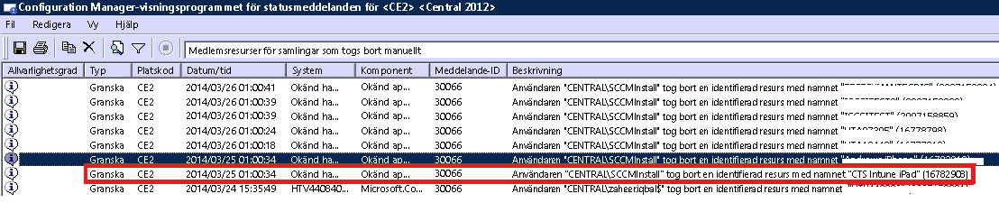

# Felsöka enhetsregistrering i Intune

Det här avsnittet innehåller förslag på hur du kan felsöka problem med enhetsregistrering. Om du inte lyckas lösa problemet med hjälp av den här informationen läser du [Ta reda på hur du kan få support för Microsoft Intune](how-to-get-support-for-microsoft-intune.md), som beskriver hur du kan få hjälp på fler sätt.

## Inledande felsökningssteg

Kontrollerar att du har konfigurerat Intune korrekt så att registrering är aktiverat innan du påbörjar felsökningen. Du kan läsa om konfigurationskraven i:

-   [Dags att registrera enheter i Microsoft Intune](/intune/deploy-use/get-ready-to-enroll-devices-in-microsoft-intune)
-   [Konfigurera iOS- och Mac-enhetshantering](/intune/deploy-use/set-up-ios-and-mac-management-with-microsoft-intune)
-   [Konfigurera hanteringen av Windows Phone och Windows 10 Mobile med Microsoft Intune](/intune/deploy-use/set-up-windows-phone-management-with-microsoft-intune)
-   [Konfigurera Windows-enhetshantering](/intune/deploy-use/set-up-windows-device-management-with-microsoft-intune)

Användare av hanterade enheter kan samla in registrerings- och diagnostikloggar som du kan granska. Anvisningar för hur användare samlar in loggar finns i:

- [Skicka loggar med Android-diagnostikdata till IT-administratören via en USB-kabel](/intune/enduser/send-diagnostic-data-logs-to-your-it-administrator-using-a-usb-cable-android)
- [Skicka loggar med Android-diagnostikdata till IT-administratören via e-post](/intune/enduser/send-diagnostic-data-logs-to-your-it-administrator-using-email-android)
- [Skicka Android-registreringsfel till IT-administratören](/intune/enduser/send-enrollment-errors-to-your-it-administrator-android)
- [Skicka iOS-registreringsfel till IT-administratören](/intune/enduser/send-errors-to-your-it-admin-ios)

## Allmänna registreringsproblem
Dessa problem kan uppstå på alla enhetsplattformar.

### Enhetstaket har nåtts
**Problem:** En användare får ett fel på enheten under registreringen, som **Företagsportalen är för tillfället otillgänglig** på en iOS-enhet och DMPdownloader.log på Configuration Manager innehåller felet **DeviceCapReached**.

**Lösning:** På grund av utformningen kan användarna inte registrera fler än fem enheter.

#### Kontrollera antalet enheter som har registrerats och som tillåts

1.  Validera i Intunes administrationsportal att användaren inte har fler än fem enheter tilldelade

2.  Kontrollera i Intunes administrationsportal  under Admin\Hantering av mobila enheter\Registreringsregler att gränsen för enhetsregistrering är inställd på fem.

Användare av mobila enheter kan ta bort enheter på följande URL: [https://byodtestservice.azurewebsites.net/](https://byodtestservice.azurewebsites.net/).

Administratörer kan ta bort enheter på Azure Active Directory-portalen.

#### Ta bort enheter i Azure Active Directory-portalen

1.  Bläddra till [http://aka.ms/accessaad](http://aka.ms/accessaad) eller välj **Admin** &gt; **Azure AD** från [https://portal.office.com](https://portal.office.com).

2.  Logga in med ditt organisations-ID med hjälp av länken till vänster på sidan.

3.  Skapa en Azure-prenumeration om du inte har någon. Detta bör inte kräva ett kreditkort eller en betalning om du har ett konto som kostar pengar (välj prenumerationslänken **Registrera en kostnadsfri Azure Active Directory** ).

4.  Välj **Active Directory** och välj sedan din organisation.

5.  Välj fliken **Användare** .

6.  Välj den användare vars enheter du vill ta bort.

7.  Välj **Enheter**.

8.  Ta bort enheter efter behov, till exempel de som inte längre används eller som har felaktiga definitioner.

> [!NOTE]

> Du kan undvika taket för enhetsregistrering genom att använda enhetsregistreringshanterare. Mer information finns i [Registrera företagsägda enheter med Enhetsregistreringshanteraren i Microsoft Intune](/intune/deploy-use/enroll-corporate-owned-devices-with-the-device-enrollment-manager-in-microsoft-intune).
>
> Ett användarkonto som läggs till i gruppen Enhetsregistreringshanterare kommer inte att kunna slutföra en registrering när en princip för villkorlig åtkomst för villkorlig åtkomst tillämpas för den specifika användarinloggning.

### Företagsportalen är för tillfället otillgänglig
**Problem:** Användaren får felet **Företagsportalen är för tillfället otillgänglig** på enheten.

#### Felsökning för felet Företagsportalen är för tillfället otillgänglig

1.  Ta bort företagsportalappen för Intune från enheten.

2.  Öppna enheten, öppna webbläsaren och bläddra till [https://portal.manage.microsoft.com](https://portal.manage.microsoft.com)och prova att logga in.

3.  Låt användaren prova ett annat nätverk om denne inte kan logga in.

4.  Om det inte går ska du validera att användarens autentiseringsuppgifter har synkroniserats korrekt med Azure Active Directory.

5.  Om användaren loggar in uppmanas denne av en iOS-enhet att installera företagsportalappen för Intune och registrera sig. På en Android-enhet måste man manuellt installera företagsportalappen för Intune, och sedan prova igen att registrera sig.

### MDM-auktoritet har inte definierats
**Problem:** Användaren får felet **MDM-utfärdare har inte definierats**.

#### Felsöka MDM-auktoritet har inte definierats

1.  Kontrollera att MDM-auktoriteten har ställts in korrekt för den version av Intune-tjänsten som du använder, det vill säga för Intune, O365 MDM eller System Center Configuration Manager med Intune. För Intune ställs MDM-utfärdaren in under **Admin** &gt; **Hantering av mobila enheter**. Om du har Configuration Manager med Intune anger du utfärdaren när du konfigurerar Intune Connector, och i O365 är det en inställning under **Mobila enheter**.

    > [!NOTE]
    > När du har angett MDM-utfärdaren kan du bara ändra inställningen genom att kontakta supporten. Mer information finns i [Ta reda på hur du kan få support för Microsoft Intune](how-to-get-support-for-microsoft-intune.md).

2.  Kontrollera att användarens autentiseringsuppgifter har synkroniserats korrekt med Azure Active Directory genom att kontrollera att deras UPN matchar Active Directory-informationen i kontoportalen.
    Om aktuellt UPN inte överensstämmer med Active Directory-informationen:

    1.  Inaktivera DirSync på den lokala servern.

    2.  Ta bort den felmatchade användaren från användarlistan **Intune kontoportal** .

    3.  Vänta ungefär en timme så att Azure-tjänsten kan ta bort felaktiga data.

    4.  Aktivera DirSync igen och kontrollera om användaren nu är korrekt synkroniserad.

3.  I ett scenario där du använder System Center Configuration Manager med Intune ska du kontrollera att användaren har ett giltigt molnanvändar-ID:

    1.  Öppna SQL Management Studio.

    2.  Anslut till rätt DB.

    3.  Öppna databasmappen och leta upp och öppna mappen **CM_DBName** där DBName är namnet på kunddatabasen.

    4.  Klicka på **Ny fråga** överst och kör följande frågor:

        -   Om du vill visa alla användare: `select * from [CM_ DBName].[dbo].[User_DISC]`

        -   Om du vill se specifika användare använder du följande fråga där %testuser1% representerar username@domain.com för den användare som du vill söka efter: `select * from [CM_ DBName].[dbo].[User_DISC] where User_Principal_Name0 like '%testuser1%'`

        När du har skrivit frågan väljer du **!Kör**.
        När resultatet har returnerats, leta efter molnanvändar-ID:et.  Om det finns något ID är inte användaren licensierad för att använda Intune.

### Det går inte att skapa en princip eller registrera enheter om företagets namn innehåller specialtecken
**Problem:** Du kan inte skapa en princip eller registrera enheter.

**Lösning:** I [administrationscenter för Office 365](https://portal.office.com/) tar du bort specialtecknen från företagets namn och sparar företagsinformationen.

### Det går inte att logga in eller registrera enheter om det finns flera verifierade domäner
**Problem:** När du lägger till en andra verifierad domän i ADFS kanske användare med UPN-suffixet (användarens huvudnamn) för den andra domänen inte kan logga in på portalerna eller registrera enheter. 

**Lösning:** Microsoft Office 365-kunder som använder enkel inloggning (SSO) via AD FS 2.0 och som har flera domäner på toppnivå för användarnas UPN-suffix i organisationen (till exempel @contoso.com eller @fabrikam.com) måste distribuera en separat instans av AD FS 2.0 Federation Service för varje suffix.  Nu finns det en [sammanslagning för AD FS 2.0](http://support.microsoft.com/kb/2607496) som fungerar tillsammans med växeln **SupportMultipleDomain** och som gör att AD FS-servern har stöd det här scenariot utan att ytterligare AD FS 2.0-servrar krävs. Mer information finns i [den här bloggen](https://blogs.technet.microsoft.com/abizerh/2013/02/05/supportmultipledomain-switch-when-managing-sso-to-office-365/).

## Android-problem
### Det gick inte att installera profilen
**Problem:** En användare får felmeddelandet **Det gick inte att installera profilen** på en Android-enhet.

### Felsökningssteg för misslyckad profilinstallation

1.  Bekräfta att användaren har tilldelats en lämplig licens för den version av Intune-tjänsten som du använder.

2.  Kontrollera att enheten inte redan har registrerats för en annan MDM-provider eller att den inte redan har en hanteringsprofil installerad.

4.  Bekräfta att Chrome för Android är standardwebbläsaren och att cookies har aktiverats.
## iOS-problem
### Det gick inte att installera profilen
**Problem:** En användare får felmeddelandet **Det gick inte att installera profilen** på en iOS-enhet.

### Felsökningssteg för misslyckad profilinstallation

1.  Bekräfta att användaren har tilldelats en lämplig licens för den version av Intune-tjänsten som du använder.

2.  Kontrollera att enheten inte redan har registrerats för en annan MDM-provider eller att den inte redan har en hanteringsprofil installerad.

3.  Gå till [https://portal.manage.microsoft.com](https://portal.manage.microsoft.com) och försök att installera profilen när du uppmanas till detta.

4.  Bekräfta att Safari för iOS är standardwebbläsaren och att cookies har aktiverats.

### En registrerad iOS-enhet visas inte i konsolen när System Center Configuration Manager används med Intune
**Problem:** Användaren registrerar iOS-enheten, men den visas inte i administrationskonsolen i Configuration Manager. Enheten visar inte att den har registrerats. Möjliga orsaker:

- Du kanske har registrerat Intune Connector för ett konto och sedan för ett annat. 
- Du kanske har hämtat MDM-certifikatet från ett konto och använt det för ett annat.

**Lösning:** Utför följande steg:

1. Inaktivera iOS i Windows Intune Connector. 
    1. Högerklicka på Intune-prenumerationen och välj **Egenskaper**.
    1. På fliken iOS avmarkerar du Aktivera iOS-registrering.

1. I SQL kör du följande steg mot CAS-databasen
  
    1. update SC_ClientComponent_Property set Value2 = '' where Name like '%APNS%' 
    1. delete from MDMPolicy where PolicyType = 7 
    1. delete from MDMPolicyAssignment where PolicyType = 7
    1. update SC_ClientComponent_Property set Value2 = '' where Name like '%APNS%' 
    1. delete from MDMPolicy where PolicyType = 11 
    1. delete from MDMPolicyAssignment where PolicyType = 11 
    1. DELETE Drs_Signals
1. Starta om SMS Executive-tjänsten eller CM-servern 

1. Skaffa ett nytt APN-certifikat och ladda upp det: Högerklicka på Intune-prenumerationen i den vänstra rutan i Configuration Manager. Välj **Skapa APNs-certifikatförfrågan** och följ instruktionerna.
## Problem när du använder System Center Configuration Manager med Intune
### Mobila enheter försvinner 
**Problem:** När du registrerar en mobil enhet i Configuration Manager försvinner den från samlingen med mobila enheter, men enheten har fortfarande hanteringsprofilen och visas i CSS Gateway.

**Lösning:** Detta kan inträffa eftersom du har en egen process som tar bort enheter som inte är anslutna till en domän eller för att användaren har dragit tillbaka enheten från prenumerationen. Följ stegen nedan om du vill kontrollera vilken process eller vilket användarkonto som tog bort enheten från Configuration Manager-konsolen.

#### Kontrollera hur enheten har tagits bort

1.  I administrationskonsolen i Configuration Manager väljer du **Övervakning** &gt; **Systemstatus** &gt; **Statusmeddelandefrågor**.

2.  Högerklicka på **Medlemsresurser för samlingar som togs bort manuellt** och välj **Visa meddelanden**.

3.  Välj lämplig tid/datum eller de senaste 12 timmarna.

4.  Hitta enheten i fråga och granska hur enheten har tagits bort. Exemplet nedan visar att kontot SCCMInstall tog bort enheten via ett okänt program.

    

5.  Kontrollera att Configuration Manager inte har någon schemalagd aktivitet, något skript eller någon annan process som automatiskt kan rensa något som inte är anslutet till någon domän, någon, mobil eller andra relaterade enheter.

### Övriga iOS-registreringsfel
En lista med fel som kan uppstå i samband med iOS-registreringen finns i dokumentationen för enheten/användaren i [Du får felmeddelanden när du försöker registrera enheten i Intune](/intune/enduser/using-your-ios-or-mac-os-x-device-with-intune).

## Datorproblem

### Datorn har redan registrerats – Fel hr 0x8007064c
**Problem:** Registreringen misslyckas med felet **Datorn har redan registrerats**. Registreringsloggen visar felet **hr 0x8007064c**.
  
Detta kan bero på att datorn har registrerats tidigare eller att den har den klonade avbildningen av en dator som har registrerats. Kontocertifikatet för det tidigare kontot finns kvar på datorn.

**Lösning:** 

1. Öppna **Start**-menyn och välj **Kör** -> **MMC**. 
1. **Arkiv** -> **Lägg till eller ta bort snapin-moduler**.
1. Dubbelklicka på **Certifikat**, välj **Datorkonto**, **Nästa** och sedan **Lokal dator**.
1. Dubbelklicka på **Certifikat (lokal dator)** och välj **Personliga certifikat**. 
1. Leta efter Intune-certifikat som utfärdats av Sc_Online_Issuing och ta bort det om det visas
1. Ta bort följande registernyckel om den finns: **HKEY_LOCAL_MACHINE\SOFTWARE\Microsoft\OnlineManagement regkey** och alla undernycklar.
1. Försök att registrera datorn igen. 
1. Om datorn fortfarande inte kan registreras letar du upp och tar bort följande nyckel, om den finns: **KEY_CLASSES_ROOT\Installer\Products\6985F0077D3EEB44AB6849B5D7913E95**. 
1. Försök att registrera datorn igen. 

    > [!IMPORTANT]
    > Avsnittet, metoden eller uppgiften som beskrivs innehåller information om hur du ändrar registret. Tänk på att allvarliga problem kan inträffa om du ändrar registret på fel sätt. Se därför till att du följer anvisningarna noga. För extra skydd rekommenderar vi att du säkerhetskopierar registret innan du gör några ändringar. Du kan sedan återställa registret om det uppstår problem.
    > Mer information om hur du säkerhetskopierar och återställer registret finns i avsnittet [Säkerhetskopiera och återställa registret i Windows](https://support.microsoft.com/en-us/kb/322756)

## Felkoder för allmänna registreringsfel

|Felkod|Möjligt problem|Föreslagen lösning|
|--------------|--------------------|----------------------------------------|
|0x80CF0437 |Klockan på klientdatorn är inte inställd på rätt tid.|Kontrollera att klockan och tidszonen på klientdatorn är inställda på rätt tid och tidszon.|
|0x80240438, 0x80CF0438, 0x80CF402C|Det går inte att ansluta till Intune-tjänsten. Kontrollera klientens proxyinställningar.|Kontrollera att proxykonfigurationen på klientdatorn stöds av Intune och att klientdatorn har Internetanslutning.|
|0x80240438, 0x80CF0438|Proxyinställningarna i Internet Explorer och Lokalt system har inte konfigurerats.|Det går inte att ansluta till Intune-tjänsten. Kontrollera klientens proxyinställningar och bekräfta att proxykonfigurationen på klientdatorn stöds av Intune och att klientdatorn har Internetanslutning.|
|0x80043001, 0x80CF3001, 0x80043004, 0x80CF3004|Registreringspaketet är inaktuellt.|Hämta och installera det aktuella klientprogramvarupaketet från arbetsytan Administration.|
|0x80043002, 0x80CF3002|Kontot är i underhållsläge.|Du kan inte registrera nya klientdatorer när kontot är i underhållsläge. Logga in på ditt konto för att visa dina kontoinställningar.|
|0x80043003, 0x80CF3003|Kontot har tagits bort.|Kontrollera att ditt konto och din prenumeration på Intune fortfarande är aktiva. Logga in på ditt konto för att visa dina kontoinställningar.|
|0x80043005, 0x80CF3005|Klientdatorn har tagits bort.|Vänta några timmar, ta bort alla äldre versioner av klientprogramvaran på datorn och pröva sedan att installera klientprogramvaran igen.|
|0x80043006, 0x80CF3006|Maximalt antal tillåtna klienter för kontot uppnått.|Din organisation måste köpa fler platser innan du kan registrera fler klientdatorer i tjänsten.|
|0x80043007, 0x80CF3007|Det gick inte att hitta certifikatfilen i samma mapp som installationsprogrammet.|Extrahera alla filer innan du påbörjar installationen. Byt inte namn på eller flytta någon av de hämtade filerna: alla filer måste finnas i samma mapp annars misslyckas installationen.|
|0x8024D015, 0x00240005, 0x80070BC2, 0x80070BC9, 0x80CFD015|Det går inte att installera programvaran eftersom klientdatorn väntar på att startas om.|Starta om datorn och pröva sedan att installera klientprogramvaran igen.|
|0x80070032|Ett eller flera installationskrav för klientprogramvaran kunde inte bekräftas på klientdatorn.|Kontrollera att alla nödvändiga uppdateringar är installerade på klientdatorn och pröva sedan att installera klientprogramvaran igen.|
|0x80043008, 0x80CF3008|Det gick inte att starta tjänsten Uppdatering av Microsoft onlinehantering.|Kontakta Microsoft-supporten. Mer information finns i [Ta reda på hur du kan få support för Microsoft Intune](how-to-get-support-for-microsoft-intune.md).|
|0x80043009, 0x80CF3009|Klientdatorn har redan registrerats i tjänsten.|Du måste inaktivera klientdatorn innan du kan registrera den igen i tjänsten.|
|0x8004300B, 0x80CF300B|Det går inte att köra installationspaketet för klientprogramvaran eftersom den version av Windows som körs på klienten inte stöds.|Intune stöder inte den version av Windows som körs på klientdatorn.|
|0xAB2|Windows Installer kunde inte komma åt VBScript-körtiden för en anpassad åtgärd.|Det här felet beror på en anpassad åtgärd som baseras på DLL:er (Dynamic-Link Libraries). När du felsöker DLL-filen kan du behöva använda de verktyg som beskrivs i [Microsoft Support-artikeln KB198038: Användbara verktyg för paket- och distributionsproblem](https://support.microsoft.com/en-us/kb/198038).|
|0x80cf0440|Anslutningen till tjänstslutpunkten avbröts.|Utvärderings- eller betalkontot har inaktiverats tillfälligt. Skapa ett nytt utvärderings- eller betalkonto och registrera dig igen.|

### Nästa steg
Om du inte lyckas lösa problemet med hjälp av den här felsökningsinformationen kontaktar du Microsoft-supporten. Mer information finns i [Ta reda på hur du kan få support för Microsoft Intune](how-to-get-support-for-microsoft-intune.md).

<!--HONumber=Jul16_HO1-->

